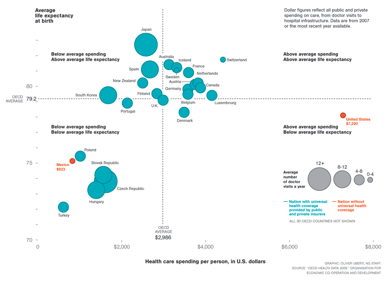
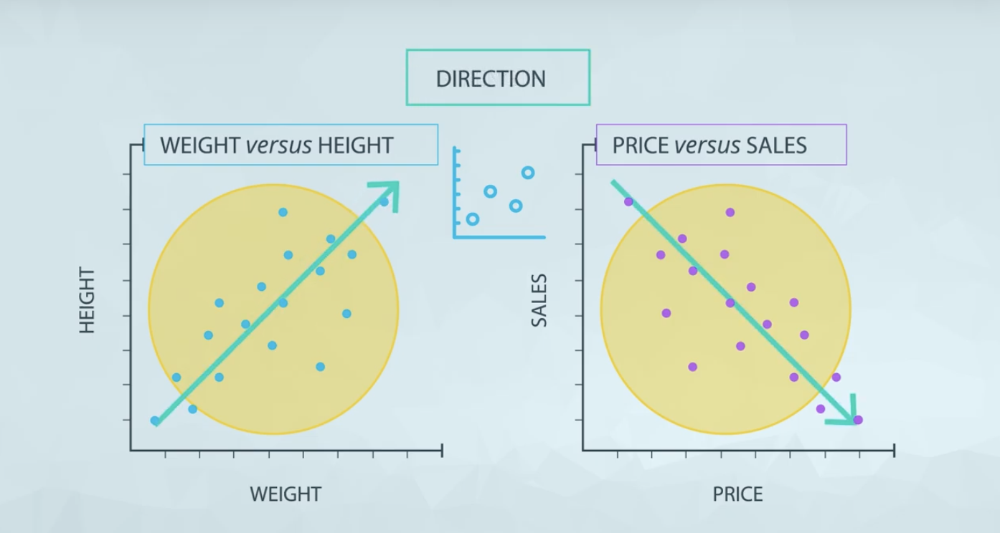
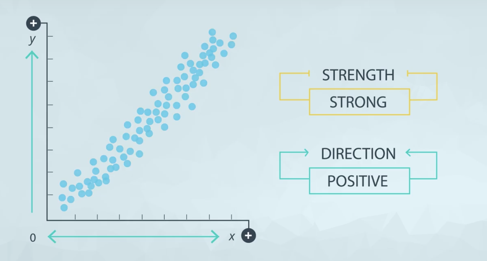
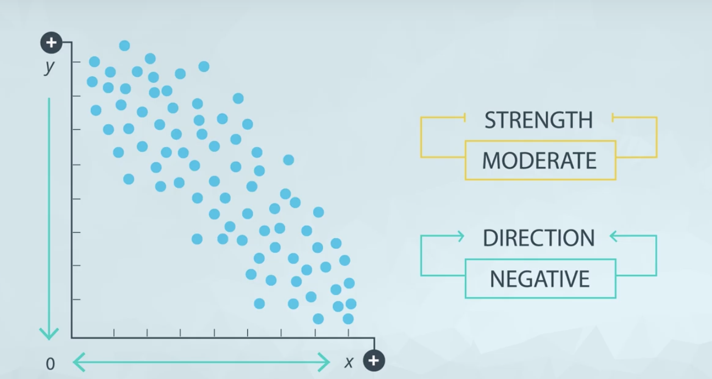

## [Why Do We Use Data Visualizations?](https://www.youtube.com/watch?v=iiOP4PE46f4)

**Areas of Focus**

There are two major areas of focus in this lesson:

1. Why are data visualizations more useful for delivering insight than just using summary statistics?
2. What plot do you build in a given situation?

**Summary Statistics vs. Visualizations**

Summary statistics like the mean and standard deviation can be great for attempting to quickly understand aspects of a dataset, but they can also be misleading if you make too many assumptions about how the data distribution looks.

[Further Motivation](https://www.youtube.com/watch?v=sjGxUKrbKoI)

**Beyond Anscombe's Quartet**
More recently **[Alberto Cairo](http://albertocairo.com/)** created the **[Datasaurus](https://www.autodeskresearch.com/publications/samestats)** dataset, which is **amazingly insightful and artistic**, but is built on the same idea that you just discovered. You can find the full dataset, and the visualizations on the **Datasaurus** link.

* [Alberto Cairo](https://video.udacity-data.com/topher/2019/November/5dc49f25_albertocairo.com/albertocairo.com.pdf)
* [Datasaurus dataset](https://video.udacity-data.com/topher/2019/November/5dc49fcf_samestats-differentgraphs/samestats-differentgraphs.pdf)

[Data Types Review](https://github.com/m-soro/Business-Analytics/tree/main/Introduction-to-Data/L1-and-L2-Descriptive-Statistics)

Now take a look at the visualization below, and complete the quiz below by identifying each of the data types.

## [Univariate Plots](https://www.youtube.com/watch?v=kgmYLreYB0A)
### Recommended charts to use

For **quantitative data**, if we are just looking at **one column** worth of data, we have four common visuals:

1. Histogram
2. Normal Quantile Plot
3. Stem and Leaf Plot
4. Box and Whisker Plot

In **most** cases, you will want to use a **histogram**.

For **categorical data**, if we are looking at just **one variable (column)**, we have three common visuals:

1. Bar Chart
2. Pie Chart
3. Pareto Chart

In **most** cases, you will want to use a **bar chart**.

[Scatter Plots](https://www.youtube.com/watch?v=DvlxZ37O4i8)

**Scatter plots**

Scatter plots are a common visual for comparing **two quantitative** variables. A common summary statistic that relates to a scatter plot is the **correlation coefficient** commonly denoted by **r**.

Though there are a [few different](http://www.statisticssolutions.com/correlation-pearson-kendall-spearman/) ways to measure correlation between two variables, the most common way is with [Pearson's correlation coefficient](https://en.wikipedia.org/wiki/Pearson_correlation_coefficient). Pearson's correlation coefficient provides the:

1. Strength
2. Direction

of a **linear relationship**. [Spearman's Correlation Coefficient](https://en.wikipedia.org/wiki/Spearman%27s_rank_correlation_coefficient) does not measure linear relationships specifically, and it might be more appropriate for certain cases of associating two variables.

