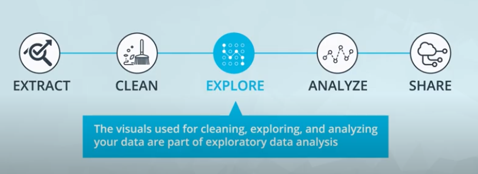
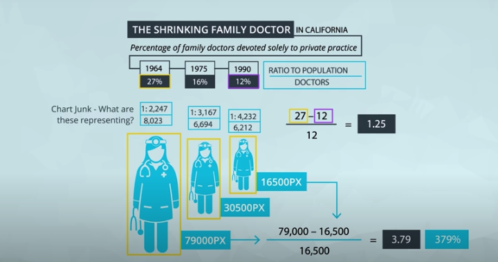
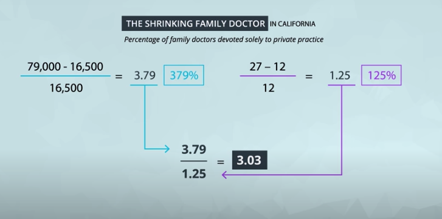
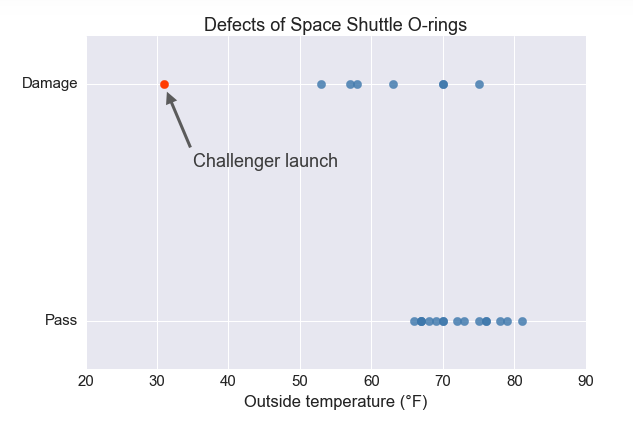
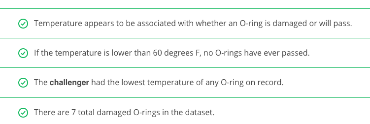
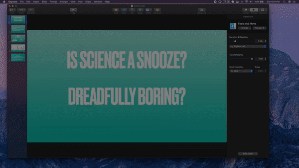

### [Introduction](https://www.youtube.com/watch?v=Q0lZkNF6O0g)

### [Lesson Overview](https://www.youtube.com/watch?v=Gg77PqkQkhs)

You can see one of Cole's seminars [here](https://www.youtube.com/watch?v=8EMW7io4rSI). She stresses that six lessons of communicating with data:

1. **Understand the context** - this means knowing your audience and conveying a clear message about what you want your audience to know or do with the information you are providing.

2. **Choose an appropriate visual display** - this was covered in the last lesson. Check out the lesson titled recap in the previous section if you need a quick refresher.

3. **Eliminate clutter** - you should only provide information to the user that helps convey your message.

4. **Focus attention where you want it** - build visualizations that pull attention to the message you want to highlight.

5. **Think like a designer** - you will learn a number of design principles in this lesson to assist as you start to put together your own data visualizations.

6. **Tell a story** - your visualizations should give the audience a story. The most powerful data visualizations move people to take action.

## [Exploratory vs. Explanatory Analysis](https://www.youtube.com/watch?v=wvgBSMks4p8)

There are two main reasons for creating visuals using data:

**Exploratory analysis** is done when you are searching for insights. These visualizations don't need to be perfect. You are using plots to find insights, but they don't need to be aesthetically appealing. You are the consumer of these plots, and you need to be able to find the answer to your questions from these plots.


**Explanatory analysis** is done when you are providing your results for others. These visualizations need to provide you the emphasis necessary to convey your message. They should be accurate, insightful, and visually appealing.

The five steps of the data analysis process:



1. **Extract** - Obtain the data from a spreadsheet, SQL, the web, etc.

2. **Clean** - Here we could use exploratory visuals.

3. **Explore** - Here we use exploratory visuals.

4. **Analyze** - Here we might use either exploratory or explanatory visuals.

5. **Share** - Here is where explanatory visuals live.

### [What Makes a Bad Visual?](https://www.youtube.com/watch?v=zbvB_9f7bFs)

Visuals can be bad if they:

1. Don't convey the message.
2. Are misleading.

This seems straightforward, but often visuals are created that do one or both of these unintentionally. There is an entire book that was published aimed at misleading visuals: [How to Lie with Statistics](http://faculty.neu.edu.cn/cc/zhangyf/papers/How-to-Lie-with-Statistics.pdf).

### [What Experts Say About Visual Encodings](https://www.youtube.com/watch?v=98aog0eVcC4)

Experts and researchers have determined the types of visual patterns that allow humans to **best** understand certain information. In general, humans are able to best understand data encoded with **positional changes** **(differences in x- and y- position as we see with scatterplots)** and **length changes (differences in box heights as we see with bar charts and histograms)**.

Alternatively, humans **struggle** with understanding data encoded with **color hue changes** (as are unfortunately commonly used as an additional variable encoding in scatter plots - we'll study this in upcoming concepts) and **area changes** (as we see in pie charts, which often makes them not the best plot choice).

### [Chart Junk](https://www.youtube.com/watch?v=3BTBEYOG2o8)

From [Wikipedia](https://en.wikipedia.org/wiki/Chartjunk), Chart junk refers to all visual elements in charts and graphs that are not necessary to comprehend the information represented on the graph or that distract the viewer from this information.

Examples of chart junk you saw in this video include:

1. Heavy grid lines
2. Unnecessary text
3. Pictures surrounding the visual
4. Shading or 3d components
5. Ornamented chart axes

### [Data Ink Ratio](https://www.youtube.com/watch?v=gW2FapuYV4A)

The **data-ink ratio**, credited to Edward Tufte, is directly related to the idea of chart junk. The more of the ink in your visual that is related to conveying the message in the data, the better.

Limiting chart junk increases the data-ink ratio.

### [Design Integrity](https://www.youtube.com/watch?v=y72_fVFtqlY)

**Design Integrity Notes**
It is key that when you build plots you maintain integrity for the underlying data.

One of the main ways discussed here for looking at data integrity was with the lie factor. Lie factor depicts the degree to which a visualization distorts or misrepresents the data values being plotted. It is calculated in the following way:


**Calculating the Lie Factor**





The delta symbol (\DeltaΔ) stands for difference or change. In words, the lie factor is the relative change shown in the graphic divided by the actual relative change in the data. Ideally, the lie factor should be 1: any other value means that there is some mismatch in the ratio of depicted change to actual change.


**Lie Factor in the Video**
The lie factor shown in the video was in comparing the largest to the smallest doctor in terms of pixels.


The number of pixels related to the largest image is 79,000 and 16,500 for the smallest. The percentage change is 27% to 12%. So, the lie factor is calculated as:


**Further Reading**
* [Flowing Data: How to Spot Visualization Lies](https://flowingdata.com/2017/02/09/how-to-spot-visualization-lies/)

#### Practice, Practice, Practice

**Calculate the Lie Factor**


The graphical effect is (146-27)/27 = 4.407, and the data effect is (39.6-35)/35 = 0.131, giving a lie factor of 33.54. Any lie factor different than **1** suggests that a **visual** is **distorting** the data. When the factor is **greater than 1**, we are **making an effect larger** than it actually is and factors **less than 1** are **hiding the magnitude** of an effect.





### Effective Explanatory Visual Recap

**What have you learned so far?**

At this point, you have all you need to make effective **explanatory visuals**. **Simplicity** is the key to displaying your message to any audience. You know

* The types of plots you can build with different variables.
* The difference between exploratory and explanatory visuals.
* Important **visual components** like **position**, **size**, **color**, and **length**.
* The importance of **design integrity**, and how to assure your visuals maintain integrity.
* The importance of **removing chart junk**.

In the upcoming concepts before the end of this lesson, you will learn about some additional effects that you can add to your visualizations. Use these when necessary, but don't overdo it.

### [Using Color](https://www.youtube.com/watch?v=6bAedqD3ilw )

Color can both help and hurt a data visualization. Three tips for using color effectively.

1. Before adding color to a visualization, start with black and white.

2. When using color, use less intense colors - not all the colors of the rainbow, which is the default in many software applications.

3. Color for communication. Use color to highlight your message and separate groups of interest. Don't add color just to have color in your visualization.

### [Designing for Color Blindness](https://www.youtube.com/watch?v=k4iTzS7t2U4)

To be sensitive to those with colorblindness, you should use color palettes that **do not move from red to green** without using another element to **distinguish this change** like **shape, position,** or **lightness**. Both of these colors appear in a **yellow tint** to individuals with the most common types of **colorblindness**. Instead, **use** colors on a **blue to orange palette**.

**Further Reading:**

[Tableau Blog:](https://www.tableau.com/about/blog/2016/4/examining-data-viz-rules-dont-use-red-green-together-53463)

### [Shape, Size, & Other Tools](https://www.youtube.com/watch?v=fzEliHW3ZLM)

**Additional Encodings**
As seen earlier in the lesson, we typically try to use position on the x- and y- axes to encode, or depict the value of variables. If we have more than two variables, however, we have to start considering other visual encodings for the additional variables.

In general, **color** and **shape** are **best for categorical variables**, while the size of marker can assist in adding additional quantitative data, as we demonstrated here.

Only use these additional encodings when absolutely necessary. Often, overuse of these additional encodings suggest you are providing too much information in a single plot. Instead, it might be better to **break the information into multiple individual messages**, so the audience can understand every aspect of your message. You can also build in each aspect one at a time, which you saw in the previous lesson with Hans Rosling. This feels less overwhelming than if you just saw this plot all at once.

**Extra: Code**
Some of the plots in this presentation were created using the programming language R, and a very popular library known as ggplot2. Though this is beyond the scope of this course, the code used to create these visualizations is provided below:

```
  install.packages('ggplot2')
  library(ggplot2)

  df = read.csv(file.choose()) #select your dataset
  df2 = head(df, 30)


  qplot(df2$Math.SAT, df2$Verbal.SAT, xlab = 'Math SAT Score',
        ylab = 'Verbal SAT Score', main = 'Average SAT Scores By College')

  qplot(df2$Math.SAT, df2$Verbal.SAT, xlab = 'Math SAT Score',
        ylab = 'Verbal SAT Score', main = 'Average SAT Scores By College',
        color = as.factor(df2$Public..1...Private..2.))

  qplot(df2$Math.SAT, df2$Verbal.SAT, xlab = 'Math SAT Score',
        ylab = 'Verbal SAT Score', main = 'Average SAT Scores By College',
        shape = as.factor(df2$Public..1...Private..2.), color = df2$stud..fac..ratio)

  ggplot(df2, aes(x=Math.SAT, y=Verbal.SAT, group=stud..fac..ratio)) +
    geom_point(aes(shape=stud..fac..ratio, color=as.factor(df2$Public..1...Private..2.))
```

### [General Design Tips](https://www.youtube.com/watch?v=Zq-wMwOfQqY)

Bad visuals can be avoided by:

1. Maintaining a large data-ink ratio and removing unnecessary items from visuals.

2. Choosing visual encodings that work to highlight insights.

3. Maintaining data Integrity in the visual.

For explanatory visuals:

1. Focus the audience's attention on the insight you want them to act on.
2. Use color only when necessary. Simple is often better.
3. Tell a story. More on this ahead!

### [Tell A Story](https://www.youtube.com/watch?v=_IdOUEhjVGI)

Telling stories with data follows these steps:

1. Start with a Question
2. Repetition is a Good Thing
3. Highlight the Answer
4. Call Your Audience To Action

### [Same Data, Different Stories](https://www.youtube.com/watch?v=jSSnkz3QT5Y)

### Quiz on Data Storytelling

***Final Quiz of the Lesson***

This final quiz won't be assessed, but consider one of the questions that was posed in one of the earlier concepts comparing student interest in science before and after attending a science camp.

My Presentation




### Recap

In this lesson, we learned

* How to build data visualizations for explanatory purposes.

* How visual encodings impact our abilities as humans to accurately perceive that information.

* How chart junk distracts from the message - maximize your data-ink ratio.

* How to calculate lie factors and the importance of design integrity.

* How to use more advanced design features like color, shape, and size - make sure these are truly enhancing your message!

* The importance of story telling in communicating with data.

**Looking Ahead - Using Tableau**

In the next lessons you will learn to use Tableau, which will allow you to build very complex visualizations. Much of what you build with Tableau in practice will allow for you and other users to explore the data. When you find an insight using Tableau, it is important to use the techniques highlighted in this lesson to communicate your insights as this is explanatory in nature!
