## [What is Tableau](https://www.youtube.com/watch?v=LeCpU8HvVg8)

## Topics Covered

There are a lot of ways you can interact with data using Tableau. This lesson is going to cover A LOT of information. Don't worry if you don't memorize where everything is stored. The goal is to gain familiarity with Tableau, so you aren't afraid to explore beyond the course materials on your own.

Even the below summary might seem overwhelming. It is just here to assist as a nice template of what is to come. Don't worry if you don't follow it all right now. That is what this lesson is for!

With that, here are the areas this lesson will cover:

### I. [Connecting to Data](#connecting-to-data-tv)
In this section, you will get started with importing data into Tableau. Tableau public has fewer options, but paid versions of Tableau are quite extensive connecting directly to databases and cloud based data storage systems.

### II. [Combining Data](#combining-data-tv)
In this section, you will learn how to connect data from multiple sources for use in your visuals. If you are comfortable with SQL joins, this section should be second nature.

### III. [Worksheets](#worksheets-tv)
The visuals you create will be stored in worksheets. This is the template we will be working in for this course.

### IV. [Aggregations](#aggregations-tv)
Tableau performs aggregations of our data by default. In this section, you will learn more about how to work with different aggregations, as well as how to break your aggregations into a more granular level of the data.

### V. [Hierarchies](#hierarchies-tv)
Hierarchies allow you to 'drill' into your data and questions at different levels. One of the easiest ways to think of hierarchies is in relation to time. You could look at your data at a year, month, day, hour, or another level. Moving across these levels is considered working with hierarchies.

You can also perform hierarchical calculations in other ways. Imagine you have different companies, with different departments, and teams within those departments. This creates a hierarchy that you might want to analyze at different levels.

### VI. [Marks & Filters](#marks--filters-tv)
Filtering is one of the most powerful techniques in creating dashboards. This relates to the marks portion of a dashboard, which controls the colors, shapes and other attributes of our data. You can think of this like a WHERE statement in SQL used to filter your data to only the parts you are interested in for a specific question.

### VII. [Show Me](#show-me-tv)
The Show Me portion of Tableau controls what your ending visual looks like. There are a lot of options here. In most cases, Tableau will guess what visual you want to create, but sometimes you might have your own ideas for implementation.

### VIII. [Small Multiples & Dual Axis](#small-multiples--dual-axis-tv)
Small multiples & dual charts are a way to visualize data that needs to share an axis for comparison purposes. [This](http://www.evolytics.com/blog/tableau-201-how-to-make-small-multiples/) and [this](http://kb.tableau.com/articles/HowTo/dual-axis-bar-chart-multiple-measures) are great articles for explaining how these two parts of Tableau work and why you might use them.

### IX. [Groups & Sets](#groups--sets-tv)
Groups and sets are two ways to categorize our data within a visualization. The difference between these two can be confusing, but we will see when and why you would use each.

### X. [Calculated Fields](#calculated-fields-tv)
Often you might add these fields to your dataset before adding your data to Tableau, but sometimes you want to add them to a visualization on the fly. Many of these calculated fields are things you have probably done in a spreadsheet application like finding a total or a cost per item.

### XI. [Table Calculations](#table-calculations-tv)
Table calculations are often used to perform comparisons of our data over time or between groups. A great article on table calculations is available [here](https://www.tableau.com/about/blog/2017/2/top-10-tableau-table-calculations-65417).

---

## [Connecting to Data](https://www.youtube.com/watch?v=WmsAtqbwRI0) :tv:

[:top:](#)

Tableau guesses if numerical data is discrete or continuous and indicates this with color, **blue for discrete** and **green for continuous**. You'll see this color coding again later.

With string columns, you can do some simple transformations such as splitting the data into multiple columns. For instance, the Order IDs have three parts separated by dashes. You might want individual columns for each of these parts. To split the column, click on the little triangle in the column header.

This does an automatic split where Tableau guesses the character separating the parts, a dash here. You can also do a custom split (select Custom Split... instead) to choose a different character to split on.

In the drop down menu, you'll also see Create Calculated Field.... This lets you create new columns from existing columns. You can check it out in Tableau or read more about it [in the documentation](https://onlinehelp.tableau.com/current/pro/desktop/en-us/calculations_calculatedfields.html), but I'll cover calculated fields in detail later.

### View data

Something I find useful often is being able to quickly preview the data in a table. If you hover over one of the sheets, an icon appears to the right. Clicking on this lets you view the data.

## [Combining Data](https://www.youtube.com/watch?v=7KICenO-lKc) :tv:

[:top:](#)

If you are using Tableau version 2020, the steps may be slightly different. You can still use joins to connect to the data. There is just one extra step to reach the joins/unions canvas.

First, drag your table on the data pane, this will create a logical table(used for relationships)

Then double click on the table(on the data pane) to open it. This will by default open the physical table to perform joins.

Here is the [Tableau Article](https://help.tableau.com/current/pro/desktop/en-us/joining_tables.htm) with detailed information on how to perform joins on tables in the new version of Tableau. Check the content under **Combine tables from the same database** section of the article.

### Combining Data Recap

**Combining data**

Often you're going to want to combine data from multiple sources, such as different tables in a database or sheets in an Excel file. For example, you might want to include the information from the People sheet with the Orders sheet so you can analyze the performance of each salesperson.

In Tableau, you can do this by dragging multiple sheets into the top panel. You get two different outcomes depending on where you drag it, a **union** or a **join**.

**Union**

If you drag People below Orders, you get a union. **Unions stack the data on top of each other, the second sheet ends up being appended to the end of the first sheet**. This works great if you have multiple sheets with columns in common as the columns will match up. However if the columns are different, then you'll get a lot of "nulls" because columns are created for both sheets, but the first sheet doesn't have data for the second sheet's columns.

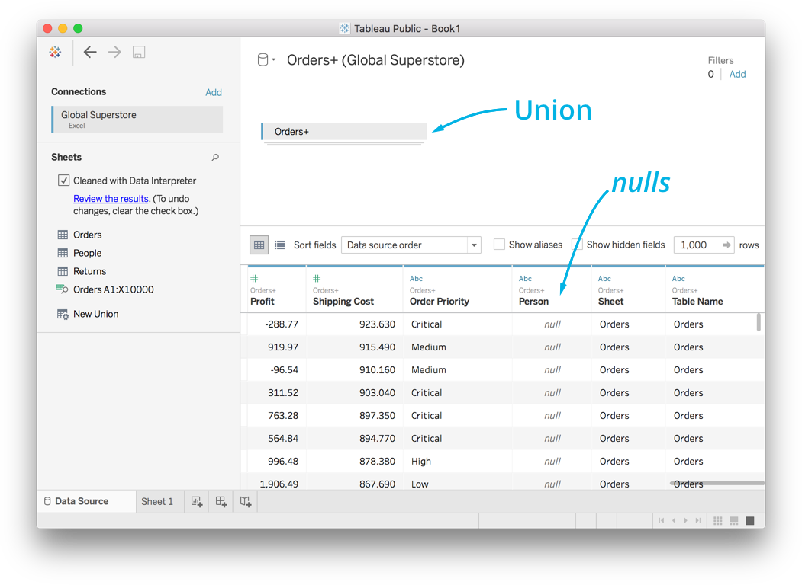

**Joins**

If you drag the second sheet or table to the top panel but not on top of the first sheet, you'll get a join. Instead of stacking the data on top of each other, **joins combines data from the sheets based on common values**. In our case, both Orders and People have a column Region that we can use for the common values.

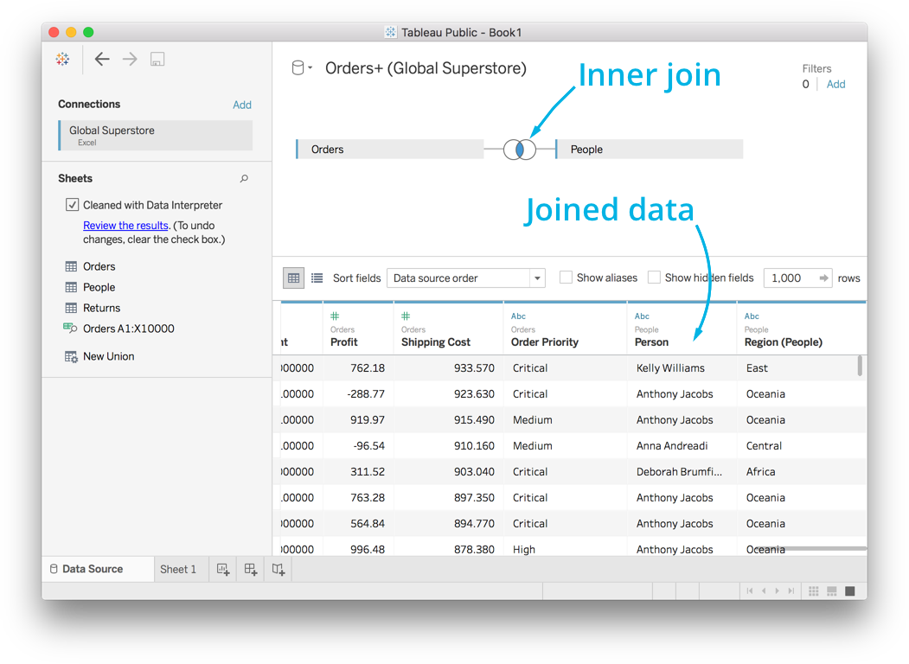

Tableau does an **"inner join"** by **default**. This **combines** the data wherever there is a **common value**. So when Region in Orders is "East", it takes the data from People where Region is "East". Above you can see the Person column from People has been added to the data from Orders.

You can click on the join symbol to change the type of join being performed. In this case you can also select the "left inner join."

The **normal inner join** combines **only data** that is **common**,

but - The **left inner join** returns **all** the **data** **in the original sheet** setting **rows not common** to **null**.

It's important to understand joins because you'll be combining data often. Here's the [Tableau documentation](https://onlinehelp.tableau.com/current/pro/desktop/en-us/joining_tables.html) on joins, which I suggest you read if you haven't encountered joins before.

>**When would you want to use a UNION instead of a JOIN?**
To combine two sheets stacked on top of one another that have all the same columns.

**LEFT JOIN, OUTER JOIN, INNER JOIN**

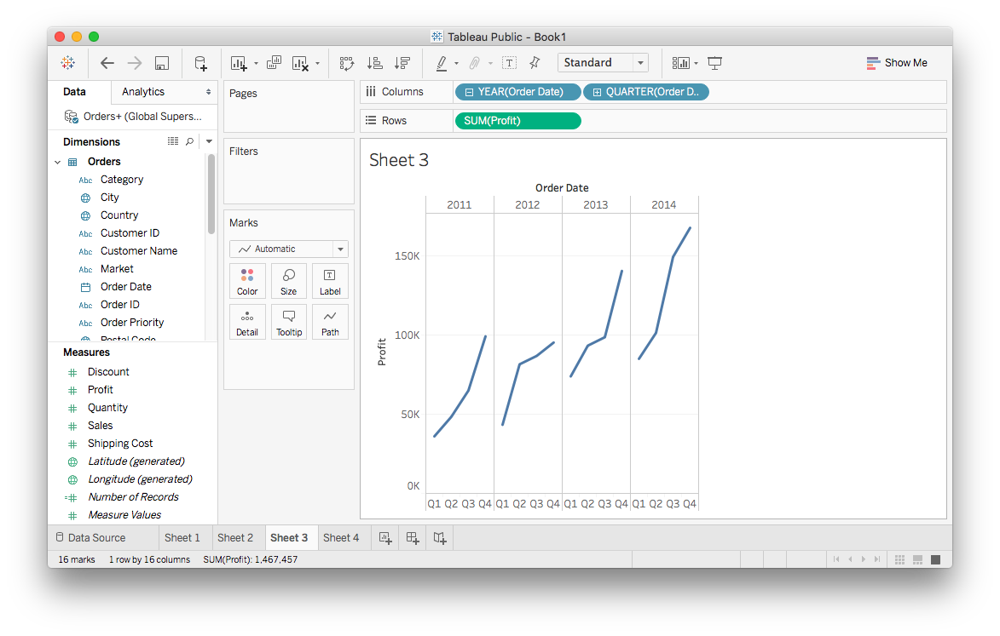

### [What Can You Create In Tableau?](https://www.youtube.com/watch?v=gNqIvf5iJA8) :tv:

There are three main products that you can create using Tableau:

1. Worksheets

2. Dashboards

3. Stories

This lesson is focused on creating worksheets, which are the core of creating dashboards and stories. You will learn to create dashboards and stories in the final lesson of this course.

## [Worksheets](https://www.youtube.com/watch?v=2xRKvQTRtlk) :tv:

[:top:](#)

### Sheet interface

On the left you’ll see your data columns (also called "fields"), split between dimensions and measures.

**Categorical, qualitative, and time data** are listed as **dimensions**.

**Quantitative numerical** data is listed as **measure**.

Tableau automatically detects the data type in each column and splits them up accordingly.

You'll notice the dimensions are colored blue and the measures are green. This is the same color coding you've seen before, **blue for discrete data** and **green for continuous data**. **Remember that discrete data** can only be certain values **like integers or categories**, while **continuous data can be any value**.

**Dimensions aren't required** to be discrete and measures aren't required to be continuous. You can convert discrete data to continuous in some cases, such as with time. Right click the field, or click the little triangle to bring up the menu. You can’t do this with categorical data because it can’t be continuous. You can also convert continuous data to discrete.

Tableau **automatically aggregates measures**, but not dimensions. That is, it does calculations like sums and means. **Dimensions are used to group** the data and **set the level of granularity**. You’ll learn about aggregation and granularity next, so don’t worry if you don't know what these mean yet.

**Making your first plot**

You can select the data you want to plot by dragging the fields to the columns or rows shelves. When you drag a discrete field to Columns, it creates a discrete axis. When you use a continuous field, it creates a continuous axis. You can also drag the fields directly onto the sheet.

To start with, you can look at the number of records for each market. Drag the Market field to the Columns shelf.

You'll see in the rows shelf the Number of Records field turned into a little pill that says `SUM(Number of Records)`. This is called an aggregation, it is aggregating the data for each market and summing the values. You can hover over the bars to see the exact sum for each market. (Try this yourself!)

>In general, this is how you will make most of your plots, dragging dimension and measure fields to the shelves. You can also remove fields from the plot by dragging the pills off the shelves.

From here you can also sort the bars by clicking on the sort icon on the axis.

The reason for using 1 in step 3 is that each 1 is a representation one record in the data. So, when you drag it to the rows pane, the calculated field `"Number of records"` takes an aggregate form of the sum which gives us the total number of records for each market.

Secondly, You can also use `Orders (Count)` measure, which is the same as the Number of Records. However, instead of using sum (number of records), you need to use count as the aggregation for Orders(count).

### [Aggregations](https://www.youtube.com/watch?v=4nGL3y3Nq-0) :tv:

[:top:](#)

**Aggregation and Granularity**

Let's start making some more complex plots. The first thing we'll do is create a simple scatter plot to see how some measures are related. I expect that the more items sold, the higher the profit will be, so let’s look at **profit vs quantity**.

Try it out yourself. You see just one point! What’s going on? Why isn’t there a point for each record in the data set?

**Aggregation**

When I was first learning Tableau, I couldn't understand why I was only seeing one point when I thought I'd see a bunch of points. The answer is how **Tableau aggregates the data**. You should see in the pills that Tableau is taking the sums of Quantity and Profit. This is called an aggregation. It is *summing Quantity and Profit over all records in the data set*, this is why you are seeing only one dot. There is one sum over all the records for Quantity and one sum over all the records for Profit.

The kind of aggregation you're doing can be selected by right clicking on the pill or clicking the triangle. To change the aggregation method, select Measure then Sum, Average, Median, and others.

**Granularity**

**To get more points**, you need to **increase the granularity**. That means you need to aggregate not over all the records, but over something like categories. For instance, you can drag Market to “Detail” in the Marks card.

You should see seven dots, one for each value in Market. You’ve increased the granularity, Tableau is aggregating the data over each market now. You get sums of Quantity and Profit for each one. The aggregation hasn't really changed. **It's still the sum of quantity and profit, that sum is just now being calculated at a different granularity**.

### [Hierarchies](https://www.youtube.com/watch?v=wl_AM-spH68) :tv:

[:top:](#)

**Hierarchies**

Try this: Create a new sheet, drag Order Date to Columns and Profit to Rows. You should see a line plot, this is Tableau's default for time data. There is a little plus symbol on the Order Date pill now. Click it and see what happens.

What you've done here is "drill down" into the hierarchy starting with the yearly data then grouping it by quarter. Tableau automatically makes a hierarchy of time periods from date and time data fields. As you drill down, you get more fine divisions, from year, to quarter, to month, then day.

You'll notice the pills have a little minus sign in them now. Clicking on it will go back up the hierarchy.

You can remove levels of the hierarchy from the plot by dragging the pill out of the shelf. For instance, if you drill down to Month then remove Year and Quarter, you'll see something like this:

It might not be what you expect here, I expect this to show the monthly profit over the four years in the data. However, there is only one value for each month. Tableau is doing this because Order Date has been set to the discrete data type, so it's aggregating the Profit values for each month. **That is, each value is the sum of Profit for that month over the four years in the data**.

However, I'd typically like to see this as one long line over all four years. To change how this is being plotted, you need a continuous axis and to convert Order Date to continuous data. One thing you can do is to open the Order Date field menu (right click, or left click the triangle) and select "Convert to Continuous".

You can also open the menu on the Month pill and convert it to continuous from there:

If you select "Month" in the continuous section, it'll switch to a view with the monthly profit over the whole time range. Try it yourself.

You should see a plus sign in the pill, this will also let you drill down further so you can see weekly profit. However, there is no minus sign now, so you can't go back up the hierarchy from there.

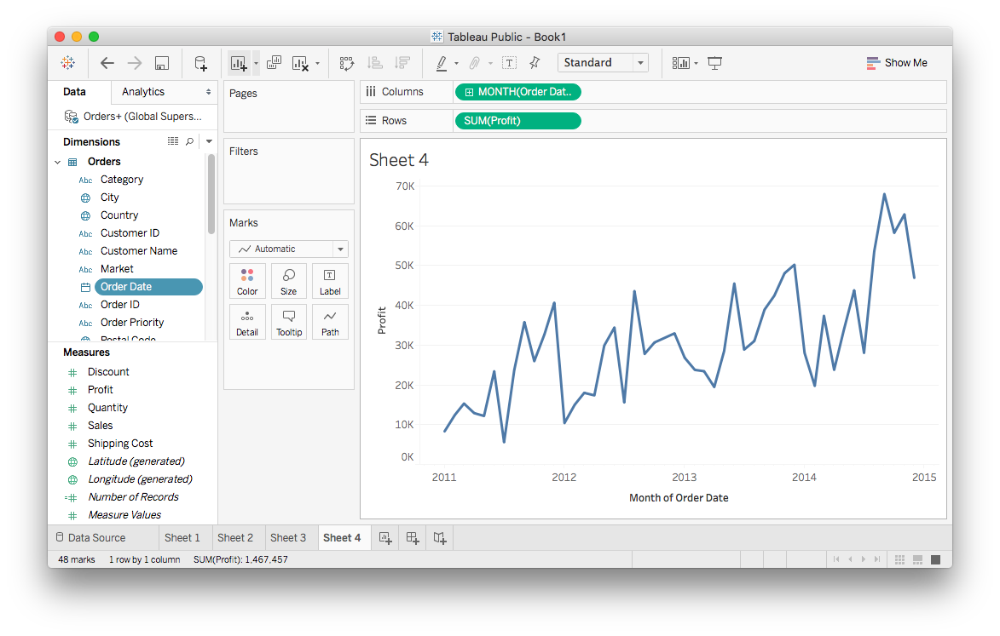

**Manual hierarchies**

Tableau created the hierarchy from the date automatically, but you can also create your own hierarchies. For example, each value in Sub-Category belongs to one in Category. For example, a record with the Sub-Category value "Bookcases" always has a Category value of "Furniture." There is a hierarchy here where the Sub-Category values branch out from Category values.

You can make a hierarchy by selecting both Category and Sub-Category (control/command-click both fields), then opening the menu and selecting `Hierarchy > Create Hierarchy...`

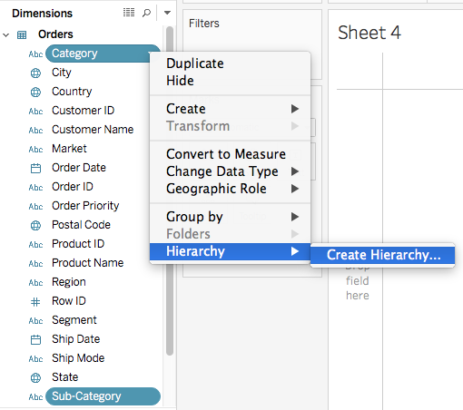

Now you can create a new hierarchy and give it a name. I named it "Categories". It shows up on the left and you can drag it to the shelves just like a normal field. But now it starts with "Category" with a plus sign, you can drill down to "Sub-Categories."

## [Marks & Filters](https://www.youtube.com/watch?v=FeYRmZHHu0A) :tv:

**Marks options**

Often, you’ll want to include more dimensions in your graph. You can do that through the `Marks card`. It has options such as color, size, and shape. You can add dimensions to the plot (**increasing granularity**) by dragging **dimensions or measures to the Marks shelf**.

**Color**

Most often you'll be encoding data with color. This is easily done in Tableau, simply drag the field to "Color" in the Marks card. Below I made a line plot of the monthly profit, split up by Segment.

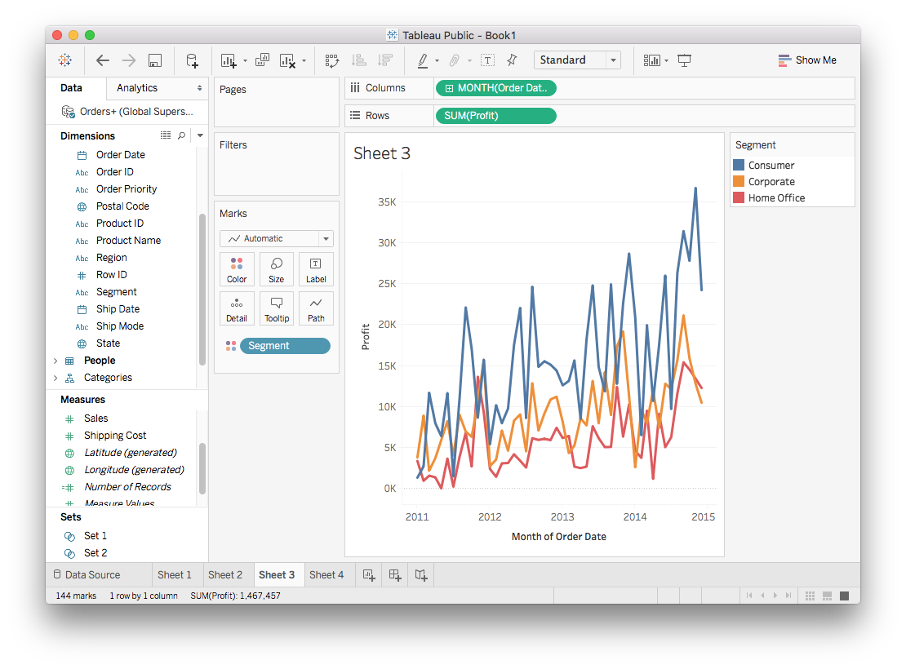

**Color options**

Clicking on "Color" in the Marks card lets you change the color palette used to encode the data.

In the menu, you can select the palette then click "Assign Palette" to change the colors and click Apply or OK to make the change. It's possible to change individual colors too, just click on a data item then on a color in the palette.

Color is great for encoding data on maps too.

Color is one of the most important factors for making attractive and understandable visualizations. In the recent update to version 10, Tableau (the company) spent a lot of time getting it right. You can read about their efforts [here](http://www.tableau.com/about/blog/2016/7/colors-upgrade-tableau-10-56782).

**Size**

Dragging a field, either discrete or continuous, to "Size" will encode the data in the size of the markers. **You'll most often use** this encoding in a **scatter plot**, commonly known as a **bubble plot**.

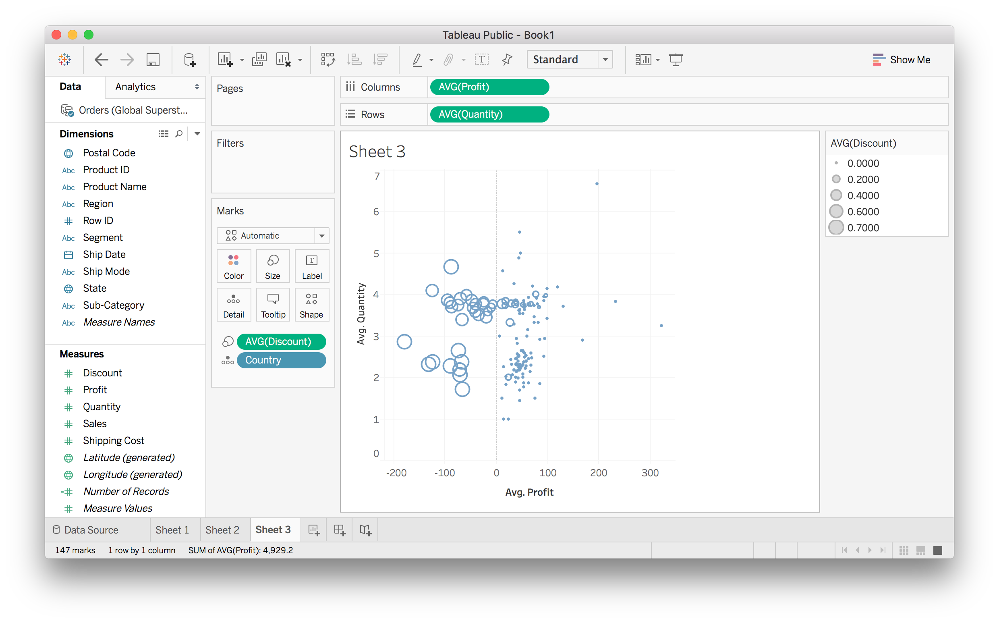

Above I made a scatter plot with average quantity vs average profit for each country. I encoded the average discount using the size of the markers, it's clear that discounts are responsible for the countries with negative profits.

As with color, if you aren't encoding data with size, you can set it by clicking on the Markers card and moving the slider.

**Shape**

As with color and size, you can use the shape of the markers to encode data. You'll want to **use discrete data only** for this. Also, if you have too many categories the shapes are too difficult to identify.

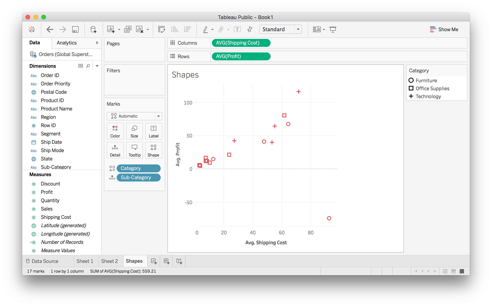

You can set the shape if you aren't encoding any data with it.

**Other Cards**

The "Detail" card allows you to bring in a field without any visual encoding. This enables you to increase granularity without adding any graphical effect.

The "Label" card adds in labels for all of our markers.

**Filters**

One of my favorite features of Tableau is the ability to quickly make interactive filters. This way you can view only the data you're interested in and allow your users to do the same.

**Filtering basics**

There are a few different ways to create filters. First, you can make a filter directly from the view. Suppose you have something like the image below where there are a lot of visual elements and you want to pare it down.

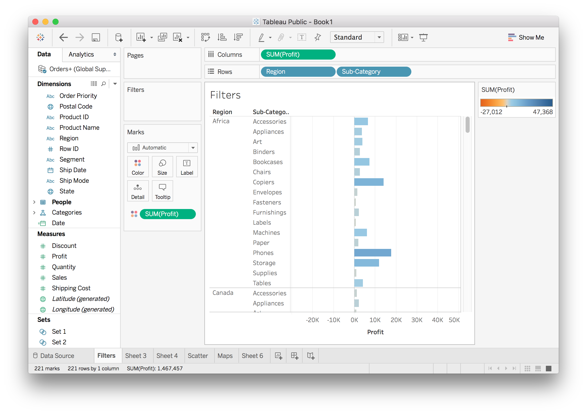

You can filter directly from this view by selecting the data, right clicking to open the context menu, and creating a filter. I chose a few categories I wanted to keep.

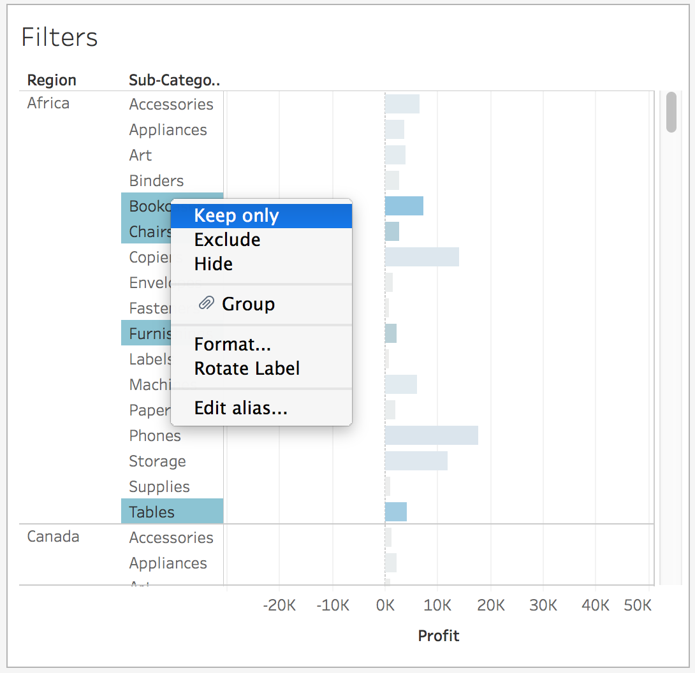

Above you see I can select "Keep only" which filters out everything other than the selected values. I can also choose to exclude the selected values. I'm going to choose "Keep only" here.

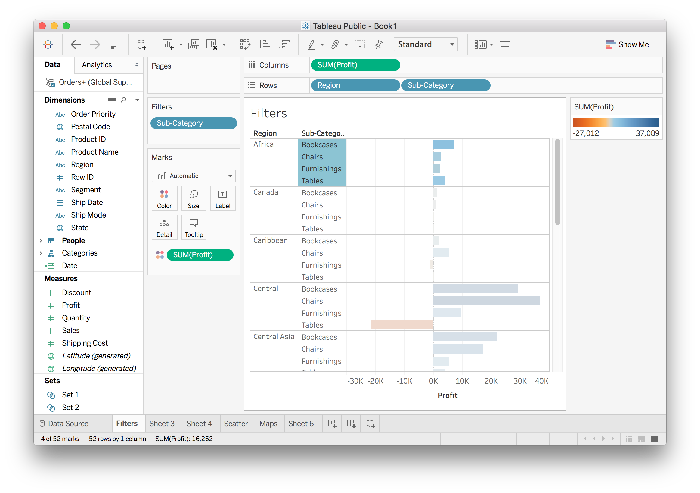

There is now a Sub-Category pill in the Filters shelf since I am filtering on that field. Now there are still a lot of regions, so I'm going to choose only a few to look at. Filters can also be created by dragging a field to the Filters shelf.

If you do this too, a menu should pop up. There are four different tabs here that let you filter in different ways. Here I'm just going to select four of the regions.

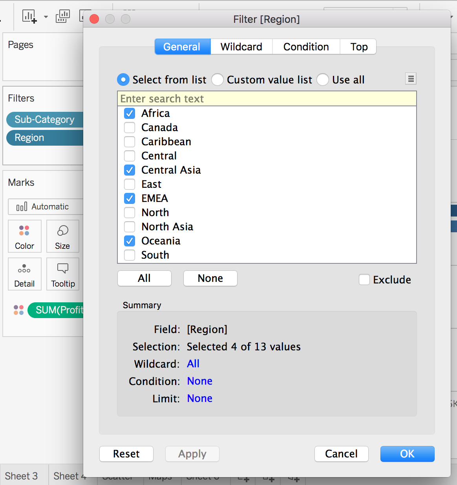

And finally, this is what it looks like with everything filtered.

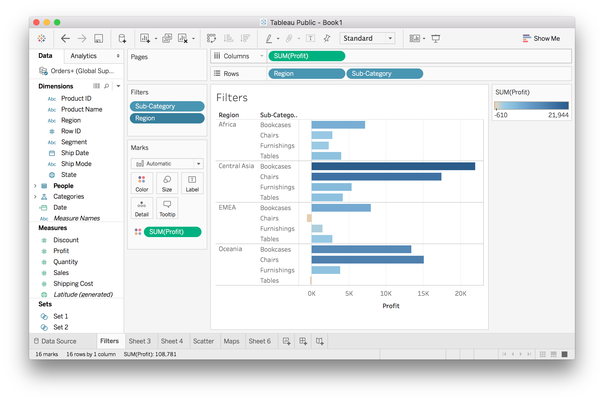

**Interactive filters**

This is a static filter which you set in the menu and if you want to change it, you have to go back into the menu. Tableau does something cool here. It lets you make the filter interactive and control it from the view.

To do this open the menu on the Region pill in the Filters shelf. You should see this:

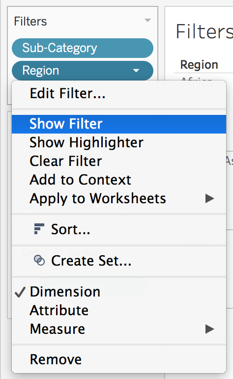

Clicking "Show Filter" brings out a control for the filter (you can see it on the right in the image below).

You can change the way you control the filter by opening the menu on the controls, click the little triangle.

Try out the different options to see what they do. I chose the Multiple Values (dropdown) to save on screen space.

Now it's a dropdown menu where I can select the regions I want to see in the view.

**More on filters**

Interactive filters like these are one of Tableau's most powerful features. Tableau has a series of great tutorial videos going into more detail which you can find [here](http://www.tableau.com/learn/tutorials/on-demand/using-filter-shelf). You might have to create an account, but you'll want to anyway, there are a lot of excellent tutorial videos.

* **Size is frequently a last option for visual encodings.**
* **Position and length are the best encodings.**
* **Color and shape are next,**
* **but using areas and size can be hard for an audience member to understand.**

* **Double encoding** is handy in drawing our eyes to the categories that had negative profits.

## [Show Me](https://www.youtube.com/watch?v=Jpk99mgmwaA) :tv:

[:top:](#)

From there you can customize the graph. Show Me is usually a good start once you decide what you want to look at or show. Feel free to take some time to play around with the Show Me panel, there are a lot of different plots you can make.

## [Small Multiples & Dual Axis](https://www.youtube.com/watch?v=bx6MxsoDqsI) :tv:

[:top:](#)

**Small multiples**

Small multiples are one of my favorite visualization techniques and Tableau loves them too. Simply dragging multiple dimensions to the Columns and Rows shelves creates a small multiple. You saw this before when learning about hierarchies.

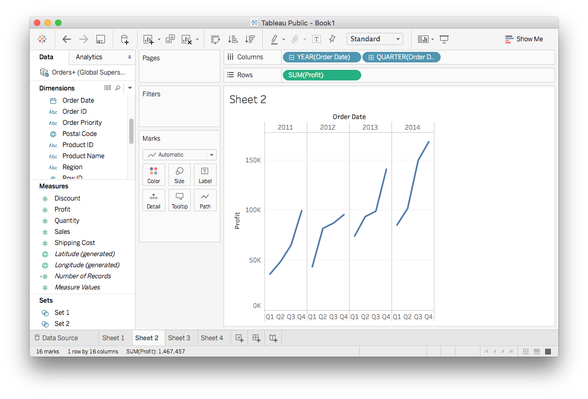

Here we have four separate plots showing how the profit grows each quarter through the four years in the data set. You'll notice the plots are distributed horizontally due to the Order Date fields in the Columns shelf.

But, what's driving this growth? Maybe one category is the profit leader. You can see this by dragging Category to the Rows shelf. This will create more plots with the data split by Category distributed vertically.

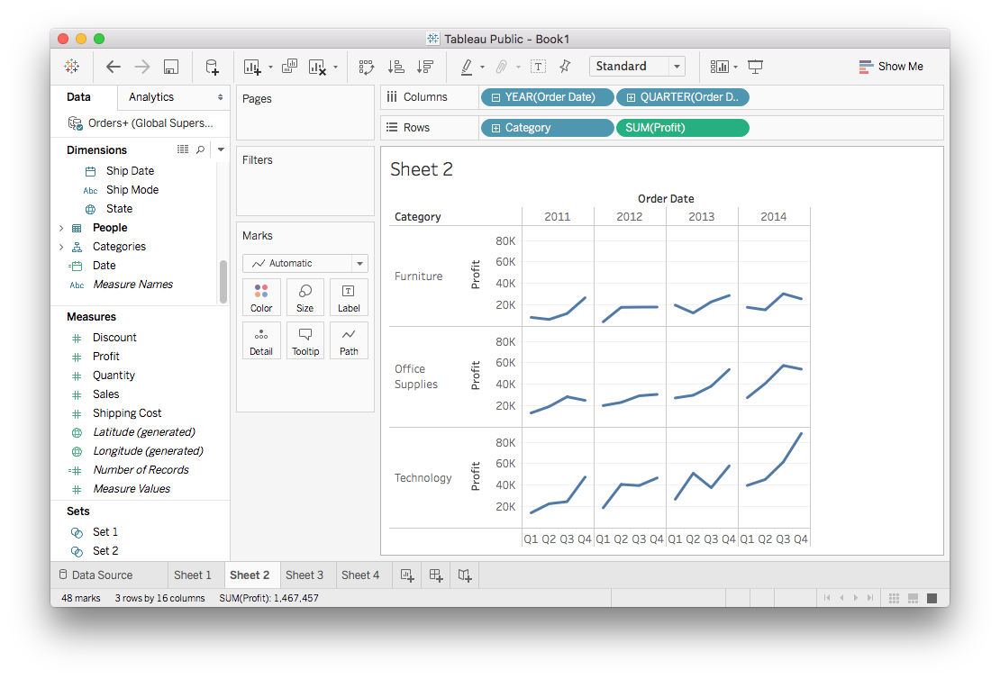

**Dual Axis**

Sometimes you'll want to compare two variables on one plot. If you drag two measures to the Rows shelf, you get two plots instead of one. For example, let's try plotting both the profit and sales on one figure. Drag Profit and Sales to the Rows shelf, you should get something like the image below.

Here you get two plots, but we really just want one. You can convert this to both lines on one plot by opening the menu one of the measure pills and selecting `"Dual Axis"`.

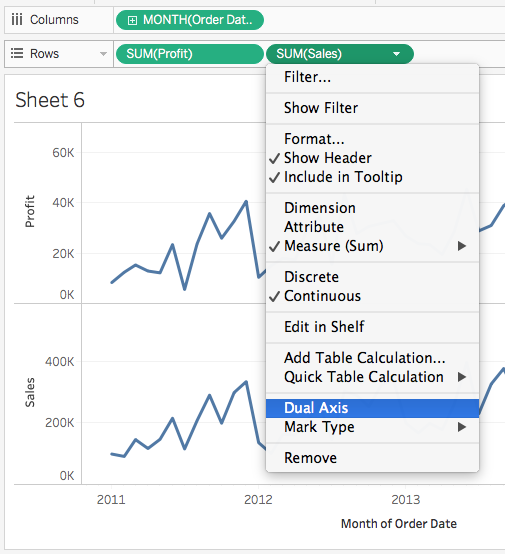

It should look like this:

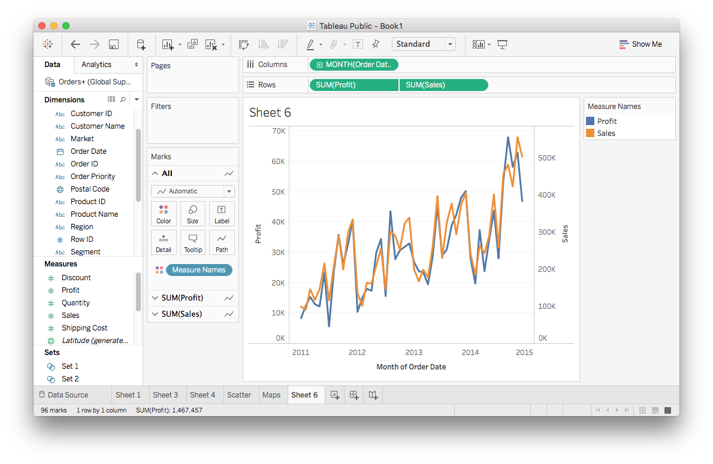

You can do a little shortcut by dragging the second measure to the right side of the view.

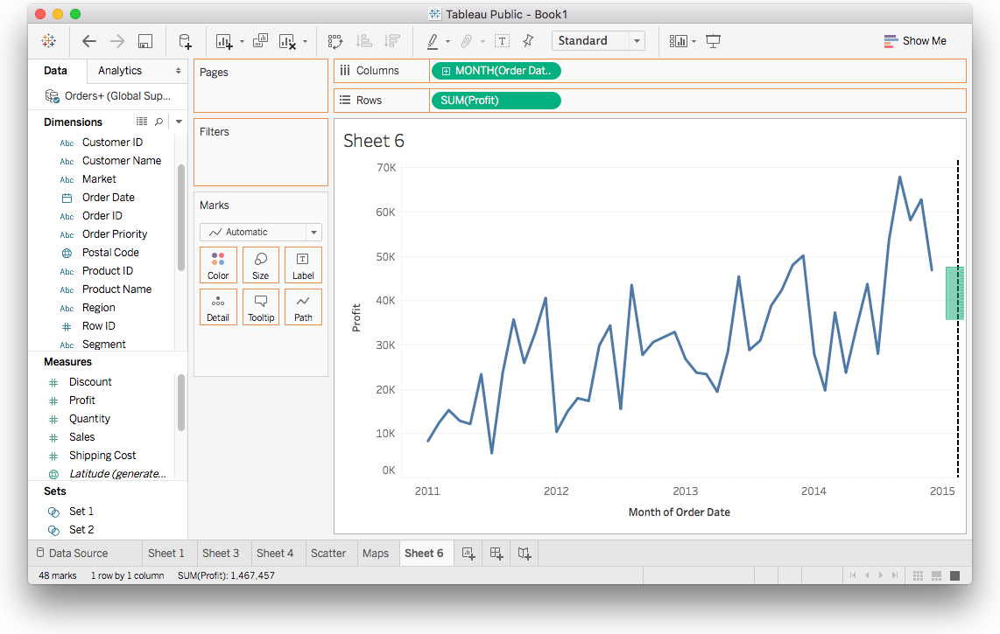

**[The slippery slope of dual axis](https://www.perceptualedge.com/articles/visual_business_intelligence/dual-scaled_axes.pdf)**

## [Groups & Sets](https://www.youtube.com/watch?v=Yb-91NVNgTA) :tv:

[:top:](#)

**Groups and Sets**

Tableau has two different methods for grouping together data, groups and sets. They are similar but have differences I'll go over.

**Grouping data points together** can help **illuminate your message**. For instance, if you want to point out the products that are losing money, you'd want to **create a group** of those products and **color them separately** from the positive profit products.

**Groups**

Groups are **typically created from the view by selecting multiple data** points in the view. For example, I wanted to look at the average quantity sold and average profits for the countries in the data set. You should follow along with me so you can get some experience creating groups and sets.

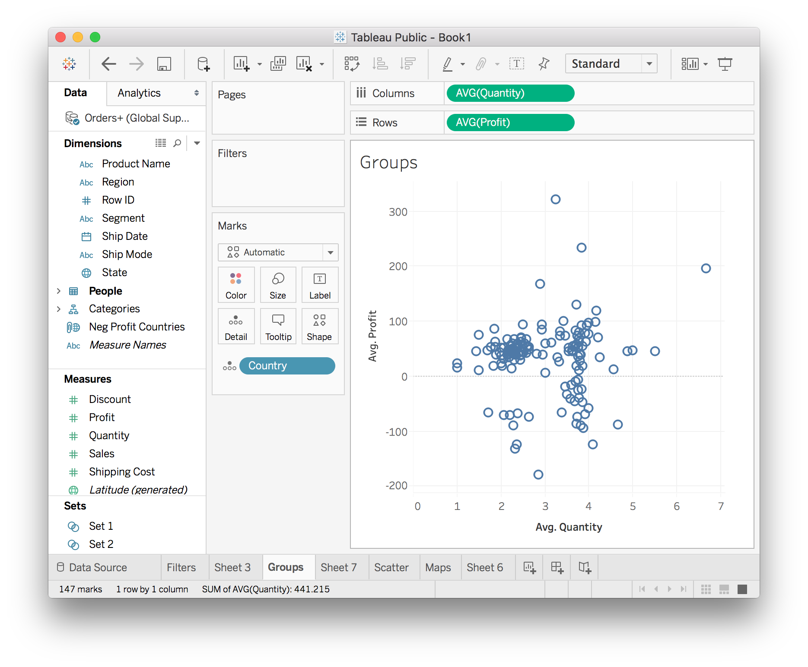

There's something interesting here, it looks like there are two clusters with different average quantities. You can look more into this by grouping together one of the clusters and doing more visualizations. To select the data points with low average quantity, hold down the mouse and drag a box around the left cluster. Then you can either hover over a point and a small menu will pop up, or right click on a data point and a large menu will pop up.

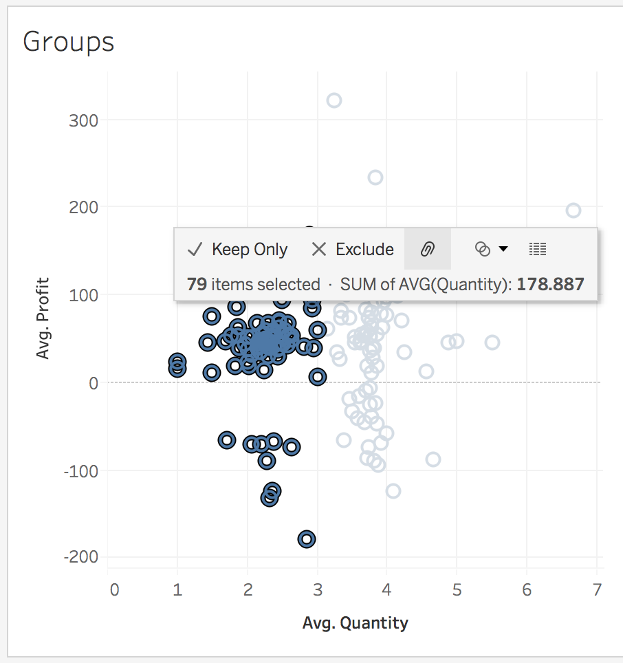

From the hover menu, you can create the group by clicking the link icon (it looks like a paperclip to me). From the right-click menu, select "Group". You should see something like the image below.

Now there is a group called Country (group) 1, this is the group you just created. I renamed the group to "Low Quantity Countries". The group is really just a list of the countries you selected in the view as you can see below in the "Edit Group" menu.

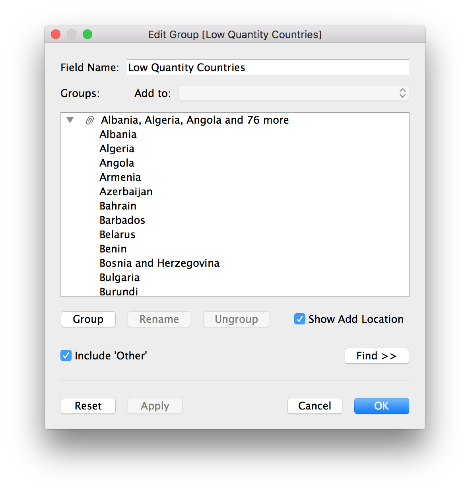

Now that you have the group created, you can use it in other sheets. For instance, create a map that shows how the low quantity countries are distributed in the world.

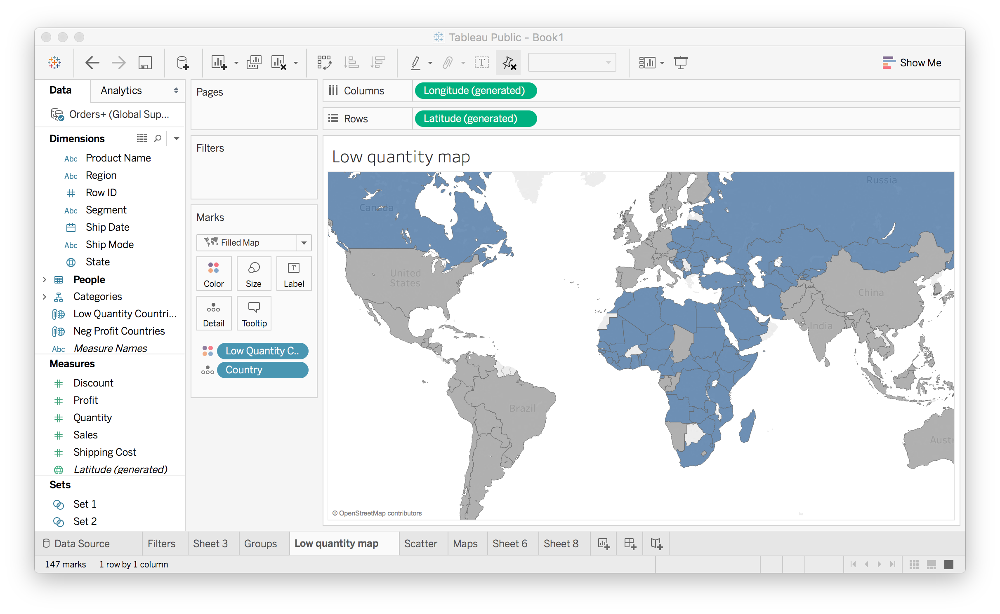

Here I used the group we created (Low Quantity Countries) to color the map. The blue countries are the ones in the group, the ones with low average quantity. It's apparent that most of these countries are in Africa, the Middle East, and Eastern Europe.

**Sets**

Sets are similar to groups in that you can select data points and create a set from them. However, **sets can be dynamic** where the members of the set will change as the underlying data changes. **Groups** on the other hand are **static**, the members will always be the members.

For example, say you want to see how your poor performing products are affecting the overall profits. You can create a set from the product names or IDs which lose money, where the average profit is below zero. To create the set, open the menu for the Product Name field and choose C`reate > Set...`

This will bring up the menu for editing a set. Click the `"Condition"` tab. Then select By field: `Profit Average < 0` as seen below.

This will create a set of products where the average profit is less than zero. We can use the set in plots to encode these products that are losing money. Let's look at the total profits for the different sub-categories of products.

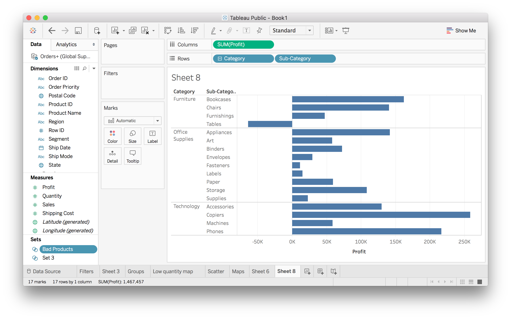

With the set you just made, you can split these bars into losses and gains.

The red bars are showing how much money is lost due to the bad products. It looks like Office Supplies products are almost all winners, but Furniture is losing a lot of money.

You might group items for lots of reasons. **Most often it occurs when you find a certain observations in a histogram or scatterplot, and you want to see how they are related to other parts of your data**.

## [Calculated Fields](https://www.youtube.com/watch?v=tR-K9Mvd4B0) :tv:

[:top:](#)

**Calculated fields**

There will be times when you want to look at something but there isn't a specific field for it. For instance, maybe you want to know the profit per item for each order record. It seems pretty simple, just divide profit by order for each record, then aggregate it, but how do you actually do the division in Tableau?

The answer is calculated fields. **Calculated fields** let you create new fields to use in your visualizations. If you have experience working with **formulas in Excel**, creating calculated fields should feel pretty similar.

To create a calculated field, open the menu on a field (such as Profit), then `Create > Calculated Field....` (See below). You can also create one by clicking on `"Analysis"` in the top menu bar, then selected `"Create Calculated Field..."`

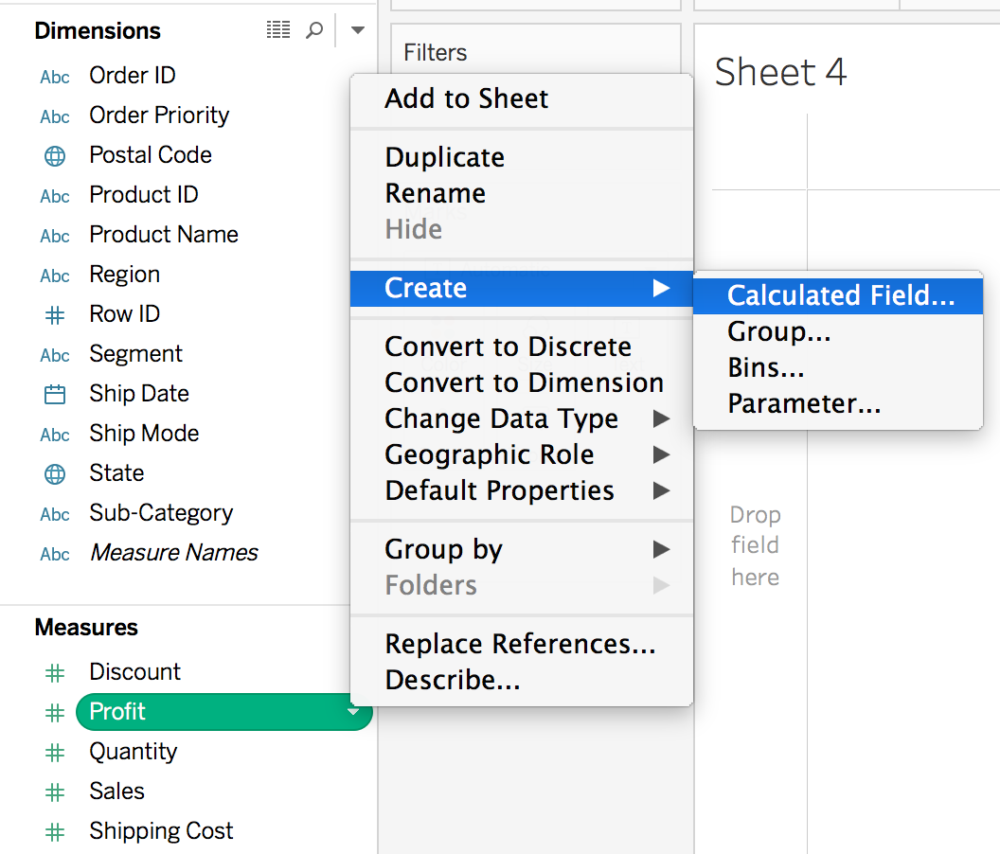

You should see the editor:

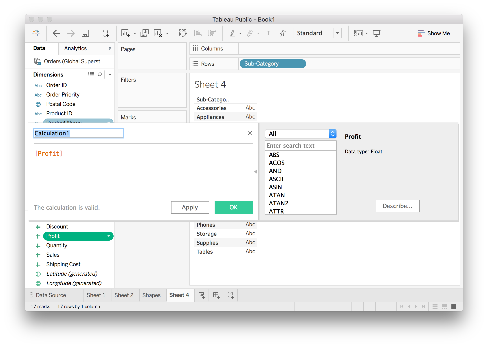

If you don't see the functions panel, click on the little triangle on the right edge of the editor.

Fields in the editor show up in brackets, like [Profit]. You can do simple arithmetic here, like adding a constant, or multiplying the field. You can also use functions such as absolute value, sine, square root, etc. If you want to make a field all positive, you'd do ABS([Profit]). There is a list of functions on the right and some short documentation is shown when you select one.

Here we want to create a new field that calculates the profit per item for each record. It's pretty simple, just `[Profit]/[Quantity]` which I've done below. I also renamed the calculated field to "Profit per item".

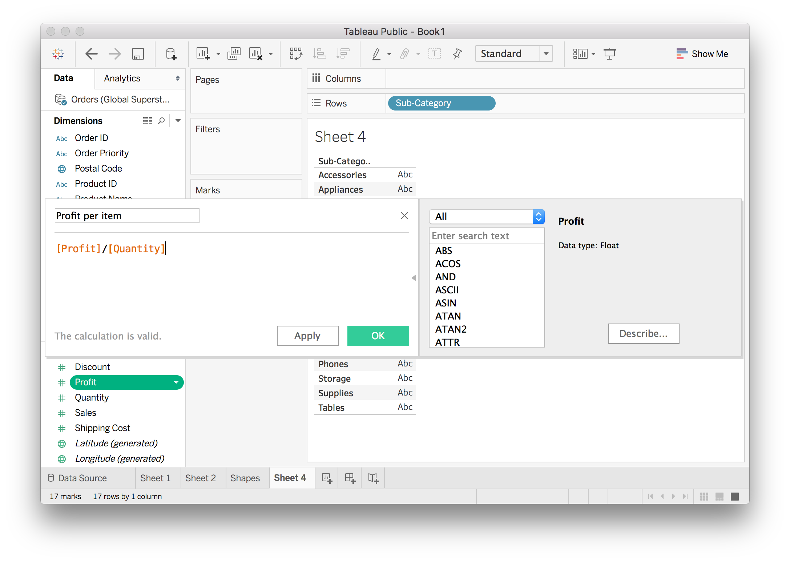

Once you hit "OK" and create it, the new field shows up in the data pane. You can use it just like any other field. I made a plot of the average profit per item for each sub-category.

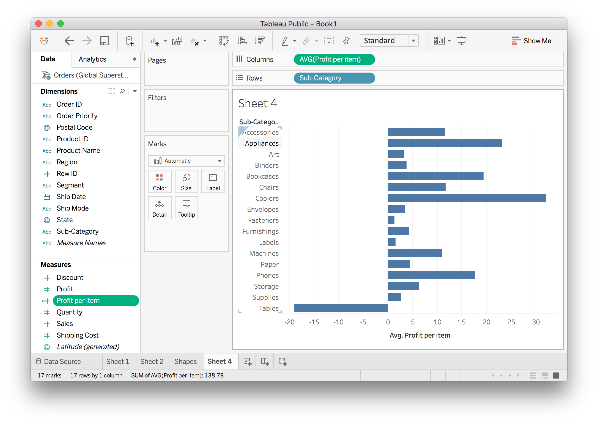

You can see the Profit per item field on the left. The little equals sign `=#` next to the name means it is a calculated field. Now this field has the profit per item for each record. We want to know the average profit per item for each sub-category, so drag it to Columns and do an average aggregation.

**Aggregation in Calculated Fields**

You can also do aggregation directly in a calculated field. For instance, we can also calculate the profit per item by `SUM([Profit])/SUM([Quantity])`. The SUM() functions are aggregations just like you do with fields in views.

The two methods for calculating the profit per item look basically the same, but there are some discrepancies like in "Tables". I'm going to look at this a little closer so you can see how Tableau works a bit better.

If I expand the table to products...

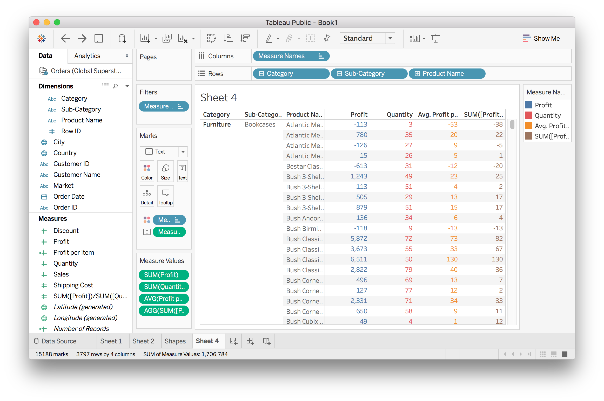

Now we see there are some weird things going on. A lot of the results from the two methods are extremely different. The third product has a profit per item of $9 or -$5. Looking at the values of Profit and Quantity, it appears that the aggregation method `(SUM([Profit])/SUM([Quantity])` is doing the right thing. I'll dig down to individual records to see what's happening.

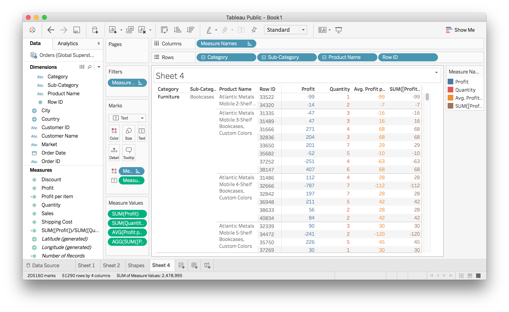

At the row level, the two calculations are the same. It's the averaging of the `[Profit]/[Quantity]` calculation that is causing the difference. For the the "Atlantic Mobile 4-Shelf Bookcases" product, all the ratios are correct. But when you average them, (28-112+28+42+28+42)/6 = 9.333, you get what we see at the product name level.

The aggregation in the other calculation takes care of that for us. It always calculates the ratios for the level of granularity we're at. You can see the columns Profit and Quantity doing the summation at the level of granularity and the ratio `SUM([Profit])/SUM([Quantity])` is taken from those numbers.

The two calculations are answering different questions.

1. What is the profit ratio for a single order within any product or any other category level?

* Use Average `[Profit]/[Quantity]`

2. What is the profit ratio at any level of a category?

* Use `SUM([Profit])/SUM([Quantity])`

It's important to make sure you are answering the right question when working with data!

**Conditional statements**

As in Excel and most programming languages, you can use conditional statements like `IF`, `THEN`, `ELSE` in calculations. For example to make a new field to categorize sales as "good" and bad", you could do:

IF `SUM([Sales]) > 10000 THEN "Good" ELSE "Bad"`

You'll use this pattern a lot, there is a short hand version with the function `IIF`. The function works like `IIF(conditions, if true, if false)`

`IIF(SUM([Sales]) > 10000, "Good", "Bad")`

**Calculations with strings**

Much of the time you'll find yourself working with strings (text) like the product names in this data set. In calculations, you can do things like split up words in a string, find words in a string, and concatenate strings.

Here's a great [tutorial video from Tableau](http://www.tableau.com/learn/tutorials/on-demand/string-calculations) and a [blog post](http://www.clearlyandsimply.com/clearly_and_simply/2014/06/string-calculations-in-tableau.html) with a bunch of in depth examples.

**More on calculated fields**

There is a lot to learn about calculate fields that's outside the scope of this lesson. If you want to know more about calculated fields, the Tableau [documentation](https://onlinehelp.tableau.com/current/pro/desktop/en-us/calculations_calculatedfields.html) is a great place to start. As you're working with Tableau, be sure to visit the documentation often.

## [Table Calculations](https://www.youtube.com/watch?v=VJfCNO0J9jY) :tv:

[:top:](#)

**Table Calculations**

Table calculations can be really useful for helping you to compare the data that exists in a plot to other parts of the plot. This is easier to understand by just doing it - so let's look at an example.

Let's compare the amount of profit from one market to the next.

Great, but what if we want to compare the percent of profits from each market to the total profit.

This can be done by doing a Table Calculation. Select the drop down associated with SUM(Profit), and select Quick Table Calculation... > Percent of Total. Alternatively, it could be useful to look at compounding profit, which is also easily done from the same menu.

A lot of table calculations work well for line plots. Let's take a look at an example. Add the Order Date to the Columns and Sales to the Rows. Make sure the Order Date is continuous. Drill down to the Quarter level, and select Quick Table Calculation... > Percent Difference.

In order to get a better idea of how things are moving over time, we might use a moving average. You can see below how this is done using the table calculations. Additionally, I broke out the Category to see how things change over time for each.

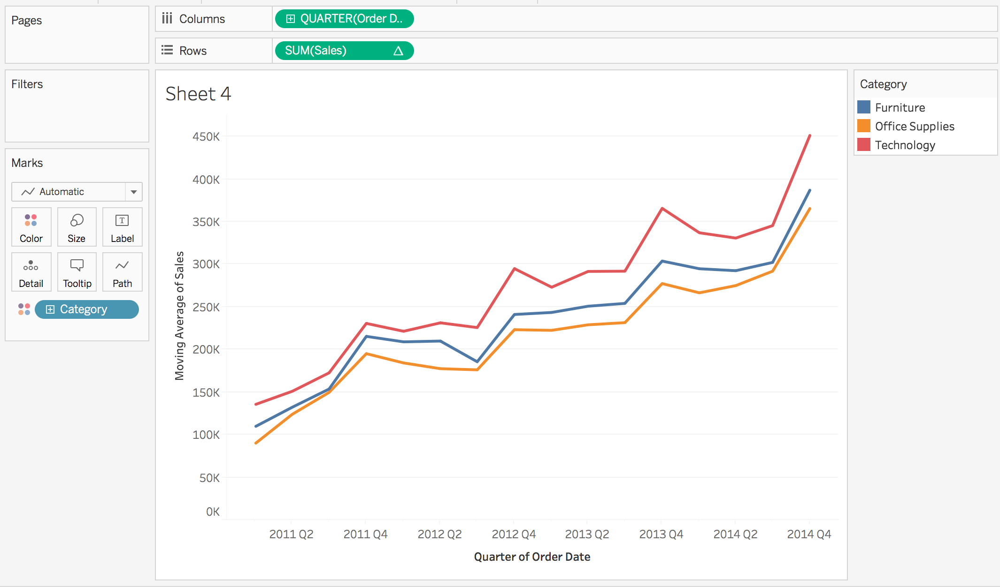

This plot is great for seeing the trend of the data, and that sales are increasing, but they aren't great for seeing how sales are changing over time from one quarter to the next. Instead, the last question on the next concept requires the plot below.

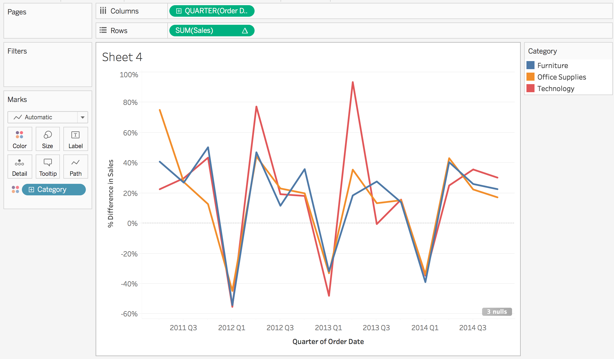

**Additional quick calculations for running total, percent difference, and moving average that are particularly useful in line plots.**

### [Next Steps](https://www.youtube.com/watch?v=y46uDftUXHo) :tv:

[:top:](#)
