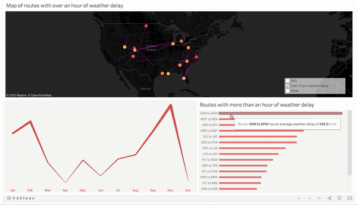
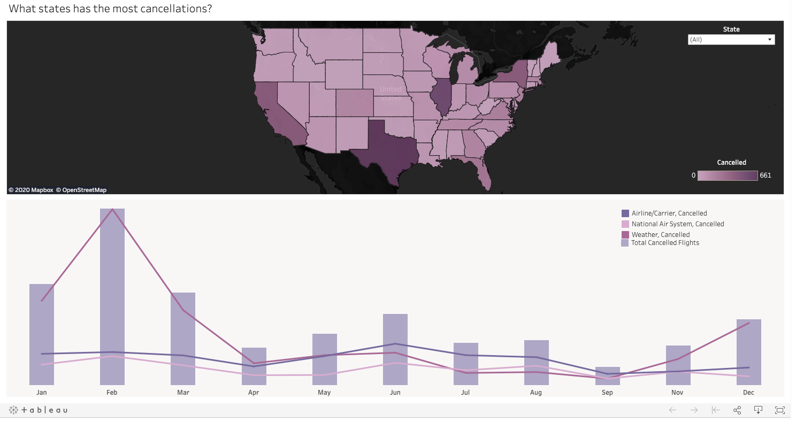
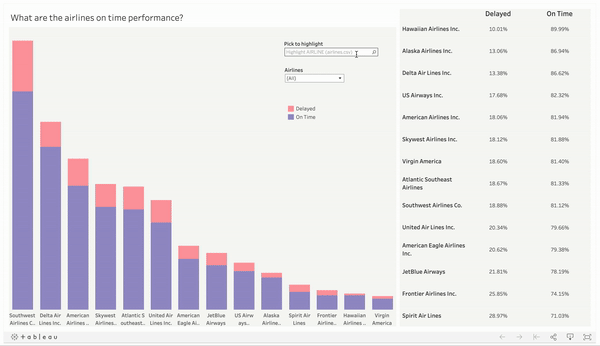

# [Build a Data Dashboard](https://www.youtube.com/watch?v=AoqtkQwI6b0)

## [Skip to My Project](#my-project)

**Project Description**

In this project, you'll create visualizations to reveal insights from a data set. You will create data visualizations that tell a story or highlight patterns in the data set. Your work should be a reflection of the theory and practice of data visualization, such as visual encodings, design principles, and effective communication.

There are 3 different data sets you can choose from.

1. Flight Delays and Cancellations
2. US Census Demographic Data
3. Youtube Data from the US

**1) Flight Delays and Cancellations**

This data comes from a Kaggle dataset, it tracks the on-time performance of US domestic flights operated by large air carriers in 2015. You can find the dataset in supporting materials at the bottom of this page.

The file you must use in creating your data visualizations is the flights.csv file. The other two provided files may be used in conjunction with the flights.csv file, but should not be used alone.

You are required to create three visualizations. Some questions you may attempt to answer include those pertaining to the following areas:

**Which airlines or airports have the worst delays?**

Determine which destinations and arrival destinations have the most delays? **Doing this using maps is actually pretty difficult**, but you may choose an alternative visual to provide this information. Think about what kind of aggregates might work best to determine which airlines and airports are the best and worst in terms of delays.

**What causes delays?**

Think about if you work at an airline and you want to decrease delays. What part of the flight causes the most delays? Do these causes vary by airport or time of year?

You can also come up with your own question!

As you work with the data, come up with a question you're curious about and can be answered from the data. Build a dashboard or story to answer your question and lead viewers to that answer.

**2) US Census Demographic Data**

This data comes from a Kaggle dataset, it includes the census data for all counties in 2015. You can find the dataset in supporting materials at the bottom of this page. Required dashboards

You are required to create three visualizations. Some questions you may attempt to answer include those pertaining to the following areas:

**Which states have the best transportation?**

This is a fairly subjective question, so your first job is to define what the best transportation is. Is it highest percentage of transit use? Is it lowest mean commute times. Then you need to determine how to aggregate the data from the county level to the state. Are there outlier counties affecting the data? How should you aggregate all the data from the counties to represent the state effectively? Please provide your reasoning in your report.

**How does income and poverty look across America?**

Think about how best to contrast this data to show an interesting finding. You can look across many of the different fields to show interesting findings. Do counties with more construction experience more or less poverty? Do counties near the coast experiene more or less income? Remember this is all correlation and not causation so we cannot say any one thing causes it but we can report descriptive statistics.

You can also come up with your own question!

As you work with the data, come up with a question you're curious about and can be answered from the data. Build a dashboard or story to answer your question and lead viewers to that answer.

**3) Youtube Data US**

This data comes from a Kaggle dataset, it includes a bunch of information for videos that were trending for at least one day. This data set will require some cleaning in excel prior to Tableau. You can find the dataset in supporting materials at the bottom of this page.

You are required to create three visualizations. Some questions you may attempt to answer include those pertaining to the following areas:

**What tags have grow in popularity over time?**

(The tag field is very hard to work with, consider asking a different question. Reminder all of the questions here are suggestions, they are not required. There is an additional file with the tags transposed into a a single column that you can make use of as well. To join it in you will want to join it on channel title and title of the video)

You will need to first figure out how to clean the data from having bunch of tag words all in one cell to a format where you can count the number of times the individual tag word is used each day, month, or year depending on how you are answering this question

**What categories are the most liked and disliked?**

To answer this question you will need to replace the numeric category IDs with the actual names which are in a separate file. Then you can looks at this question deeper. Perhaps there is a time of year where one category is preferred? Are there certain channels with an outlier amount of likes or dislikes?

You can also come up with your own question!

As you work with the data, come up with a question you're curious about and can be answered from the data. Build a dashboard or story to answer your question and lead viewers to that answer.

**Review the column Metadata**

Some of the columns you want to use in your project will have coded values that represent longer more readable values. For instance the cancellation_reason column in the flights data set has the values: A, B, C, D These letters are not understandable by themselves. You need to replace these letters with the full reason to make your visualizations including this data more readable.

These letters correspond with the following reasons.

A - Airline/Carrier

B - Weather

C - National Air System

D - Security

You should review the Column Metadata tab on Kaggle for each data set to find details about the data like the one I have outlined above.

**Flights**

link here: https://www.kaggle.com/usdot/flight-delays/data

**US Demographic data**

link here: https://www.kaggle.com/muonneutrino/us-census-demographic-data/data

* click the second data link that is the county file which is what we are using for the project

**Youtube US data**

link here: https://www.kaggle.com/datasnaek/youtube-new/data

* There is no column metadata for this file, reach out on Study Groups or Knowledge if you are needing assistance interpreting a column
* The location data was added so that you could make use of the map visualization, treat this as the upload location for each video.

**Requirements**

Use the Project [Rubric](./Misc/rubric4.pdf) to review your project. If you are happy with your submission, then you are ready to submit! If you see room for improvement in any category in which you do not meet specifications, keep working!

Your project will be evaluated by a Udacity reviewer according to the same Project Rubric. Your project must "Meet Specifications" in each category in order for your submission to pass.

**Reminders**

Your visualization work should use Tableau: other visualization tools may not be evaluated by reviewers. Host your dashboards/stories on Tableau Public, you'll be submitting them to reviewers and this makes them easily accessible.

Remember that your visualization should be explanatory in nature and communicate specific results that you want to show.

**Submission**

Ready to submit your project? Click on the "Submit Project" button or go back to your Udacity Home and click on the project, then follow the instructions to submit! Make sure you include the following files and information:

* A PDF or Markdown report that includes the following sections:
* Links to your dashboards or story
You must submit url links for each of your visuals from Tableau Public. If you need a reminder on how to save to Tableau Public, please see the next concept.
* Summary: brief description of the visualization and the main story or findings conveyed
* Design: explain any design choices you made including changes to the visualization after collecting feedback
* Resources: list of Web sites, books, forums, blog posts, GitHub repositories etc that you referred to or used in this submission (Add N/A if you did not use such resources).

It can take us up to a week to grade this project, but in most cases it is much faster. You will receive an email when your submission has been reviewed.

# My Project

### Dashboard 1

### Dashboard 2

### Dashboard 3

### Dashboard 4

### Dashboard 5

**[Link to Tableau public gallery](https://public.tableau.com/profile/mark.soro#!/vizhome/BuildDataaDashboardfromBANDUdacityProjectFlightData/Dashboard1-Originairportscancellationreasons)**

**[Project Report](./Misc/flight-delays/project_report.pdf)**

**[Download here](https://github.com/m-soro/Business-Analytics/tree/main/Data-Visualization/L5-Project-Build-Data-Dashboard/Misc/flight-delays)** :rocket:

[:top:](#)
