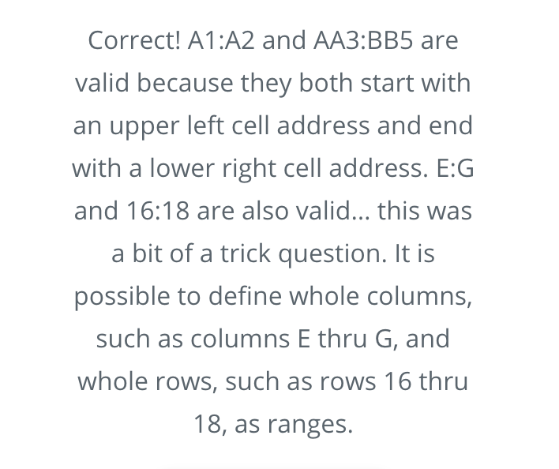
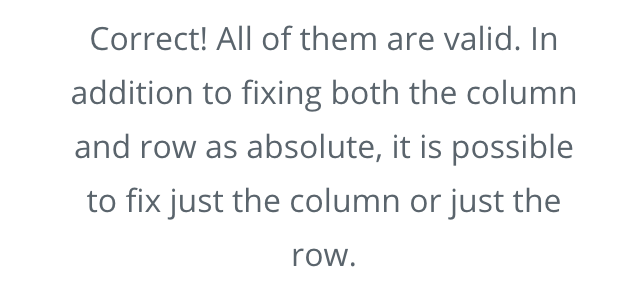
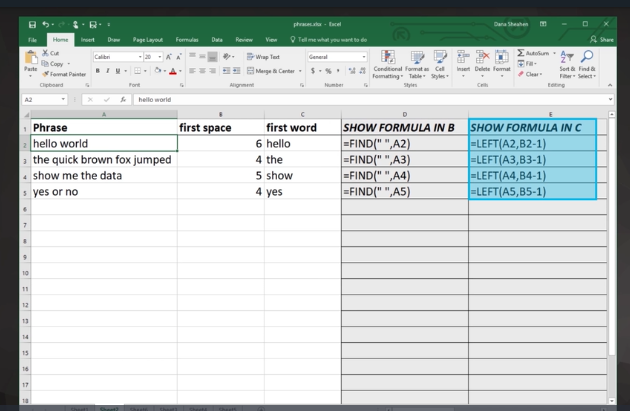

# Spreadsheets

## Spreadsheets 1

### Range

### Relative vs Absolute Addressing

- Insert a `$` sign to denote `absolute`

[fruit-stand](./Misc/fruit-stand.xlsx)

## Spreadsheets 2

[substitute](./Misc/substitute.xlsx)

### Extract text

[extract-text](./Misc/extract-text.xlsx)

### Get Average
[fruit-sum-average](./Misc/fruit-sum-average.xlsx)

### Remove duplicates

[world-cities](./Misc/worldcities.xlsx)

**Clean**
[world-cities](./Misc/worldcities-clean.xlsx)

**Split Column Tip:**

As you work with larger data sets, its can be helpful to "freeze" the header row or far left column as you scroll through data. To do this, use the `View->Freeze Panes` operation in Excel or `View->Freeze` in Google Sheets to select the rows or columns you want to always be visible.

[albb-salaries-2003](./Misc/albb-salaries-2003.xlsx)

