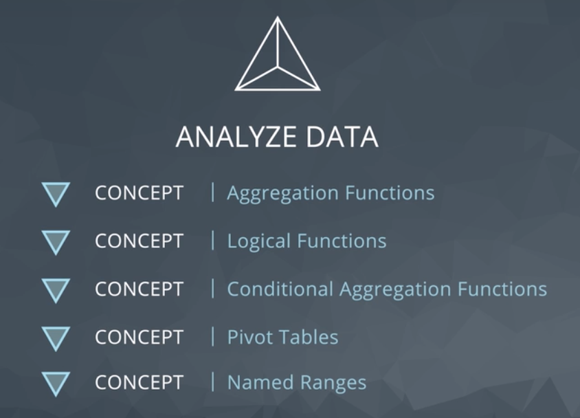
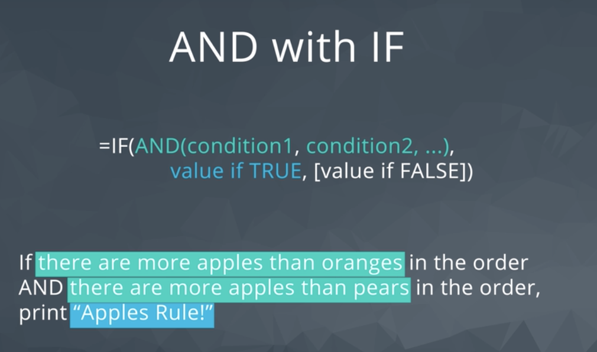

# Analyze Data

## Aggregation Function
  * Function that operates accross a group of data resulting in a single value.






**Quiz: Logical Functions**

In the following quiz, you'll need to combine what you've learned so far in a new way. The special_orders.xlsx spreadsheet can be downloaded at the bottom of the page. Your task is to add a formula in F2 and fill it down the `Special Order?` column such that the column fulfills the following statement:

```
    If the maximum number of any one fruit exceeds 10 pieces in an order,     
        or the total order exceeds 20 pieces (all fruit),
        then mark it with "Special Order".
    Otherwise, mark it with "No".
```


