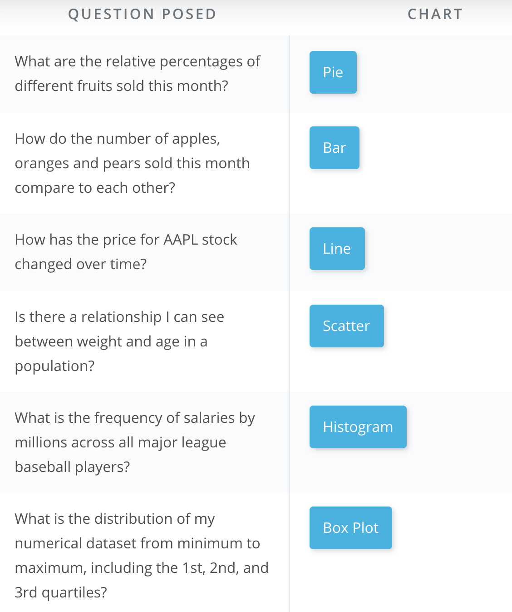
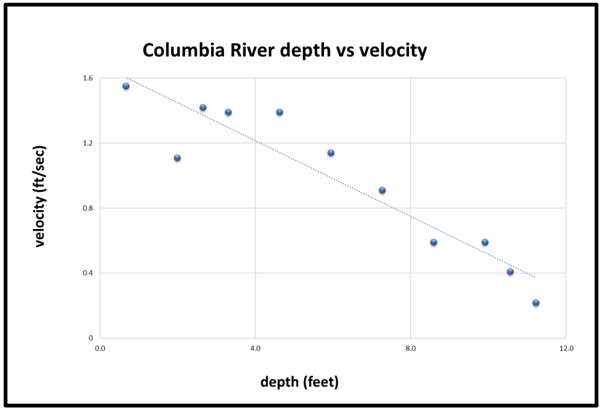
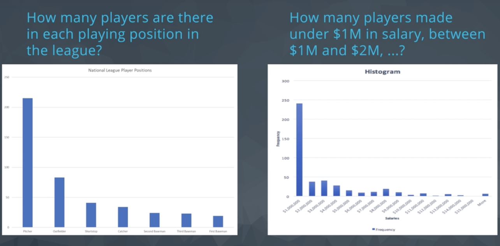

## Pie Charts
  * Used to illustrate proportionality.
  * just needs categories and value.

**Tip**
  * You can copy and transpose values.

#### Exercise: Pie Charts

In the following exercise, you'll open a spreadsheet of Financial information copied from Wikipedia containing information about the S&P 500 index companies, `sp500_companies.xlsx`. You'll use what you've learned about pivot tables and pie charts to answer questions about the data.   

[Pie Chart and Pivot Practice](./Misc/sp500-companies.xlsx)

## Bar Charts
  * Compare category values with each other.

## Scatter and Line Plots

**What chat to use?**

#### Exercise: Scatter Plots

Scatter plots are useful for displaying [bivariate](https://en.wikipedia.org/wiki/Bivariate_data) numerical data. This means a data set with two variables, such as height and weight measurements for a list of human beings.

If the data of both variables moves up together, they have a positive correlation, and this can be seen in the scatter plot, such as in the following plot of human [height and weight data](http://wiki.stat.ucla.edu/socr/index.php/SOCR_Data_Dinov_020108_HeightsWeights). We can see that generally, as height increases, so does weight. The line shown is the "trend line", which can be added in Excel by selecting the scatter chart, then `Design->Add Chart Element->Trendline->Linear`

If one variable increases as the other decreases, the two variables have a negative correlation, as in the following plot of [depth vs velocity in the Columbia River](http://www.seattlecentral.edu/qelp/sets/011/011.html):

For this exercise, open the provided spreadsheets, create scatter plots as requested, and answer the questions about the general correlation for each.

[Scatter Plot and Trend Lines](./Misc/lake-superior.xlsx)

[Scatter Plot](./Misc/puget-sound-butter-clams.xlsx)

## Histograms

**How to create a histogram? Install [Analysis ToolPak Add-in](https://support.office.com/en-us/article/Load-the-Analysis-ToolPak-6a63e598-cd6d-42e3-9317-6b40ba1a66b4)**
