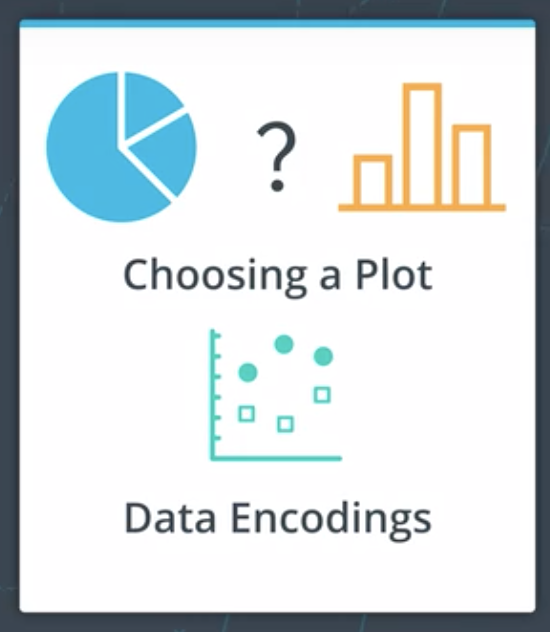
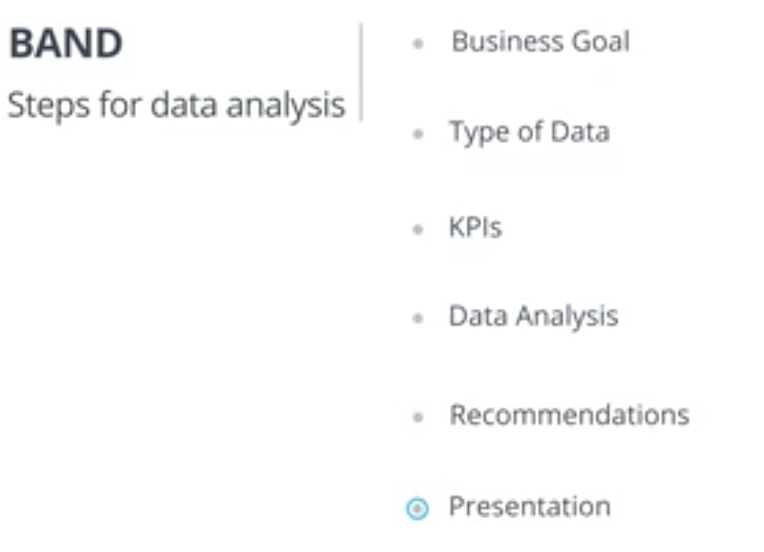
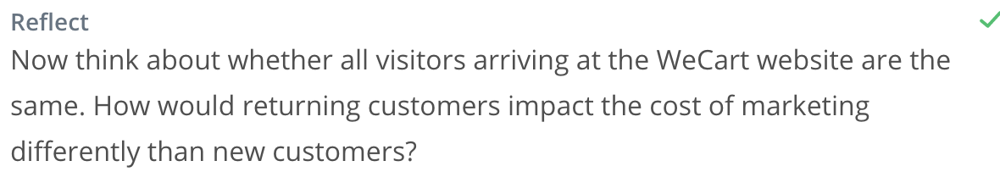
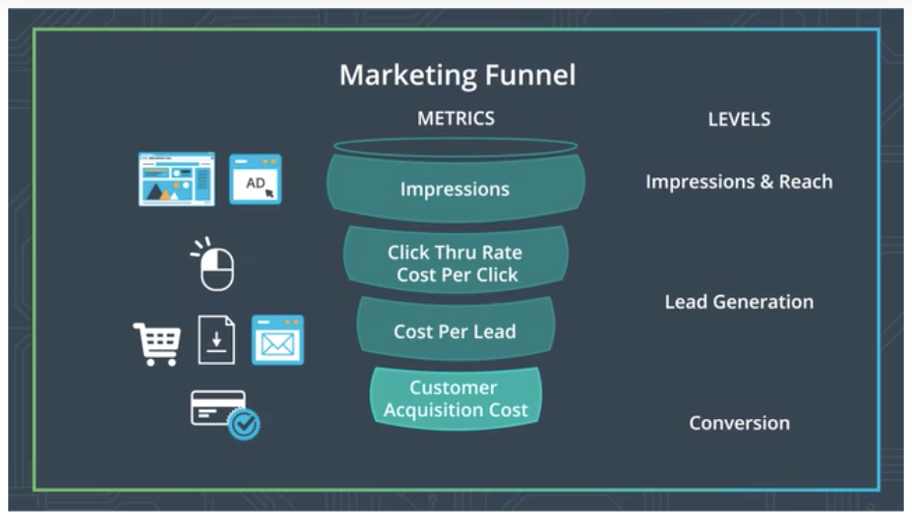
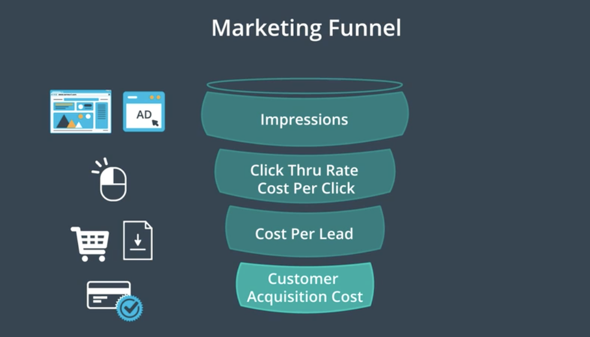
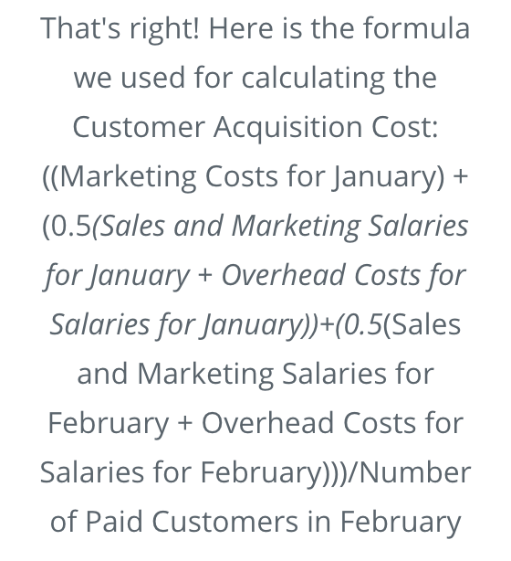
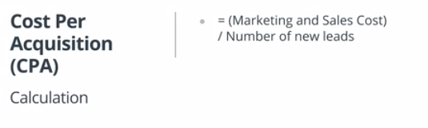
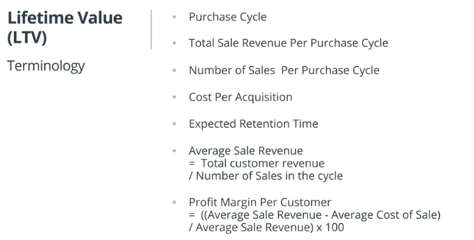

[Scatter Plot](./Misc/puget-sound-butter-clams.xlsx)

# Business Metrics

**Topics Covered**

1. **[Key Performance Indicators:](#key-performance-indicators)** We will start with a discussion about key performance indicators and how it differs by industries.

2. **[Business Process Flow:](#business-process-flow)** Then we will proceed to going through the business process flow across various business divisions. This will provide the context for learning about the business metrics.

3. **[Business metric:](#business-metric)** We will take on each business area, such as marketing and growth, and introduce you to a metric commonly used to measure success in that business area. We will discuss what each means, and how to calculate it. We will practice calculating the metrics and applying the metrics, and when and where to use the metric.

4. **[Distribution and central tendency:](#distribution-and-central-tendency)** We will circle back to the topic of data distribution that you learned about in the previous lesson, and why paying attention to the distribution of the data and to the choice of measure of central tendency is important.

5. **[Grouping data:](#grouping-data)** We will end with a discussion on how to look at the data across groups, cohorts, and time.

## Key Performance Indicators

Businesses need to be able to track how they are performing on key goals or objectives - whether they are growing number of customers, bringing down their costs, increasing revenue on an ongoing basis and myriad others. **Key Performance Indicators or KPIs** are how they measure their success on each of their key business objectives.

**Which KPI to use?**

The decision regarding which KPI a business analyst should use depends on several factors, including which industry or domain they are working in, which business function they are focusing on, and the type of data they have available to them.

**Quiz**

For this next quiz, use the link below to answer the question:

https://kpidashboards.com/kpi/

**Steps to complete the quiz below:**

1. Click on the link above to get to the KPI Dashboards website
2. Scroll down to the header KPIs By Department.
3. You can view the KPIs for each department by clicking on View All next to the department name.
4. This website provides the KPIs for several industries. Use the website to identify the correct KPI for that industry.

**Asking Data Questions**

* Gather appropriate information to answer business problems
* What needs to change and communicate it clear with data

### Recap:

1. Identify business goal and questions.
2. Narrow down the type of data needed to answer questions.
3. Identify the KPIs that will be useful to show whether you are making progress on your business goal.
4. Conduct the data analysis using the KPIs and use visualizations as part of the analysis.
5. Provide recommendations and findings based on the completed data analysis.
6. Create succinct and visual presentations for the stakeholders.

**WeCart Case Study for this lesson**

To help you master the various concepts throughout this lesson, we will use a case study of an online app throughout this lesson. The online app is designed to pick up groceries from different stores and delivers it to the customer’s home. We will assume WeCart uses a subscription model where people set up accounts and place orders on a regular basis. You’ll find examples referencing WeCart throughout this lesson.

**Business Process Flow: Marketing**

**Business Process Flow: Growth**

The following video describes a typical question business analysts try to answer when they are considering issues of a company's growth. To grow the business, companies need to not only focus on existing customers, but also new customers. This problem is at the heart of growth metric. Executive boards, investors and sales teams are constantly keeping their eye on this critical question about a company's overall health.

**New Vocabulary**

**Call To Action**: A marketing term that refers to an action a website visitor is supposed to take when given a specific prompt on a website. These can be words or phrases, or icons that prompt and encourage the user to perform the action.

**Post-Purchase**: Actions customers take after purchasing an item that promote and increase sales and advocate on behalf of the company. For e.g., coming back and purchasing more items, sharing or liking the company or product on social media, taking pictures of the item and tagging it on Pinterest.

**Two Additional Levels**

Before we move on, I wanted to share 2 more levels that companies use.

**Loyalty**

To grow their revenue and company profits, companies don’t just want their customers to buy once from them, but to come back to their website. Especially if the product is not a high-priced product. That customer loyalty allows you to track how many revisits a customer is making after their first purchase, or how many of the customers have continued shopping after their first purchase.

**Metrics**: Some commonly used metrics include Repeat Purchase Rate and Net Promoter Score. We will not be going in depth with these, but please do check out the resources below to learn more about them.

**Advocacy**

Another level companies sometimes track is whether their customer is advocating for their company. That is, saying good things about the product and services. Leaning on social media provides a great opportunity to do just that.

**Metrics**: Some commonly used metrics include Customer Referrals and Leads from Social Media. For example, as the paid customer tweets about the company, likes the product on FB, provides a good rating on Amazon or the company website, analysts can use those metrics, such as ratings and likes to show how many of the customers serve as advocates.

We will not be going in depth with these last two stage levels, but we have provided some resources below to help you understand these more.

**New Vocabulary**

* **Search Engine Optimization (SEO)** : The goal of search engine optimization is to influence the frequency of a website appearing in response to specific search terms in a search engine. You can learn more about it on this [Wikipedia page](https://en.wikipedia.org/wiki/Search_engine_optimization) and this [Forbes article](https://www.forbes.com/sites/jaysondemers/2018/02/28/the-first-9-things-you-should-learn-in-seo/#7c150b7030f9).
* **Lead**: A potential customer interested in the products or services of a company.
* **Conversion**: When the lead (potential customer) purchases the products or services being sold by a company.
* **Repurchase Rate**: This [Medium blog](https://medium.com/@matsutton/repurchase-rate-the-most-overlooked-ecommerce-kpi-337bccde184b) describes how to calculate Repurchase Rate metrics.
* **Net Promoter Score**: This [Wikipedia page](https://en.wikipedia.org/wiki/Net_Promoter) describes the calculations and origin of NPS.

## Business metric

#### [Click Through Rate (CTR)](#click-through-rate-ctr-1)
#### [Cost Per Click (CPC)](#cost-per-click-cpc-1)
#### [Cost Per Lead (CPL)](#cost-per-lead-cpl-1)
#### [Cost Per Acquisition (CPA)](#customer-acquisition-cost-cac)
#### [Lifetime Value](#lifetime-value-ltv)

### Marketing Funnel

  

### Click Through Rate (CTR)                                          *[Back to Business Metric](#business-metric)*

As potential customers view the ads, some of those potential customers will click the ad and be taken to the website for the company. To be counted at this level, the user needs to click through the ad and the metric we use here is **Click Through Rate**.

To calculate Click Through Rate, let’s cover a few key concepts. Make sure you are making a note of this terminology and definitions.

**Terminology**

- **Impressions** record an instance of an advertisement appearing on a website when it is viewed by a visitor. So if you visit the page 4 times, say in one hour, the gross impression count will include each repeated viewing.

- **Clicks**: Every time a website visitor views the ad and clicks it, this gets included in the Click count”

**Calculation**

`Click Through Rate = (Number of Clicks / Number of Impressions) X 100`

**Interpretation of CTR**

The Click Through Rate is an informative metric that informs your marketing team whether they should try and increase the number of impressions or when they should reword the ad to increase clicks. Remember, if a person clicks through the ad, it does not mean the customer purchased, but rather they are showing interest in what the ad is about.

When your CTR is low, your ad campaign is not generating enough interest. When the CTR increases, it is an indicator of an effective and interesting content in your ad campaign and that maybe you should increase the number of impressions for that ad.

**Benchmarks for CTRs for Google Ads across industries**.
Check out this blog that provides useful benchmarks for CTRs across industries: [Wordstream Blog](https://www.wordstream.com/blog/ws/2016/02/29/google-adwords-industry-benchmarks)

[Calculations](./Misc/band-marketingmetric-quizzes-a.xlsx)

#### Recap:

- **Click Through Rate (CTR)** = (Clicks/ Impressions) * 100 or Ratio of users clicking on a link or an ad to the number of total users who received the link or saw the ad.

- CTR measures the success of an advertising campaign or email campaign.

- When the CTR increases, it is an indicator of an effective and interesting content in your ad campaign and that maybe you should increase the number of impressions for that ad.

**Advanced Topics**

A related concept called **Unique Click Through Rate** is examined when looking at email campaigns to see how often a link sent through an email was opened by person receiving the email. If the person receiving the email clicks on the link 5 times, the unique CTR stays one, even though the total CTR is 5. Comparing the unique versus total CTR can help the analyst know if the email campaign reflects interest among potential customers.

We will not be going into unique CTR in detail in this lesson, but if you are interested in learning more about it, the following web pages are good resources for you to explore.

- [Mailigen website](https://www.mailigen.com/blog/email-campaign-click-through-rate-what-it-is-and-how-to-improve-it/)
- [Optimizely.com website](https://www.mailigen.com/blog/email-campaign-click-through-rate-what-it-is-and-how-to-improve-it/)

**New Vocabulary**

- **Impressions** : Impressions record an instance of an advertisement appearing on a website when it is viewed by a visitor.

**Business Metric Terminology and Formulas**

We have created a file with a list of business metrics covered in this lesson and their individual formulas - think of it as a cheat-sheet. You can locate it under the Resources tab on the top left under Lesson Resources. The file name is **[Business Metrics Lesson Terminology and Formulas](business-metrics-lesson-terminology-and-formulas-1.pdf)**.

### Cost Per Click (CPC)
*[Back to Business Metric](#business-metric)*

Cost Per Click refers to the cost to get a click on your ad. It helps us gauge the cost of advertising on the specific platform, so we can see which platform is generating more leads.

**Calculation**

`CPC = Cost of Advertising on Source Platform / Number of Viewers who Clicked on the Ad`

Since platforms charge you for the number of ads on a page, you can compare the CPC for the different platforms you are advertising on and see which platform is generating more interactions with your website, or generating more traffic to your website.

**Interpretation of CPC**

Different ad platforms cost differently, and it is important to remember that while one platform might be cheaper it may not necessarily deliver you as many potential customers as another platform. This is an important tradeoff that analysts and marketing teams have to consider. Some marketing channels or platforms convert amazing results but they are small and may not generate as many customers. While you may decide to continue using them, you will also need to identify marketing channels that deliver more potential leads.

**Quiz**

Continue using the Smoothie Rocks CSV file named BAND_MarketingMetric_Quizzes_A. In case you need the file again, you can access it under the Resources at the end of the page. Calculate the necessary metrics to answer the quiz questions below.

#### Recap
- **Cost Per Click (CPC)** = Cost of advertising on the source platform / Number of people who clicked on that ad

- CPC is an indicator of the cost effectiveness of the ad platform and a useful tool to compare and strategize about which marketing platforms is yielding higher impression and reach and resulting in potential leads.

### Cost Per Lead (CPL)
*[Back to Business Metric](#business-metric)*

Remember, a **lead is when a potential customer visits your website and does something on the website in response to a prompt**, such as share their email , or download a document, create an account. Once the viewer takes that action, we know the viewer is showing some interest for the product or service, and this could possibly lead to a sale. **With Cost Per Lead we are tracking whether the potential customer turned into a lead within a given time period, that could be a 30-day window or 60-day window**.

Let’s go back to our funnel - we are tracking how much did it cost us to get the potential customer to take that action on the website. We are calculating the cost of generating interest and nurturing the interest of the potential customer and figuring out how much did it cost us to get them to get to this level? The metric we calculate is the Cost Per Lead.

**Calculation**

`Cost Per Lead (CPL) = Cost of advertising on the source platform / Total number of leads`

**Interpretation of CPL**

A lead is an indication that the advertisement or the advertising platform is targeting the right type of person. A low cost per lead means more of this particular type of person is likely to be interested in the product. Looking at the data in the video we can see that Google Display and Google Ads were comparable in terms of the Cost Per Lead. On the other hand, Facebook was costing us more to get to our potential customers. At the same time, Facebook also generated fewer clicks, so we need to consider if we need to tweak the ad for the Facebook platform, or consider other platforms that can generate same or higher number of clicks for a comparable price.

**Useful Resources and Links**
The following websites provide some benchmarks for Cost Per Lead by industries.

- [Marketing Charts](https://www.marketingcharts.com/customer-centric/lead-generation-and-management-79707)
- [Hubspot](https://research.hubspot.com/charts/cost-per-lead-benchmarks-by-industry)

**Quiz**
Continue using the Smoothie Rocks CSV file named BAND_MarketingMetric_Quizzes_A. We have provided a copy in the Resources below if you need it again. Calculate the necessary metrics to answer the quiz questions below.

[Calculations](./Misc/band-marketingmetric-quizzes-a.xlsx)

#### Recap:
- **Cost Per Lead (CPL)** = Cost of advertising on the source platform / Total number of leads

- CPL is an indicator of the cost effectiveness of the ad platform and a useful tool to compare and strategize about which marketing platforms yielded more leads.

### Customer Acquisition Cost (CAC)
*[Back to Business Metric](#business-metric)*

The goal is to increase customer conversion at the bottom of the funnel for the lowest cost.

**Good rule of thumb is 25% of revenue**

**Interpreting CAC**

The CAC metric is an indicator of how much it cost to acquire a customer. If your customer service team is doing a good job of keeping the paid customers happy, that can lead to future leads and paying customers, and thus keep the cost of acquiring customers low. The company's goal is to keep the CAC low, while increasing revenue as this has a positive impact on the profit margin and profits.

Additional note regarding the timeline of the customer journey. If you are unsure of the timeline of your customer journey, think about when the ad was placed online, how long it was out, and when the ad was pulled out. That gives you a rough timeline of when you started getting paid customers, and estimate how much time an average customer took from seeing the ad to buying your product.

**Quiz**
Use the BAND Marketing Metric Quizzes B file in the Resources below to access the data to answer the following Quiz question. Once you have downloaded the Excel spreadsheet, calculate the appropriate metrics and then respond to the quiz question below.

Because sometimes it takes time to convert customers, marketing campaigns may take some time to realize the revenue they are trying to generate. To account for this delay, its usually calculated on your average sales cycle.

**Formula for Calculating CAC with 60 day cycle**

[CAC w/ 60 day cycle](./Misc/band-marketingmetric-quizzes-b.xlxs)

#### Recap

- **Customer Acquisition Cost (CAC)** = (Total marketing expenses + total sales expenses and salaries)/ # of customers acquired
- The CAC formula can be modified with weighting for different months based on the length of the sale cycle.
- CAC is a useful metric used to get an estimate of how much it cost us to acquire the customer in the period the money was spent to reach out to them.

**Customer Acquisition Cost tells us the cost of acquiring a paid customer.**

### Optimizing Marketing Funnel

The goal with optimizing the funnel is to reduce the drop at each level. For example, if you find only 5% of the people seeing the ad click on the ad, it could be an indication that your ad needs more work and that you need to think about its relevance.

Further down the funnel, the goal of the marketing team is that once the leads or visitors are on the company website, the website design should cause no confusion to the visitor. There should be plenty of options available to stay engaged and the website, and there should be no confusion about what steps the visitor needs to take to make the purchase.

### Cost Per Acquisition(CPA)
*[Back to Business Metric](#business-metric)*

 **Acqusition** means non paying customer

**Interpretation of CPA**

Cost Per Acquisition provides insight into whether or not the marketing campaigns are successful from a business perspective. For the purposes of calculating the CPA, the cost of the marketing campaigns should not be restricted to the cost of developing the ad, but also other costs of labor and overhead. In other words, CPA allows a business to gauge whether the marketing campaign is generating enough potential leads to cover a broader range of costs other than just direct advertisement costs.

**Recap:**

- **Cost Per Acquisition (CPA)** = (Marketing and Sales Cost)/ number of new leads customers

- CPA is referring to marketing + sales costs (overhead, salaries) in the numerator and includes only leads (non-paying customer) in the denominator.

- Here “acquisition” refers to a non-paying customer.

### Lifetime Value (LTV)
*[Back to Business Metric](#business-metric)*

To identify high value customers to bring in more of this customers. A customer that will come back and continue to purchase.

This is the net profit we can attribute to a customer over the lenght of their relationship to the company.

**Lifetime Value (LTV) = Average Sale * Number of Repeat Sales * Expected Retention Time * Profit Margin**

**Purchase cycle** time period that depicts general frequency of when a product is purchased

**Total Sale Revenue Per Purchase Cycle** revenue earned from all customers per purchase cycle

**Number of Sales Per Purchase Cycle** number of times the customer buys per purchase cycle

**Cost Per Acquisition** is the total cost of marketing and sales cost divided by the number of new leads

**Expected Retention Time** is the amount of time we expect to retain the customer measured by Purchase Cycle

For example: A purchase cycle of 2 weeks in a year then ERT is 26.

**Average Sale Revenue** is the average revenue earned per transaction during the cycle. `Total customer revenue/Number of Sales in the cycle`

**Profit Margin Per Customer** is the percentage of sales that has turned into profits `((Average Sale Revenue - Average Cost of Sale)/Average Sale Revenue)*100`

