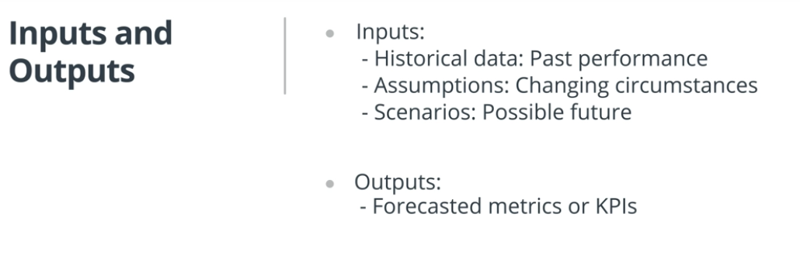
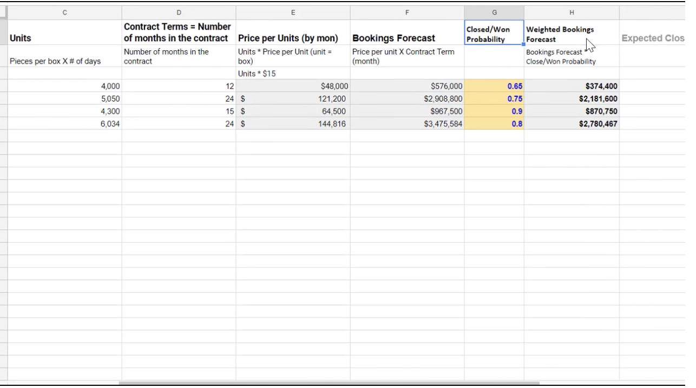
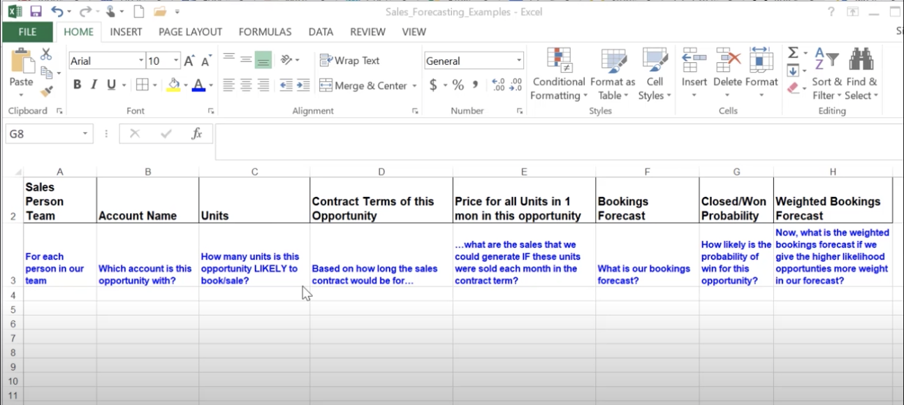
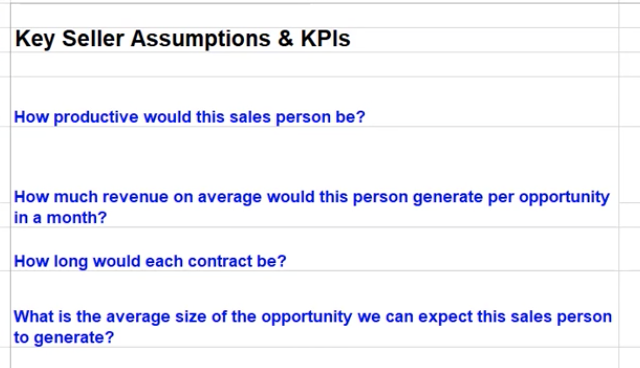

# Excel Modeling

### [Introduction](https://www.youtube.com/watch?v=LmvrXmBoZF4)

### [Lesson Structure](https://www.youtube.com/watch?v=-DIzPt-j1Hc)

### [Introduction to Modeling](https://www.youtube.com/watch?v=R_-bsrdLje0)

Modeling refers to using certain inputs and using those inputs to predict and forecast how our desired business metric will perform in the future.

It depends what type of company when you have to do it.

start ups are usually six months to a year out, established company forecast out to a few years

also depends on the metric
sales could be a few months out.

models are updated on a ongoing basis, monthly, quarterly, yearly.

Most business forecast their sales booking and financial statements, typically businesses forecast all three:

1. Profit and Loss
2. Cash Flow Statement
3. Balance Sheet.

We will focus on profit and loss statement.

## We will go over two approaches to modeling:

## [Top Down](#top-down)
## [Bottom Up](#bottom-up)

## Resources on Modeling Financial Statements

We recommend the following websites that layout considerations for making assumptions for financial forecasting.

1. [Modeling the 3 Financial Statements](http://www.streetofwalls.com/finance-training-courses/investment-banking-technical-training/three-statement-financial-modeling/)
2. [Blog on forecasting taxes and interest rates](https://www.wallstreetprep.com/knowledge/income-statement-forecasting/). Scroll down to the bottom of the page where it talks about interest income.
3. [Forecasting Revenue and Growth](https://www.entrepreneur.com/article/76418)

## [Top Down](https://www.youtube.com/watch?v=B4FtnlFBiME)

Forecasting model requires careful thinking
about which approach you want to take to create the models.

One approach to modeling is **top-down.
It takes a macro approach to forecasting**.

Here, you start with the best estimate of the larger size of
the market narrowing down to identify
the portion of the market that the company is serving,
and then estimate what it will take to capture that portion of the market.

Top-down is a macro approach,
but it is less credible and typically adopted when there's limited historical data.

We'll next look at an example that shows why this is less credible.

Let's go to the wecart example.

We start with the online grocery delivery market,
which is about $20 billion,
and then we start getting into the specifics,
such as which market segments the company wants to focus on.

Say the executive team at WeCart wants to retain the focus on the urban market,
which is about $17 million.
Now, the assumption is that WeCart will aim to capture five percent of this market,
and with that we arrive at $850,000.

say $4.95 per delivery,
we can now arrive at our sale quantity estimates of about a 170,000 customer orders.

As you can see, this is a less credible way to forecast because
you're talking in guesses and estimates based on macro figures.

It's harder to convince potential investors you
can realistically achieve this forecasted revenue.

## [Bottom Up](https://www.youtube.com/watch?v=AA_EFg07Jvc)

A **bottom up approach takes a micro approach** to forecasting.
The approach starts by looking at historical data.
The more data you have, the better.

But often, even as little as six months to one year data is used in this approach.

The model forecasts are based on these data to make
assumptions about how the key metrics will behave,
and then we forecast out the revenue based on these assumptions.

Let's look at a sample income statement that uses
bottom up approach to forecast out revenues and net income.

For instance, we started with the historical data.

For example, last year's income statement metrics,
then we use this historical numbers to calculate out
margin metrics as well as historical income tax rates and interest expenses.

The next step is to use those margins and
metrics to come up with the assumptions for the future,
in this case, the following year.

Finally, using those assumptions in our model,
we forecast out the key metrics for next year.
As you can see, bottom up approach is based on assumptions as well,

but it is built on previously attained numbers.

There are specific to how the company has performed,
and not generalizations that relate to the market as a whole.

## [Components of a Model](https://www.youtube.com/watch?v=8ImAf1NMU6o)

### Components of a Forecast Model

1. **Inputs or Drivers**
      These are the inputs that drive the output of the model.
2. **Outputs**
      This is the metric being forecasted within the model.

### [Historical Data and Assumptions](https://www.youtube.com/watch?v=0HyNRZVH18M)

In modeling, assumptions on what you think will come
true for the inputs or metrics in the model.

It can be assumptions about the
To build your assumptions out,

you start with information available to you based on historical data.
For example, we can assume we will continue to gain
market share at the same rate as we have for the last six months,

or we a
sales around holidays or on certain days of the week.
As you make assumptions,

pay attention to your forecasts about metrics you have less control over.
Costs are usually harder to change drastically.

So, when you make your assumptions about reducing the future costs,
make sure you're being realistic.

For instance, when estimating the cost of delivery,

the cost of gas is typically harder to predict since gas prices are fairly volatile.
So, in general, be careful about the assumptions you make about changes in costs,
and check to see if those assumptions are reasonable and make sense.

### [Historical Data](https://www.youtube.com/watch?v=7ytZKO0ycbU)

Historical data is above what's your metric show for the past.
So, for sales, we look at prior sales data from the last year or month.

For financial modeling, we look at
prior financial statements quarterly or annual results.
Here is an example of a financial model.

We're using these primers data on revenue and COGS to calculate our operating income.

We then use our historical data to calculate our assumptions.

Similarly for sales forecasting,
we use our prior months' data on bookings closed in one probability,

and these inputs are used to forecast out our future bookings.

### Historical Data

Historical data is about what your performance metrics show for the past. For sales, for example, we look at prior sales data from the previous year or months. For financial modeling, we look at prior financial statements, as well as quarterly and monthly results. Above we are using prior year data (e.g., Revenue, COGS) to get our operating income, which we then use to calculate the historical operating margin.

### Formulas for Calculating Historical Financial Metrics
Typically, the historical statistics or metrics used to forecast financial metrics in an Income Statement are:

  * Revenue Growth
  * Gross Margin
  * Operating Margin
  * Historical Tax Rate
  * Historical Interest Expense Rate

The following list provides more information about calculating the historical statistics.

1. `Revenue Growth (in %) = ((Current Year's Revenue / Previous year's revenue) - 1`

2. `Gross Margin = (1- (Current Year's Cost of COGS/ Current Year's Total Revenue))`
    **Keep in mind the two terms COGS and Cost of Revenue can be used interchangeably.**

3. `Operating Margin = Current Year's Operating Income / Current Year's Total Revenue`

4. `Historical Tax Rate is the tax rate from the companies previous year's tax rate.`

5. `Historical Interest Rate is the interest rate coming from the previous year's Debt Schedule.`

**Additional Resources on Developing Assumptions**

We recommend the following websites that layout considerations for making assumptions for financial forecasting.

1. [Forecasting Revenue and Growth](https://www.entrepreneur.com/article/76418)
2. [Revenue Forecasting](https://www.fundera.com/blog/revenue-forecasting-2)

## Sales forecasting

### [Bottom Up Sales Forecasting](#bottom-up-sales-forecasting)
### [Top Down Sales Forecasting](#top-down-sales-forecasting)

## [Bottom Up Sales Forecasting](https://www.youtube.com/watch?v=tFqe0MEnjmg)

Computed using the sales conversion funnel

Let's say you're the sales manager for a company that makes flatware,
say using renewable products like bamboo,
and you've been asked to [forecast the sales](https://www.youtube.com/watch?v=VKIXb4iYymQ) for the company.

Your sales team has several accounts which offer opportunities to make a sales deals,
and you're trying to forecast your sales metrics for the next year.

Account refers to the companies where you provide your products in bulk.
You're not selling to the individual customer here,
but rather to the company that will buy the products in bulk.
Now, let's go over sales forecast example using a bottom-up approach.

This is the more common approach and it comes from the sales file historical data.
We start with having one row for each person in our sales team.

So, in the model,
we are trying to understand for each person in our sales team,
which account is this opportunity with?
How many units is this opportunity likely to create a booking for or sale?

Based on how long the sales contract would be for,
what are the sales that we would generate if
these units were sold each month in the contract term?

That provides us with our bookings forecast.
In column F, we can go one step further and we can
ask how likely is the probability of a win for this opportunity?
Based on that probability,
we can calculate the weighted bookings forecast.

So, let's walk through the [sales model using a bottom-up approach](https://www.youtube.com/watch?v=Bx_CjCMr-Dc).

I've kept the overarching themes here on the top,
so you can see what is the motivation for each of these columns.
We start with this column with a row for each sales team member.

This is followed by the company,
which is the company name for which you are going to be selling products in bulk,
and then comes in column C,
the units per month.

So, this is the number of units this opportunity is likely to create a bookings for.
Contract terms shows the number of months each opportunity is for.
Price for all units in one month shows the number of
units times the sales price per unit,
which is $5 here,
and this is showing the sales price for their projected unit over a month.

For example, how much would Joe Smith,
working with company A,
bring in revenues from the sale of 4,000 units per month?
Then you multiply that with the number of months in
the contract term to arrive at the bookings forecast.

We can go one step further and multiply the bookings forecast with
the win probability to show a more realistic weighted forecast.

So, let's look at this example.
We're more likely to get the sales contract with Corey Jones, Company C,
because it has a wind probability of 0.9,

versus this ooportunity with Joe Smith
Company A, which has a lower probability.

So, the 290k is a weighted bookings forecast,
which shows this is a high probability that you'll win this compared to this one.
It takes into account the probability,
so you can get a realistic estimate of
how likely are we getting this amount versus the amount.

So, this is a bottoms-up sales forecast.

As you can see, here we're using
an opportunity level forecast to project out the bookings for the whole company.

### Assumptions and KPIs
Here are the formulas used in the sales forecasting example described in the video above.

* `Contract Terms = Number of months in the contract`
* `Price per Unit (by mon) = Units needed in 1 month X Price per Unit`
* `Bookings Forecast = Price per Unit X Contract Term (month)`
* `Closed/Won Probability = Probability of Closing the deal`
* `Weighted Bookings Forecast = Bookings Forecast * Closed/Won Probability`

**Additional Resources on Sales Forecasting:**

As described in the video, there are several different ways and goal of sales forecasting. The following websites provide more examples of sales forecasting.

* [Sales Hacker - Forecasting Methods](https://www.saleshacker.com/sales-forecasting-methods/)
* [Sales Hacker - Forecasting Metrics](https://www.saleshacker.com/sales-forecasting-101/)
* [Insight Squared](https://www.insightsquared.com/2012/08/basic-sales-forecasting-methods/)
* [Seismic: Improving sales productivity](https://seismic.com/company/blog/how-to-improve-sales-productivity-7-helpful-hints/)

## [Top Down Sales Forecasting](https://www.youtube.com/watch?v=7j4D8dWjIec)

Let's go over a top-down model that focuses on bookings for sales person.

The model is divided into four portions here.
We're starting with an assumptions about the dollar amount we need in bookings.
Then we figured out how much time and
effort it would require to get to generate those bookings.

Let's look at this more closely.
We start with an assumption about
how productive this sales person who we are going to hire will be.

We measure this in terms of the number of opportunities being generated,
and then we look at how much revenue on average
would this person generate per unit and per an opportunity.

We use these assumptions to arrive at
the average size of opportunity we can expect the sales person to generate.

Then we make assumptions about how much time and
effort it will take us to arrive at those bookings.

For this, we project out when we will hire the person.
Then based on our sales historical data,
we come up with the assumption that a new sales member would take
X number of months to get up to speed to start generating those leads and bookings.

Then finally, we use the ramp time and the average size of opportunity assumptions,
to project out when he will see the bookings that we expect this person to generate.

As you can see, we get to the final bookings number for each sales team member and month,
by starting with our bookings in the more broad sense and
then narrowing down to each person and month.

## [Example Top Down Sales Forecasting](https://www.youtube.com/watch?v=HjBq9d3NQ24)

[Walk Thru](https://www.youtube.com/watch?v=HjBq9d3NQ24)
