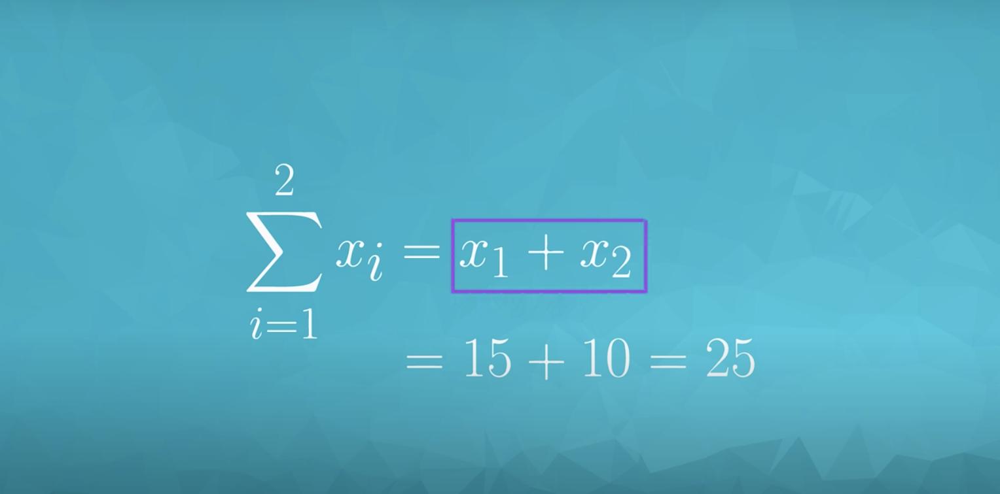

# Lesson 1: Descriptive Statistics

## Introduction to Data Types

### Quantitative and Categorical

**Quantitative** data takes on numeric values that allow us to perform mathematical operations (like the number of dogs).

**Continuous vs. Discrete**
We can think of quantitative data as being either continuous or discrete.

**Continuous data can be split into smaller and smaller units, and still a smaller unit exists**. An example of this is the age of the dog - we can measure the units of the age in years, months, days, hours, seconds, but there are still smaller units that could be associated with the age.

**Discrete data only takes on countable values**. The number of dogs we interact with is an example of a discrete data type.

[link](https://www.youtube.com/watch?v=BzgZebZD9kk&feature=emb_logo)

----

**Categorical** are used to label a group or set of items (like dog breeds - Collies, Labs, Poodles, etc.).

**Categorical Ordinal vs. Categorical Nominal**
We can divide categorical data further into two types: Ordinal and Nominal.

**Categorical Ordinal** data take on a **ranked ordering** (like a ranked interaction on a scale from Very Poor to Very Good with the dogs).

**Categorical Nominal** data **do not have an order or ranking** (like the breeds of the dog).

[link](https://www.youtube.com/watch?v=k5bLaPGY2Vw&feature=emb_logo)

----

### Recap

|   DATA TYPES  |                             |                                                       |
|:-------------:|:---------------------------:|:-----------------------------------------------------:|
| Quantitative: | Continuous                  | Discrete                                              |
|               | Height, Age, Income         | Pages in a Book, Trees in Yard, Dogs at a Coffee Shop |
|               |                             |                                                       |
| Categorical:  | Ordinal                     | Nominal                                               |
|               | Letter Grade, Survey Rating | Gender, Marital Status, Breakfast Items               |

**Quantitative vs. Categorical**
Some of these can be a bit tricky - notice even though zip codes are a number, they aren’t really a quantitative variable. If we add two zip codes together, we do not obtain any useful information from this new value. Therefore, this is a categorical variable.

***Height, Age, the Number of Pages in a Book and Annual Income all take on values that we can add, subtract and perform other operations with to gain useful insight. Hence, these are*** **quantitative**.

***Gender, Letter Grade, Breakfast Type, Marital Status, and Zip Code can be thought of as labels for a group of items or individuals. Hence, these are*** **categorical**.

**Continuous vs. Discrete**
To consider if we have continuous or discrete data, we should see if we can split our data into smaller and smaller units. Consider time - we could measure an event in years, months, days, hours, minutes, or seconds, and even at seconds we know there are smaller units we could measure time in. Therefore, we know this data type is continuous. Height, age, and income are all examples of continuous data. Alternatively, the number of pages in a book, dogs I count outside a coffee shop, or trees in a yard are discrete data. We would not want to split our dogs in half.

Continuous data types are those that can take on decimal values, where discrete data types are those that are countable.

**Ordinal vs. Nominal**
In looking at categorical variables, we found Gender, Marital Status, Zip Code and your Breakfast items are nominal variables where there is no order ranking associated with this type of data. Whether you ate cereal, toast, eggs, or only coffee for breakfast; there is no rank ordering associated with your breakfast.

Alternatively, the Letter Grade or Survey Ratings have a rank ordering associated with it, as ordinal data. If you receive an A, this is higher than an A-. An A- is ranked higher than a B+, and so on... Ordinal variables frequently occur on rating scales from very poor to very good. In many cases we turn these ordinal variables into numbers, as we can more easily analyze them, but more on this later!

**Final Words**
In this section, we looked at the different data types we might work with in the world around us. When we work with data in the real world, it might not be very clean - sometimes there are typos or missing values. When this is the case, simply having some expertise regarding the data and knowing the data type can assist in our ability to ‘clean’ this data. Understanding data types can also assist in our ability to build visuals to best explain the data. But more on this very soon!

## Introduction to Summary Statistics

### Analyzing Quantitative Data

Four Aspects for Quantitative Data
There are four main aspects to analyzing Quantitative data.

1. Measures of Center
2. Measures of Spread
3. The Shape of the data.
4. Outliers

**Analyzing Categorical Data**
Though not discussed in the video, analyzing categorical data has fewer parts to consider. Categorical data is analyzed usually by looking at the counts or proportion of individuals that fall into each group. For example if we were looking at the breeds of the dogs, we would care about how many dogs are of each breed, or what proportion of dogs are of each breed type.

### Measures of Center
There are three measures of center:

1. [The Mean](https://www.youtube.com/watch?v=1nzZxmJ8xvU&feature=emb_logo)
In this video, we focused on the calculation of the mean. The mean is ***often called the average*** or the expected value in mathematics. We calculate the mean by adding all of our values together, and dividing by the number of values in our dataset.

2. [The Median](https://www.youtube.com/watch?v=WlT3eeW0rb0&feature=emb_logo)
The median splits our data so that 50% of our values are lower and 50% are higher. We found in this video that how we calculate the median depends on if we have an even number of observations or an odd number of observations.

**Median for Odd Values**
If we have an odd number of observations, the median is simply the number in the direct middle. For example, if we have 7 observations, the median is the fourth value when our numbers are ordered from smallest to largest. If we have 9 observations, the median is the fifth value.

**Median for Even Values**
If we have an even number of observations, the median is the average of the two values in the middle. For example, if we have 8 observations, we average the fourth and fifth values together when our numbers are ordered from smallest to largest.

In order to compute the median we **MUST sort our values first**.

Whether we use the mean or median to describe a dataset is largely dependent on the shape of our dataset and if there are any outliers. We will talk about this in just a bit!

3. [The Mode](https://www.youtube.com/watch?v=NE81NZgECqg&feature=emb_logo)
The mode is the most frequently observed value in our dataset.

There might be multiple modes for a particular dataset, or no mode at all.

**No Mode**
If all observations in our dataset are observed with the same frequency, there is no mode. If we have the dataset:

1, 1, 2, 2, 3, 3, 4, 4

There is no mode, because all observations occur the same number of times.

**Many Modes**
If two (or more) numbers share the maximum value, then there is more than one mode. If we have the dataset:

1, 2, 3, 3, 3, 4, 5, 6, 6, 6, 7, 8, 9

There are two modes 3 and 6, because these values share the maximum frequencies at 3 times, while all other values only appear once.

### [What is Notation?](https://www.youtube.com/watch?v=MaHV5cKfcmE)

**Notation**
Notation is a common language used to communicate mathematical ideas. Think of notation as a universal language used by academic and industry professionals to convey mathematical ideas. In the next videos, you might see things that seem confusing. Use the quizzes to assist with your understanding of the concepts.

You likely already know some notation. Plus, minus, multiply, division, and equal signs all have mathematical symbols that you are likely familiar with. Each of these symbols replaces an idea for how numbers interact with one another. In the coming concepts, you will be introduced to some additional ideas related to notation. Though you will not need to use notation to complete the project, it does have the following properties:

1. Understanding how to correctly use notation makes you seem really smart. Knowing how to read and write in notation is like learning a new language. A language that is used to convey ideas associated with mathematics.

2. It allows you to read documentation, and implement an idea to your own problem. Notation is used to convey how problems are solved all the time. One really popular mathematical algorithm that is used to solve some of the world's most difficult problems is known as Gradient Boosting. The way that it solves problems is explained here: https://en.wikipedia.org/wiki/Gradient_boosting. If you really want to understand how this algorithm works, you need to be able to read and understand notation.

3. It makes ideas that are hard to say in words easier to convey. Sometimes we just don't have the right words to say. For those situations, I prefer to use notation to convey the message. Similar to the way an emoji or meme might convey a feeling better than words, notation can convey an idea better than words. Usually those ideas are related to mathematics, but I am not here to stifle your creativity.

### [Random Variales](https://www.youtube.com/watch?v=8NxTW1u4s-Y)

**Example to Introduce Notation**
There is a lot going on in this video - here is a recap of the big ideas.

**Rows and Columns**
If you aren't familiar with spreadsheets, this will be covered in detail in future lessons. Spreadsheets are a common way to hold data. They are composed of rows and columns. Rows run horizontally, while columns run vertically. Each column in a spreadsheet commonly holds a specific variable, while each row is commonly called an instance or individual.

The example used in the video is shown below.

**Before Collecting Data**
Before collecting data, we usually start with a question, or many questions, that we would like to answer. The purpose of data is to help us in answering these questions.

**Random Variables**
A random variable is a placeholder for the possible values of some process (mostly... the term 'some process' is a bit ambiguous). As was stated before, notation is useful in that it helps us take complex ideas and simplify (often to a single letter or single symbol). We see random variables represented by **capital letters (X, Y, or Z are common ways to represent a random variable)**.

We might have the random variable X, which is a holder for the possible values of the amount of time someone spends on our site. Or the random variable Y, which is a holder for the possible values of whether or not an individual purchases a product.

X is 'a holder' of the values that could possibly occur for the amount of time spent on our website. Any number from 0 to infinity really.

### [Capital vs. Lower](https://www.youtube.com/watch?v=KFIt2OC3wCI)

**Capital vs. Lower Case Letters**
**Random variables are represented by capital letters. Once we observe an outcome of these random variables, we notate it as a lower case of the same letter**.

**Example 1**
For example, the amount of time someone spends on our site is a random variable (we are not sure what the outcome will be for any particular visitor), and we would notate this with X. Then when the first person visits the website, if they spend 5 minutes, we have now observed this outcome of our random variable. We would notate any outcome as a lowercase letter with a subscript associated with the order that we observed the outcome.

If 5 individuals visit our website, the first spends 10 minutes, the second spends 20 minutes, the third spends 45 mins, the fourth spends 12 minutes, and the fifth spends 8 minutes; we can notate this problem in the following way:

X is the amount of time an individual spends on the website.

\bold{x_1}x
1
​	  = 10,       \bold{x_2}x
2
​	  = 20       \bold{x_3}x
3
​	  = 45       \bold{x_4}x
4
​	  = 12       \bold{x_5}x
5
​	  = 8.

The capital **X** is associated with this idea of a random variable, while the observations of the random variable take on lowercase **x** values.

**Example 2**
Taking this one step further, we could ask:

What is the probability someone spends more than 20 minutes in our website?

In notation, we would write:

**P(X > 20)?**

Here P stands for probability, while the parentheses encompass the statement for which we would like to find the probability. Since X represents the amount of time spent on the website, this notation represents the probability the amount of time on the website is greater than 20.

We could find this in the above example by noticing that only one of the 5 observations exceeds 20. So, we would say there is a 1 (the 45) in 5 or 20% chance that an individual spends more than 20 minutes on our website (based on this dataset).

**Example 3**
If we asked: What is the probability of an individual spending 20 or more minutes on our website? We could notate this as:

**P(X \geq≥ 20)?**

We could then find this by noticing there are two out of the five individuals that spent 20 or more minutes on the website. So this probability is 2 out of 5 or 40%.

**Notation for Calculating the Mean**
We know that the mean is calculated as the sum of all our values divided by the number of values in our dataset.

In our current notation, adding all of our values together can be extremely tedious. If we want to add 3 values of some random variable together, we would use the notation:

\bold{x_1} + \bold{x_2} + \bold{x_3}x
1
​	 +x
2
​	 +x
3
​	 

If we want to add 6 values together, we would use the notation:

\bold{x_1} + \bold{x_2} + \bold{x_3} + \bold{x_4} + \bold{x_5} + \bold{x_6}x
1
​	 +x
2
​	 +x
3
​	 +x
4
​	 +x
5
​	 +x
6
​

To extend this to add one hundred, one thousand, or one million values would be ridiculous! How can we make this easier to communicate?!

### Aggregations
An aggregation is a way to turn multiple numbers into fewer numbers (commonly one number).

[Summation](https://www.youtube.com/watch?v=ADx1x2ljFB4) is a common aggregation. The notation used to sum our values is a greek symbol called sigma \SigmaΣ.

**Example 1**
Imagine we are looking at the amount of time individuals spend on our website. We collect data from nine individuals:

\bold{x_1}x
1
​	  = 10,       \bold{x_2}x
2
​	  = 20       \bold{x_3}x
3
​	  = 45       \bold{x_4}x
4
​	  = 12       \bold{x_5}x
5
​	  = 8       \bold{x_6}x
6
​	  = 12,       \bold{x_7}x
7
​	  = 3       \bold{x_8}x
8
​	  = 68       \bold{x_9}x
9
​	  = 5

If we want to sum the first three values together in our previous notation, we write:

\bold{x_1} + \bold{x_2} + \bold{x_3}x
1
​	 +x
2
​	 +x
3
​	 

In our new notation, we can write:

\sum\limits_{i = 1}^3 x_i
i=1
∑
3
​	 x
i
​	 .

Notice, our notation starts at the first observation (i=1i=1) and ends at 3 (the number at the top of our summation).

So all of the following are equal to one another:

\sum\limits_{i = 1}^3 x_i
i=1
∑
3
​	 x
i
​	  = \bold{x_1} + \bold{x_2} + \bold{x_3}x
1
​	 +x
2
​	 +x
3
​	  = 10 + 20 + 45 = 75

**Example 2**
Now, imagine we want to sum the last three values together.

\bold{x_7} + \bold{x_8} + \bold{x_9}x
7
​	 +x
8
​	 +x
9
​	 

In our new notation, we can write:

\sum\limits_{i = 7}^9 x_i
i=7
∑
9
​	 x
i
​	 .

Notice, our notation starts at the seventh observation (i=7i=7) and ends at 9 (the number at the top of our summation).

**Other Aggregations**
The **\SigmaΣ sign** is used for aggregating using **summation**, but we might choose to aggregate in other ways. Summing is one of the most common ways to need to aggregate. However, we might need to aggregate in alternative ways. If we wanted to multiply all of our values together we would use a **product sign \PiΠ** , capital Greek letter pi. The way we **aggregate continuous values** is with something known as **integration (a common technique in calculus), which uses the following symbol \int∫** which is just a long s. We will not be using integrals or products for quizzes in this class, but you may see them in the future!

## [Notation for the Mean](https://www.youtube.com/watch?v=3EF15AoRxyM)
Pay attention to 1:15

**Final Steps for Calculating the Mean**
To finalize our calculation of the mean, we introduce n as the total number of values in our dataset. We can use this notation both at the top of our summation, as well as for the value that we divide by when calculating the mean.

\frac{1}{n}\sum\limits_{i=1}^nx_i
n
1
​	  
i=1
∑
n
​	 x
i
​

Instead of writing out all of the above, we commonly write \bar{x}
x
¯
  to represent the mean of a dataset. Although, similar to the first video, we could use any variable. Therefore, we might also write \bar{y}
y
¯
​	 , or any other letter.

We also could index using any other letter, not just ii. We could just as easily use jj, kk, or mm to index each of our data values. The quizzes on the next concept will help reinforce this idea.

Notice
At second 0:12, this should say \sum\limits_{i=1}^5 x_i = x_1 + x_2 + x_3 + x_4 + x_5
i=1
∑
5
​	 x
i
​	 =x
1
​	 +x
2
​	 +x
3
​	 +x
4
​	 +x
5
​	 . The x_ix
i
​	  is missing here in front of the summation.
