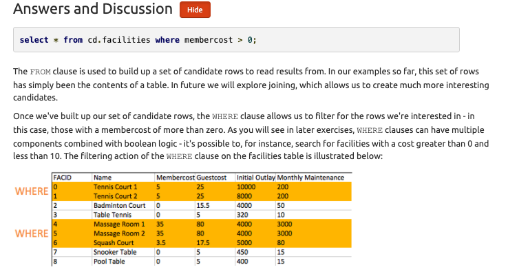
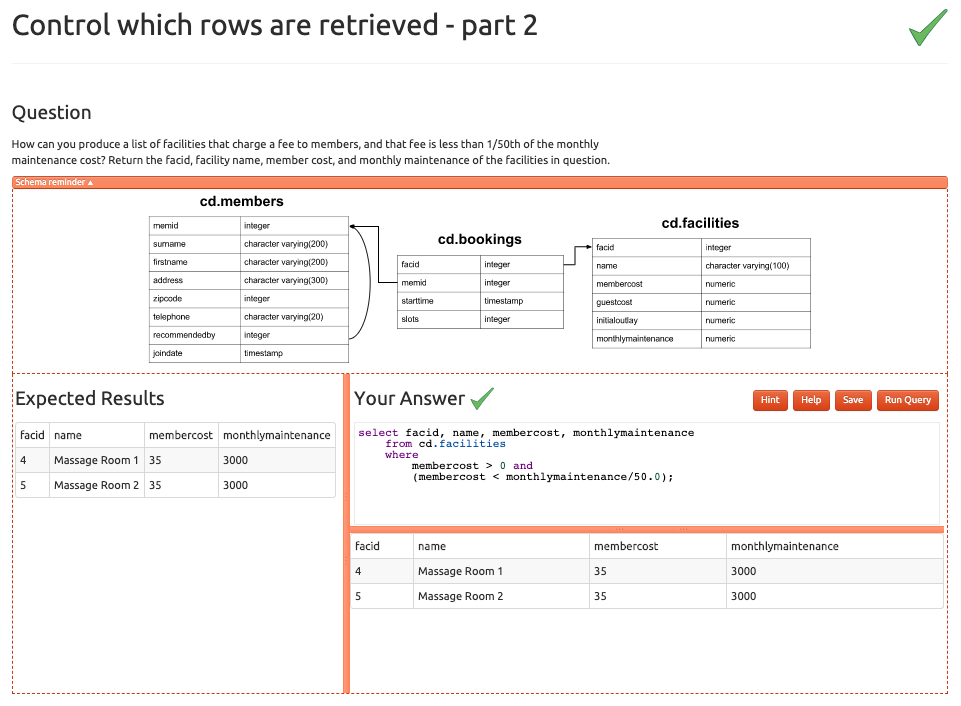
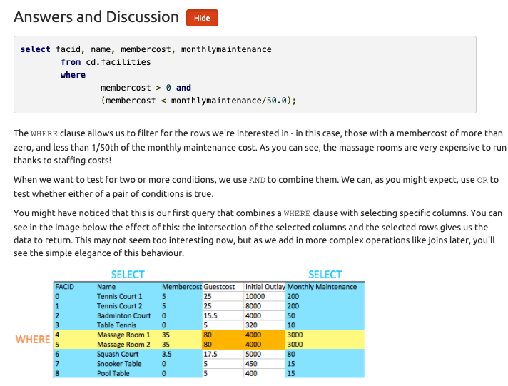
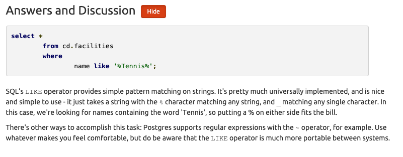
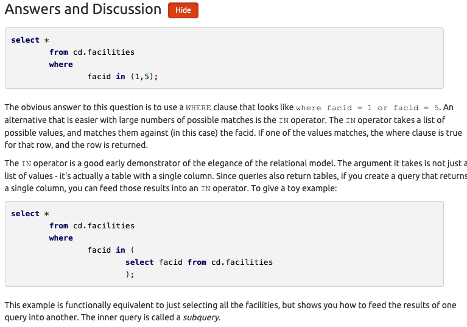

# Basic SQL

#### [Skip to Recap](#recap)
### Entity Relationship Diagrams

An **entity relationship diagram (ERD)** is a common way to view data in a database. Below is the ERD for the database we will use from Parch & Posey. These diagrams help you visualize the data you are analyzing including:

* The names of the tables.
* The columns in each table.
* The way the tables work together.

You can think of each of the boxes below as a spreadsheet.


What to Notice
In the Parch & Posey database there are five tables (essentially 5 spreadsheets):

* web_events
* accounts
* orders
* sales_reps
* region

You can think of each of these tables as an individual spreadsheet. Then the columns in each spreadsheet are listed below the table name. For example, the region table has two columns: id and name. Alternatively the web_events table has four columns.


The "crow's foot" that connects the tables together shows us how the columns in one table relate to the columns in another table. In this first lesson, you will be learning the basics of how to work with SQL to interact with a single table. In the next lesson, you will learn more about why these connections are so important for working with SQL and relational databases.


### Map of SQL Content and Project

The skills you learn in the classroom are directly extendable to writing SQL in other environments outside this classroom. For the project at the end of these lessons, you will download a program that will allow you to write code on your local machine. You will then analyze and answer business questions using data associated with a music store by querying their database.

## Lesson Outline

There are three lessons in this Nanodegree aimed at helping you understand how to write SQL queries. If you choose to take the Predictive Analytics Nanodegree or the Data Analyst Nanodegree programs, these three lessons will also be a part of these programs. However, there is also an additional lesson on Advanced SQL also taught by Derek!

The three lessons in this course aim at the following components of SQL:

**SQL Basics** - Here you will get your first taste at how SQL works, and learn the basics of the SQL language. You will learn how to write code to interact with tables similar to the ones we analyzed in Excel earlier. Specifically, you will learn a little about databases, the basic syntax of SQL, and you will write your first queries!

**SQL Joins** - In this lesson, you will learn the real power of SQL. You will learn about Entity Relationship Diagrams (ERDs), and how to join multiple tables together from a relational database. The power to join tables is what really moved companies to adopt this approach to holding data.

**SQL Aggregations** - In this final lesson, you will learn some more advanced features of SQL. You will gain the ability to summarize data from multiple tables in a database.

At the end of these three lessons, you will be ready to tackle the project. The project aims to assure you have mastered these three topics, but you will also see some of the more advanced queries that were not covered in this course. These are just meant to introduce you to the advanced material, but don't feel discouraged if you didn't get these - they were beyond the scope of the class, and they are not required to pass the project!

## Introduction
Before we dive into writing Structured Query Language (SQL) queries, let's take a look at what makes SQL and the databases that utilize SQL so popular.

SQL is a Language. Hence, the last word of SQL being language. SQL is used all over the place beyond the databases we will utilize in this class. With that being said, SQL is most popular for its interaction with databases. For this class, you can think of a database as a bunch of excel spreadsheets all sitting in one place. Not all databases are a bunch of excel spreadsheets sitting in one place, but it is a reasonable idea for this class.

[Why Do Data Analysts Use SQL?](https://www.youtube.com/watch?v=uCNOtUht2Xc) :tv:

There are some major advantages to using traditional relational databases, which we interact with using SQL. The five most apparent are:

1. SQL is easy to understand.
2. Traditional databases allow us to access data directly.
3. Traditional databases allow us to audit and replicate our data.
4. SQL is a great tool for analyzing multiple tables at once.
5. SQL allows you to analyze more complex questions than dashboard tools like Google Analytics.

[Why Do Businesses Choose SQL?](blob:https://classroom.udacity.com/bc2852c5-4bd1-46a0-aad6-4961e642f337) :tv:

**Why Businesses Like Databases**

**1. Data integrity is ensured** - only the data you want entered is entered, and only certain users are able to enter data into the database.

**2. Data can be accessed quickly** - SQL allows you to obtain results very quickly from the data stored in a database. Code can be optimized to quickly pull results.

**3. Data is easily shared** - multiple individuals can access data stored in a database, and the data is the same for all users allowing for consistent results for anyone with access to your database.

[How Databases Store Data](blob:https://classroom.udacity.com/98d10766-724f-469f-8608-7f941238b307) :tv:

A few key points about data stored in SQL databases:

**1.Data in databases is stored in tables that can be thought of just like Excel spreadsheets.**
For the most part, you can think of a database as a bunch of Excel spreadsheets. Each spreadsheet has rows and columns. Where each row holds data on a transaction, a person, a company, etc., while each column holds data pertaining to a particular aspect of one of the rows you care about like a name, location, a unique id, etc.

**2.All the data in the same column must match in terms of data type.**
An entire column is considered quantitative, discrete, or as some sort of string. This means if you have one row with a string in a particular column, the entire column might change to a text data type. This can be very bad if you want to do math with this column!

**3.Consistent column types are one of the main reasons working with databases is fast.**
Often databases hold a LOT of data. So, knowing that the columns are all of the same type of data means that obtaining data from a database can still be fast.

### Types of Databases

**SQL Databases**

There are many different types of SQL databases designed for different purposes. In this course we will use Postgres which is a popular open-source database with a very complete library of analytical functions.

Some of the most popular databases include:

* MySQL
* Access
* Oracle
* Microsoft SQL Server
* Postgres

You can also write SQL within other programming frameworks like Python, Scala, and HaDoop.

**Small Differences**

Each of these SQL databases may have subtle differences in syntax and available functions -- for example, MySQL doesn’t have some of the functions for modifying dates as Postgres. Most of what you see with Postgres will be directly applicable to using SQL in other frameworks and database environments. For the differences that do exist, you should check the documentation. Most SQL environments have great documentation online that you can easily access with a quick Google search.

The article here compares three of the most common types of SQL: SQLite, PostgreSQL, and MySQL.

You will use PostgreSQL for the lessons in this course, but you are not required to download it to your machine. We provide SQL workspaces in the classroom throughout the lessons. You may download PostgreSQL here if you'd like though.

### [Types of Statements](blob:https://classroom.udacity.com/83f9573a-6608-43e8-b3bc-b1ac01c5464c) :tv:

The key to SQL is understanding statements. A few statements include:

**1. CREATE TABLE** is a statement that creates a new table in a database.
**2. DROP TABLE** is a statement that removes a table in a database.
**3. SELECT** allows you to read data and display it. This is called a query.

The **SELECT** statement is the common statement used by analysts, and you will be learning all about them throughout this course!

SQL statements are code that can read and manipulate data. Basic syntax reminders: ***SQL isn't case sensitive*** - meaning you can write upper and lower case anywhere in the code. Additionally, you can end SQL statements with a semicolon, but ***some SQL environments don't require a semicolon at the end***.

>We will be using the SELECT statement, which is called a query. The DROP and CREATE statements actually change the data in the database. In most companies, analysts are not given permission to use these types of statements. This a good thing - ACTUALLY changing the data in the database is a powerful thing. This is generally reserved for database administrators exclusively.

### [SELECT & FROM](blob:https://classroom.udacity.com/46097a12-fef7-45c5-ac98-ad7cc85d9d8e) :tv:

Here you were introduced to the SQL command that will be used in every query you write: **SELECT** ... **FROM** ....

**1. SELECT** indicates **which column(s)** you want to be given the data for.

**2. FROM specifies from which table(s)** you want to select the columns. Notice the columns need to exist in this table.
If you want to be provided with the data from all columns in the table, you use "\*", like so:

**SELECT * FROM** orders
Note that using **SELECT does not create a new table** with these columns in the database, it just provides the data to you as the results, or output, of this command.

**SELECT** and **FROM** in Every SQL Query
Every query will have **at least a SELECT and FROM statement**. The **SELECT** statement is **where you put the columns** for which you would like to show the data. The **FROM statement** is where you put the tables from which you **would like to pull data**.

### [LIMIT](https://www.youtube.com/watch?v=cCPHNNhBgpQ) :tv:

We have already seen the **SELECT (to choose columns)** and **FROM (to choose tables)** statements. The **LIMIT** statement is useful when you want to see **just the first few rows of a table**. This can be much faster for loading than if we load the entire dataset.

The **LIMIT command is always the very last part of a query**. An example of showing just the first 10 rows of the orders table with all of the columns might look like the following:

#### Excercises

Try using LIMIT yourself below by writing a query that displays all the data in the occurred_at, account_id, and channel columns of the web_events table, and limits the output to only the first 15 rows.

```
  SELECT occurred_at, account_id, channel
  FROM web_events
  LIMIT 15;
```

### [ORDER BY](https://www.youtube.com/watch?v=wqj2As31LqI) :tv:

The **ORDER BY** statement allows us to sort our results using the data in any column. If you are familiar with Excel or Google Sheets, using ORDER BY is **similar to sorting a sheet using a column**. A key difference, however, is that using ORDER BY in a SQL query only **has temporary effects**, for the results of that query, unlike sorting a sheet by column in Excel or Sheets.

In other words, when you use ORDER BY in a SQL query, your output will be sorted that way, but then the next query you run will encounter the unsorted data again. It's important to keep in mind that this is different than using common spreadsheet software, where sorting the spreadsheet by column actually alters the data in that sheet until you undo or change that sorting. This highlights the meaning and function of a SQL "query."

The **ORDER BY** statement always comes in a query **after the SELECT and FROM** statements, but before the LIMIT statement. If you are using the LIMIT statement, it will always appear last. As you learn additional commands, the order of these statements will matter more.

**Pro Tip**
Remember **DESC** can be added after the column in your ORDER BY statement to sort in descending order, as the default is to sort in ascending order.

#### Excercises:

1. Write a query to return the 10 earliest orders in the orders table. Include the id, occurred_at, and total_amt_usd.
```
  SELECT id, occurred_at, total_amt_usd
  	FROM orders
  ORDER BY occurred_at
  LIMIT 10;
```

2. Write a query to return the top 5 orders in terms of largest total_amt_usd. Include the id, account_id, and total_amt_usd.
```
  SELECT id, account_id, total_amt_usd
  	FROM orders
  ORDER BY total_amt_usd DESC
  LIMIT 5;
```

3. Write a query to return the lowest 20 orders in terms of smallest total_amt_usd. Include the id, account_id, and total_amt_usd.
```
  SELECT id, account_id, total_amt_usd
    FROM orders
  ORDER BY total_amt_usd
  LIMIT 20;
```

### [ORDER BY Part II](https://www.youtube.com/watch?v=XQCjREdOqwE) :tv:

When you provide a list of columns in an **ORDER BY** command, the **sorting occurs using the leftmost column in your list first**, then the **next column from the left**, and so on. We still have the ability to flip the way we order using DESC.

#### Excercises:

1. Write a query that displays the order ID, account ID, and total dollar amount for all the orders, sorted first by the account ID (in ascending order), and then by the total dollar amount (in descending order).

```
  SELECT id, account_id, total_amt_usd
  FROM orders
  ORDER BY account_id ,total_amt_usd DESC;
```

2. Now write a query that again displays order ID, account ID, and total dollar amount for each order, but this time sorted first by total dollar amount (in descending order), and then by account ID (in ascending order).
```
  SELECT id, account_id, total_amt_usd
  FROM orders
  ORDER BY total_amt_usd DESC, account_id;  
```

3. Compare the results of these two queries above. How are the results different when you switch the column you sort on first?

```
  #1 just sorted by account id, #2 sorted by total amount
```

```
  In query #1, all of the orders for each account ID are grouped together, and then within each of those groupings, the orders appear from the greatest order amount to the least. In query #2, since you sorted by the total dollar amount first, the orders appear from greatest to least regardless of which account ID they were from. Then they are sorted by account ID next. (The secondary sorting by account ID is difficult to see here, since only if there were two orders with equal total dollar amounts would there need to be any sorting by account ID.)
```

### [WHERE](https://www.youtube.com/watch?v=mN0uTnlXaxg) :tv:

Using the **WHERE** statement, we can display subsets of tables based on conditions that must be met. You can also think of the **WHERE** command as **filtering the data**.

This video above shows how this can be used, and in the upcoming concepts, you will learn some common operators that are useful with the WHERE' statement.

Common symbols used in WHERE statements include:

* \> (greater than)

* \< (less than)

* \>= (greater than or equal to)

* \<= (less than or equal to)

* \= (equal to)

* \!= (not equal to)

#### Excercises:

1. Pulls the first 5 rows and all columns from the orders table that have a dollar amount of gloss_amt_usd greater than or equal to 1000.
```
  SELECT *
  FROM orders
  WHERE gloss_amt_usd >= 1000
  LIMIT 5;
```

2. Pulls the first 10 rows and all columns from the orders table that have a total_amt_usd less than 500.
```
  SELECT *
  FROM orders
  WHERE total_amt_usd <500
  LIMIT 10;
```

### [WHERE with Non-Numeric Data](https://www.youtube.com/watch?v=_pLx7MHOyjo) :tv:

The **WHERE** statement can also be used with **non-numeric data**. We can use the **= and **!=** operators here. You need to be sure to **use single quotes** (just be careful if you have quotes in the original text) with the text data, not double quotes.

Commonly when we are using WHERE with non-numeric data fields, we use the **LIKE, NOT, or IN** operators. We will see those before the end of this lesson!

#### Excercise:
1. Filter the accounts table to include the company name, website, and the primary point of contact (primary_poc) just for the Exxon Mobil company in the accounts table.
```
  SELECT name, website, primary_poc
  FROM accounts
  WHERE name = 'Exxon Mobil';
```

###[Derived Columns](https://www.youtube.com/watch?v=fgcJdiNECxI) :tv:

Creating a new column that is a combination of existing columns is known as a **derived column** (or **"calculated"** or **"computed"** column). Usually you want to give a name, or "alias," to your new column using the **AS** keyword.

This derived column, and its alias, are **generally only temporary**, **existing just for the duration of your query. The next time you run a query and access this table, the new column **will not be there**.

If you are deriving the new column from existing columns using a mathematical expression, then these familiar mathematical operators will be useful:

1. \* (Multiplication)
2. \+ (Addition)
3. \- (Subtraction)
4. \/ (Division)

Consider this example:

```
  SELECT id, (standard_amt_usd/total_amt_usd)*100 AS std_percent, total_amt_usd
  FROM orders
  LIMIT 10;

```
Here we divide the standard paper dollar amount by the total order amount to find the standard paper percent for the order, and use the AS keyword to name this new column "std_percent." You can run this query on the next page if you'd like, to see the output.

Order of Operations
Remember PEMDAS from math class to help remember the order of operations? If not, check out this [link](http://www.purplemath.com/modules/orderops.htm) as a reminder. The same order of operations applies when using arithmetic operators in SQL.

The following two statements have very different end results:

1. Standard_qty / standard_qty + gloss_qty + poster_qty
2. standard_qty / (standard_qty + gloss_qty + poster_qty)

It is likely that you mean to do the calculation as written in statement number 2!

#### Exercises

1. Create a column that divides the standard_amt_usd by the standard_qty to find the unit price for standard paper for each order. Limit the results to the first 10 orders, and include the id and account_id fields.
```
  SELECT 	id,
  		    account_id,
          standard_amt_usd/standard_qty AS unit_price
  FROM orders
  LIMIT 10;
```

2. Write a query that finds the percentage of revenue that comes from poster paper for each order. You will need to use only the columns that end with \_usd. (Try to do this without using the total column.) Display the id and account_id fields also. NOTE - you will receive an error with the correct solution to this question. This occurs because at least one of the values in the data creates a division by zero in your formula. You will learn later in the course how to fully handle this issue. For now, you can just limit your calculations to the first 10 orders, as we did in question \#1, and you'll avoid that set of data that causes the problem.

```
  SELECT	id,
  		account_id,
     		poster_amt_usd/(standard_amt_usd + gloss_amt_usd + poster_amt_usd) AS post_per
  FROM orders
  LIMIT 10;
```
### Introduction to Logical Operators
In the next concepts, you will be learning about Logical Operators. Logical Operators include:

1. **LIKE**
This allows you to perform operations similar to using WHERE and =, but for cases when you might not know exactly what you are looking for.

2. **IN**
This allows you to perform operations similar to using WHERE and =, but for more than one condition.

3. **NOT**
This is used with IN and LIKE to select all of the rows NOT LIKE or NOT IN a certain condition.

4. **AND** & **BETWEEN**
These allow you to combine operations where all combined conditions must be true.

5. **OR**
This allow you to combine operations where at least one of the combined conditions must be true.

### [LIKE](https://www.youtube.com/watch?v=O5z6eWkNip4) :tv:

The **LIKE** operator is extremely useful for working with text. You will use **LIKE** within a **WHERE** clause. The **LIKE** operator is frequently used with **%**. The % tells us that we might want any number of characters leading up to a particular set of characters or following a certain set of characters, as we saw with the google syntax above. Remember you will **need to use single quotes** for the text you pass to the LIKE operator, because of this lower and uppercase letters are not the same within the string. Searching for 'T' is not the same as searching for 't'. In other SQL environments (outside the classroom), you can use either single or double quotes.

Hopefully you are starting to get more comfortable with SQL, as we are starting to move toward operations that have more applications, but this also means we can't show you every use case. Hopefully, you can start to think about how you might use these types of applications to **identify phone numbers from a certain region**, or **an individual where you can't quite remember the full name**.

#### Exercises:

1. All the companies whose names start with 'C'.
```
  SELECT name
  FROM accounts
  WHERE name LIKE 'C%';
```

2. All companies whose names contain the string 'one' somewhere in the name.
```
  SELECT name
  FROM accounts
  WHERE name LIKE '%one%';
```

3. All companies whose names end with 's'
```
  SELECT name
  FROM accounts
  WHERE name LIKE '%s';
```

### [IN](https://www.youtube.com/watch?v=_JPO7wwX3uA) :tv:

The **IN** operator is useful for working with both numeric and text columns. This operator allows you to use an **=**, but for more than one item of that particular column. We **can check one, two or many column values** for which we want to pull data, but all within the same query. In the upcoming concepts, you will see the **OR** operator that would also allow us to perform these tasks, **but the IN operator is a cleaner way to write these queries**.

**Expert Tip**

In most SQL environments, although not in our Udacity's classroom, you can use single or double quotation marks - and you may NEED to use double quotation marks if you have an apostrophe within the text you are attempting to pull.

In our Udacity SQL workspaces, note you can include an apostrophe by putting two single quotes together. For example, Macy's in our workspace would be 'Macy''s'.

#### Excercise:
1. Use the accounts table to find the account name, primary_poc, and sales_rep_id for Walmart, Target, and Nordstrom.
```
  SELECT name, primary_poc, sales_rep_id
  FROM accounts
  WHERE name IN ('Walmart','Target','Nordstrom');
```
2. Use the web_events table to find all information regarding individuals who were contacted via the channel of organic or adwords.
```
  SELECT *
  FROM web_events
  WHERE channel IN ('organic','adwords');
```

###[NOT](https://www.youtube.com/watch?v=dSQF87oW8a0) :tv:

The **NOT** operator is an extremely useful operator for working with the previous two operators we introduced: **IN** and **LIKE**. By specifying **NOT LIKE** or **NOT IN**, we can grab all of the rows that do not meet a particular criteria.

#### Excercises:

We can pull all of the rows that were excluded from the queries in the previous two concepts with our new operator.

1. Use the accounts table to find the account name, primary poc, and sales rep id for all stores except Walmart, Target, and Nordstrom.
```
  SELECT name, primary_poc, sales_rep_id
  FROM accounts WHERE name NOT IN ('Walmart','Target','Nordstrom');
```

2. Use the web_events table to find all information regarding individuals who were contacted via any method except using organic or adwords methods.
```
  SELECT *
  FROM web_events WHERE channel  NOT IN ('organic','adwords');
```
Use the accounts table to find:

1. All the companies whose names do not start with 'C'.
```
  SELECT name
  FROM accounts WHERE name NOT LIKE ('C%');
```

2. All companies whose names do not contain the string 'one' somewhere in the name.
```
  SELECT name
  FROM accounts WHERE name NOT LIKE ('%one%');
```

3. All companies whose names do not end with 's'.
```
  SELECT name
  FROM accounts WHERE name NOT LIKE ('%s');
```

### [AND and BETWEEN](https://www.youtube.com/watch?v=nBuDPneWcKY) :tv:

The **AND** operator is used within a **WHERE** statement to consider more than one logical clause at a time. Each time you link a new statement with an **AND**, you will need to specify the column you are interested in looking at. You may link as many statements as you would like to consider at the same time. This operator works with all of the operations we have seen so far including arithmetic operators (+, \*, -, /). **LIKE**, **IN**, and **NOT** logic can also be linked together using the AND operator.

**BETWEEN Operator**
Sometimes we can make a cleaner statement using **BETWEEN** than we can using AND. Particularly this is true when we are **using the same column for different parts of our AND statement**. In the previous video, we probably should have used BETWEEN.

Instead of writing :
  `WHERE column >= 6 AND column <= 10`

we can instead write, equivalently:
  `WHERE column BETWEEN 6 AND 10`

#### Exercises:

1. Write a query that returns all the orders where the standard_qty is over 1000, the poster_qty is 0, and the gloss_qty is 0.
```
  SELECT *
  FROM orders
  WHERE standard_qty > 1000 AND poster_qty = 0 AND gloss_qty = 0;
```
2. Using the accounts table, find all the companies whose names do not start with 'C' and end with 's'.
```
  SELECT *
  FROM accounts
  WHERE name NOT LIKE 'C%''s%';
```

3. When you use the BETWEEN operator in SQL, do the results include the values of your endpoints, or not? Figure out the answer to this important question by writing a query that displays the order date and gloss_qty data for all orders where gloss_qty is between 24 and 29. Then look at your output to see if the BETWEEN operator included the begin and end values or not.
```
  SELECT occurred_at, gloss_qty
  FROM orders
  WHERE gloss_qty BETWEEN 24 AND 29;
```

```
  Yes, it includes the endpoints
```

4. Use the web_events table to find all information regarding individuals who were contacted via the organic or adwords channels, and started their account at any point in 2016, sorted from newest to oldest.
```
  SELECT *
  FROM web_events
  WHERE channel IN ('adwords','organic') AND occurred_at >= '2016-01-01'
  ORDER BY occurred_at DESC;
```

>While BETWEEN is generally inclusive of endpoints, it assumes the time is at 00:00:00 (i.e. midnight) for dates. This is the reason why we set the right-side endpoint of the period at '2017-01-01'.

```
  SELECT *
  FROM web_events
  WHERE channel IN ('organic', 'adwords') AND occurred_at BETWEEN '2016-01-01' AND '2017-01-01'
  ORDER BY occurred_at DESC;
```

###[OR](https://www.youtube.com/watch?v=3vLGEuXAAvA) :tv:

Similar to the **AND** operator, the **OR** operator can combine multiple statements. Each time you link a new statement with an **OR**, you will need to specify the column you are interested in looking at. You may link as many statements as you would like to consider at the same time. This operator works with all of the operations we have seen so far including arithmetic operators (+, \*, -, /), **LIKE**, **IN**, **NOT**, **AND**, and **BETWEEN** logic can all be linked together using the OR operator.

When combining multiple of these operations, we frequently might need to use parentheses to assure that logic we want to perform is being executed correctly. The [video](https://www.youtube.com/watch?v=DRmkKVhe6-s) :tv: below shows an example of one of these situations.

#### Exercises:
1. Find list of orders ids where either gloss_qty or poster_qty is greater than 4000. Only include the id field in the resulting table.
```
  SELECT id
  FROM orders
  WHERE gloss_qty > 4000 OR poster_qty > 4000;
```

2. Write a query that returns a list of orders where the standard_qty is zero and either the gloss_qty or poster_qty is over 1000.
```
  SELECT *
  FROM orders
  WHERE standard_qty = 0 AND (gloss_qty > 1000 OR poster_qty >1000);
```

3. Find all the company names that start with a 'C' or 'W', and the primary contact contains 'ana' or 'Ana', but it doesn't contain 'eana'.
```
  SELECT name, primary_poc
  FROM accounts
  WHERE (name LIKE 'C%' OR name LIKE 'W%')
    AND ((primary_poc LIKE '%ana%' OR primary_poc LIKE '%Ana%')
    AND primary_poc NOT LIKE '%eana%');
```

### RECAP
 

**Other Tips**

Though SQL is **not case sensitive** (it doesn't care if you write your statements as all uppercase or lowercase), we discussed some best practices. The **order of the key words does matter**! Using what you know so far, you will want to write your statements as:

```
  SELECT col1, col2
  FROM table1
  WHERE col3  > 5 AND col4 LIKE '%os%'
  ORDER BY col5
  LIMIT 10;
```

Notice, you can retrieve different columns than those being used in the ORDER BY and WHERE statements. Assuming all of these column names existed in this way (col1, col2, col3, col4, col5) within a table called table1, this query would run just fine.

**Looking Ahead**

In the next lesson, you will be learning about **JOINs**. This is the real secret (well not really a secret) behind the success of SQL as a language. **JOINs** allow us to combine multiple tables together. All of the operations we learned here will still be important moving forward, but we will be able to answer much more complex questions by combining information from multiple tables! You have already mastered so much - potentially writing your first code ever, but it is about to get so much better!


================

## My Notes:

I installed PostgreSQL.app.
To start the server `start` and select the database
To create a database from a downloaded sql file run `psql -U <username> -f <sqlfile>.sql -d postgres -x -q`

### [Then I practiced here](https://pgexercises.com/questions/basic/)

### Retrieve everything from a table


`select * from cd.facilities`

The SELECT statement is the basic starting block for queries that read information out of the database. A minimal select statement is generally comprised of `select [some set of columns] from [some table or group of tables]`.

In this case, we want all of the information from the facilities table. The from section is easy - we just need to specify the `cd.facilities` table. `'cd'` is the table's schema - a term used for a logical grouping of related information in the database.

Next, we need to specify that we want all the columns. Conveniently, there's a shorthand for 'all columns' - \*. We can use this instead of laboriously specifying all the column names.

### Retrieve specific columns from a table


`select name, membercost from cd.facilities;`

For this question, we need to specify the columns that we want. We can do that with a simple comma-delimited list of column names specified to the select statement. All the database does is look at the columns available in the FROM clause, and return the ones we asked for, as illustrated below


Generally speaking, for non-throwaway queries it's considered desirable to specify the names of the columns you want in your queries rather than using \*. This is because your application might not be able to cope if more columns get added into the table.

### Control which rows are retrieved




`select * from cd.facilities where membercost > 0;`

The FROM clause is used to build up a set of candidate rows to read results from. In our examples so far, this set of rows has simply been the contents of a table. In future we will explore joining, which allows us to create much more interesting candidates.

Once we've built up our set of candidate rows, the **WHERE** clause allows us to filter for the rows we're interested in - in this case, those with a membercost of more than zero. As you will see in later exercises, WHERE clauses can have multiple components combined with boolean logic - it's possible to, for instance, search for facilities with a cost greater than 0 and less than 10. The filtering action of the WHERE clause on the facilities table is illustrated below:

### Control which rows are retrieved - part 2





```
  select facid, name, membercost, monthlymaintenance
  	from cd.facilities
  	where
  		membercost > 0 and
  		(membercost < monthlymaintenance/50.0);     
```

The WHERE clause allows us to filter for the rows we're interested in - in this case, those with a membercost of more than zero, and less than 1/50th of the monthly maintenance cost. As you can see, the massage rooms are very expensive to run thanks to staffing costs!

When we want to test for two or more conditions, we use `AND` to combine them. We can, as you might expect, use `OR` to test whether either of a pair of conditions is true.

You might have noticed that this is our first query that combines a WHERE clause with selecting specific columns. You can see in the image below the effect of this: the intersection of the selected columns and the selected rows gives us the data to return. This may not seem too interesting now, but as we add in more complex operations like `joins` later, you'll see the simple elegance of this behaviour.

### Basic string searches




```
  select *
    from cd.facilities
    where
      name like '%Tennis%';  
```

SQL's `LIKE` operator provides simple pattern matching on strings. It's pretty much universally implemented, and is nice and simple to use - it just takes a string with the `%` character matching any string, and _ matching any single character. In this case, we're looking for names containing the word 'Tennis', so putting a % on either side fits the bill.

There's other ways to accomplish this task: Postgres supports regular expressions with the ~ operator, for example. Use whatever makes you feel comfortable, but do be aware that the LIKE operator is much more portable between systems.

### Matching against multiple possible values




```
  select *
    from cd.facilities
    where
      facid in (1,5);     
```
The obvious answer to this question is to use a WHERE clause that looks like `where facid = 1 or facid = 5`. An alternative that is easier with large numbers of possible matches is the `IN` operator. The `IN` operator takes a list of possible values, and matches them against (in this case) the facid. If one of the values matches, the where clause is true for that row, and the row is returned.

The IN operator is a good early demonstrator of the elegance of the relational model. The argument it takes is not just a list of values - it's actually a table with a single column. Since queries also return tables, if you create a query that returns a single column, you can feed those results into an IN operator. To give a toy example:

```
  select *
  	from cd.facilities
  	where
  		facid in (
  			select facid from cd.facilities
  			);
```

This example is functionally equivalent to just selecting all the facilities, but shows you how to feed the results of one query into another. The inner query is called a *subquery*.
