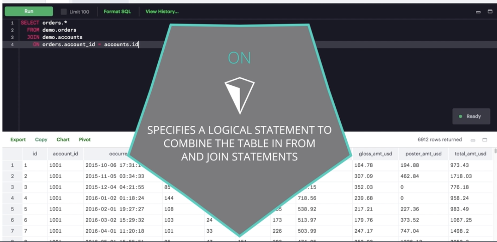
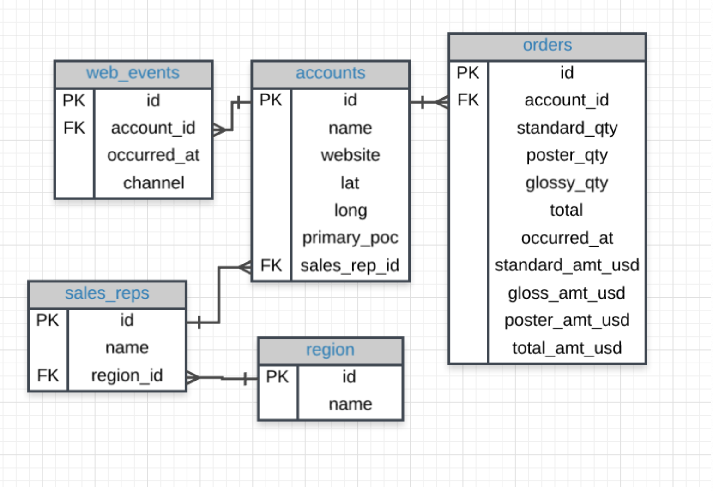
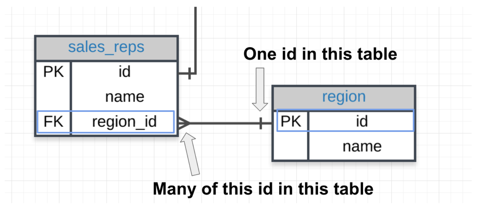
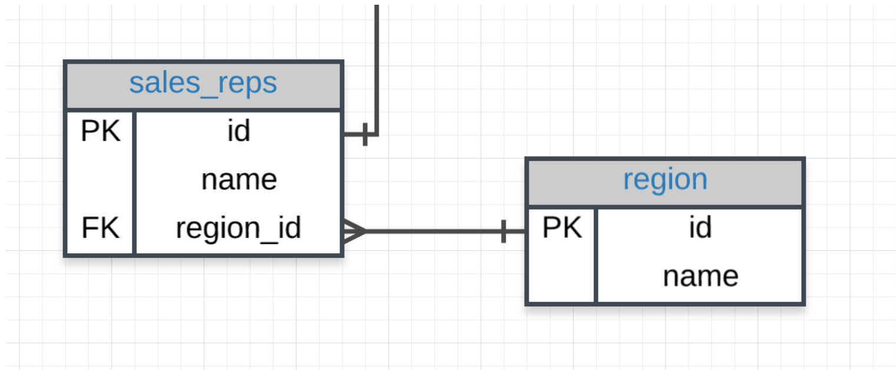
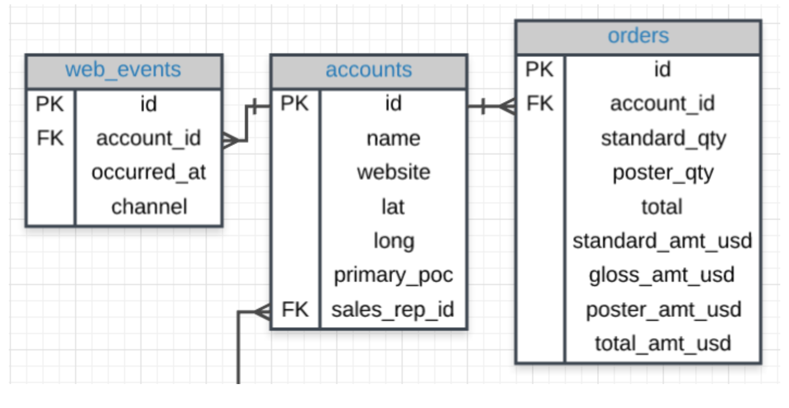
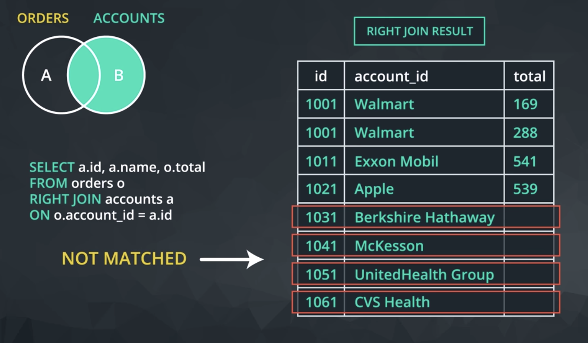

### [Intro](https://www.youtube.com/watch?v=YvZ010GU-Ck) :tv:

[Why Would We Want to Split Data Into Separate Tables?](blob:https://classroom.udacity.com/75dc60dd-b029-438b-905e-cb292694bef2) :tv:

So above, we understand that all of the information related to an account is not in the orders table, but why not? [Watch the below video](blob:https://classroom.udacity.com/bfe5fa46-1321-4cb3-84b2-42d6bce33550) :tv: to find out!

### Database Normalization
When creating a database, it is really important to think about how data will be stored. This is known as **normalization**, and it is a huge part of most SQL classes. If you are in charge of setting up a new database, it is important to have a thorough understanding of database normalization.

There are essentially three ideas that are aimed at database normalization:

1. Are the tables storing logical groupings of the data?
2. Can I make changes in a single location, rather than in many tables for the same information?
3. Can I access and manipulate data quickly and efficiently?

This is discussed in detail [here](https://www.itprotoday.com/sql-server/sql-design-why-you-need-database-normalization).

However, most analysts are working with a database that was already set up with the necessary properties in place. As analysts of data, you don't really need to think too much about data normalization. You just need to be able to pull the data from the database, so you can start making insights. This will be our focus in this lesson.

### [Introduction to JOINs](blob:https://classroom.udacity.com/fb8382c8-f123-41f1-a6fb-24cc6d0e4cc9) :tv:





This entire lesson will be focused on **JOINs**. The whole purpose of **JOIN** statements is to allow us to **pull data from more than one table at a time**.

Again - JOINs are useful for allowing us to pull data from multiple tables. This is both simple and powerful all at the same time.

With the addition of the JOIN statement to our toolkit, we will also be adding the **ON** statement.

We use **ON clause to specify a JOIN condition which is a logical statement to combine the table in `FROM` and `JOIN` statements**.

#### Write Your First JOIN
Below we see an example of a query using a JOIN statement. Let's discuss what the different clauses of this query mean.

```
  SELECT orders.*
  FROM orders
  JOIN accounts
  ON orders.account_id = accounts.id;
```
As we've learned, the `SELECT` clause indicates which column(s) of data you'd like to see in the output (For Example, orders.* gives us all the columns in orders table in the output). The `FROM` clause indicates the first table from which we're pulling data, and the `JOIN` indicates the second table. The `ON` clause specifies the column on which you'd like to merge the two tables together. Try running this query yourself below.

**What to Notice**
We are able to pull data from two tables:

1. **orders**
2. **accounts**

Above, we are only pulling data from the **orders** table since in the **SELECT** statement we only reference columns from the orders table.

The **ON** statement holds the two columns that get linked across the two tables. This will be the focus in the next concepts.

**Additional Information**

If we wanted to *only pull individual elements from either the orders or accounts table, we can do this by using the exact same information* in the **FROM** and **ON** statements. However, in your SELECT statement, you will need to know how to specify tables and columns in the SELECT statement:

1. The **table name** is always **before** the period.
2. The **column** you want from that table is always **after** the period.

For example, if we want to pull only the **account name** and the dates in which that account placed an order, but none of the other columns, we can do this with the following query:

```
  SELECT  accounts.name,
          orders.occurred_at
  FROM orders
  JOIN accounts
  ON orders.account_id = accounts.id;
```

This query only pulls two columns, not all the information in these two tables. Alternatively, the below query pulls all the columns from both the **accounts** and **orders** table

```
  SELECT *
  FROM orders
  JOIN accounts
  ON orders.account_id = accounts.id;
```
And the first query you ran pull all the information from only the **orders** table:

```
  SELECT orders.*
  FROM orders
  JOIN accounts
  ON orders.account_id = accounts.id;
```

Joining tables allows you access to each of the tables in the **SELECT** statement through the table name, and the columns will always follow a . after the table name.

#### Exercises:
1. Try pulling all the data from the **accounts** table, and all the data from the **orders** table.
```
  SELECT  accounts.*,
          orders.*
  FROM accounts
  JOIN orders
  ON accounts.id = orders.account_id;
```

2. Try **pulling standard_qty**, **gloss_qty**, and **poster_qty** from the **orders** table, and the **website** and the p**rimary_poc** from the **accounts** table.
```
  SELECT	orders.standard_qty,
  		orders.gloss_qty,
          orders.poster_qty,
          accounts.website,
          accounts.primary_poc
  FROM orders
  JOIN accounts
  ON orders.account_id = accounts.id;
```
> Notice that we need to specify every table a column comes from in the SELECT statement.

### Entity Relationship Diagrams

From the last lesson, you might remember that an entity relationship diagram (ERD) is a common way to view data in a database. It is also a key element to understanding how we can pull data from multiple tables.

It will be beneficial to have an idea of what the ERD looks like for Parch & Posey handy, so I have posted it again below. You might even print a copy to have with you as you work through the exercises in the remaining content.



**Tables & Columns**
In the Parch & Posey database there are 5 tables:

**web_events**
**accounts**
**orders**
**sales_reps**
**region**
You will notice some of the columns in the tables have PK or FK next to the column name, while other columns don't have a label at all.

If you look a little closer, you might notice that the **PK** is **associated with the first column in every table**. The PK here stands for **primary key**. A primary key exists in every table, and it is a **column that has a unique value for every row**.

If you look at the first few rows of any of the tables in our database, you will notice that this first, **PK, column is always unique**. *For this database it is always called `id`, but that is not true of all databases*.

You can explore the database ERD below by clicking on the table names in the left menu of the workspace below. Or you can query the first row of these tables in the workspace to see some examples of the content inside of each field.

### Keys

#### Primary Key (PK)

A primary key is a unique column in a particular table. This is the first column in each of our tables. Here, those columns are all called `id`, but that doesn't necessarily have to be the name. It is common that the primary key is the first column in our tables in most databases.

>The primary key is a single column that must exist in each table of a database. Again, these rules are true for most major databases, but some databases may not enforce these rules.

#### Foreign Key (FK)
A foreign key is a column in one table that **is a primary key in a different table**. We can see in the Parch & Posey ERD that the foreign keys are:

1. region_id
2. account_id
3. sales_rep_id

>Though all of the above only have one foreign key, a table can actually have multiple foreign keys (unlike primary keys).

Each of these is linked to the primary key of another table. An example is shown in the image below:



**Primary - Foreign Key Link**
In the above image you can see that:

1. The **region_id** is the foreign key.
2. The region_id is **linked** to id - this is the primary-foreign key link that connects these two tables.
3. The crow's foot shows that the **FK** can actually appear in many rows in the **sales_reps** table.
4. While the single line is telling us that the PK shows that id appears only once per row in this table.

### JOIN Revisited

Let's look back at the first JOIN you wrote.
```
  SELECT orders.*
  FROM orders
  JOIN accounts
  ON orders.account_id = accounts.id;
```
Here is the ERD for these two tables:


**Notice**

Notice our SQL query has the two tables we would like to join - one in the **FROM** and the other in the **JOIN**. Then in the **ON**, we will **ALWAYs** have the **PK** **equal** to the **FK**:

The way we join any two tables is in this way: linking the **PK** and **FK** (generally in an **ON** statement).



### JOIN More than Two Tables

This same logic can actually assist in joining more than two tables together. Look at the three tables below.



The Code

If we wanted to join all three of these tables, we could use the same logic. The code below pulls all of the data from all of the joined tables.
```
  SELECT *
  FROM web_events
  JOIN accounts
  ON web_events.account_id = accounts.id
  JOIN orders
  ON accounts.id = orders.account_id
```
Alternatively, we can create a **SELECT** statement that could pull specific columns from any of the three tables. Again, our **JOIN** holds a table, and **ON** is a **link** for our **PK** to equal the **FK**.

To pull specific columns, the **SELECT** statement will need to specify the table that you are wishing to pull the column from, as well as the column name. We could pull only three columns in the above by changing the select statement to the below, but maintaining the rest of the JOIN information:

`SELECT web_events.channel, accounts.name, orders.total`

We could continue this same process to link all of the tables if we wanted. For efficiency reasons, we probably don't want to do this unless we actually need information from all of the tables.

### [Alias](https://www.youtube.com/watch?v=viWHJaxWTvw) :tv:

When we JOIN tables together, it is nice to give each table an alias. Frequently an alias is just the first letter of the table name. You actually saw something similar for column names in the Arithmetic Operators concept.

Example:
```
  FROM tablename AS t1
  JOIN tablename2 AS t2
```
Before, you saw something like:

`SELECT col1 + col2 AS total, col3`

Frequently, you might also see these statements without the **AS** statement. Each of the above could be written in the following way instead, and they would still produce the **exact same results**:
```
  FROM tablename t1
  JOIN tablename2 t2
```
and

`SELECT col1 + col2 total, col3`

#### Aliases for Columns in Resulting Table
While aliasing tables is the most common use case. It can also be used to alias the columns selected to have the resulting table reflect a more readable name.

Example:

```
  Select t1.column1 aliasname, t2.column2 aliasname2
  FROM tablename AS t1
```

aliasname	  | aliasname2
example row	| example row
example row	| example row

#### Exercises:

1. Provide a table for all **web_events** associated with account **name** of Walmart. There should be three columns. Be sure to include the primary_poc, time of the event, and the channel for each event. Additionally, you might choose to add a fourth column to assure only Walmart events were chosen.
```
  SELECT  a.primary_poc,
          w.occurred_at, w.channel
  FROM accounts AS a
  JOIN web_events AS w
  ON w.account_id = a.id
  WHERE name = 'Walmart'
```
2. Provide a table that provides the **region** for each **sales_rep** along with their associated **accounts**. Your final table should include three columns: the region **name**, the sales rep **name**, and the account **name**. Sort the accounts alphabetically (A-Z) according to account name.
```
  SELECT	sales_reps.name AS rep,
          accounts.name AS account_name,
          region.name AS region      
  FROM accounts
  JOIN sales_reps
  ON accounts.sales_rep_id = sales_reps.id
  JOIN region
  ON sales_reps.region_id = region.id
  ORDER BY account_name;
```
3. Provide the **name** for each region for every **order**, as well as the account **name** and the **unit price** they paid (total_amt_usd/total) for the order. Your final table should have 3 columns: **region name**, **account name**, and **unit price**. A few accounts have 0 for **total**, so I divided by (total + 0.01) to assure not dividing by zero.
```
  SELECT r.name region, a.name account,
         o.total_amt_usd/(o.total + 0.01) unit_price
  FROM region r
  JOIN sales_reps s
  ON s.region_id = r.id
  JOIN accounts a
  ON a.sales_rep_id = s.id
  JOIN orders o
  ON o.account_id = a.id;
```

>We can simply write our alias directly after the column name (in the SELECT) or table name (in the FROM or JOIN) by writing the alias directly following the column or table we would like to alias. This will allow you to create clear column names even if calculations are used to create the column, and you can be more efficient with your code by aliasing table names.

#### [Expert Tip on JOINs](https://www.youtube.com/watch?v=3qdv1Ojc9Og)

You have had a bit of an introduction to these **one-to-one** and **one-to-many** relationships when we introduced **PKs** and **FKs**. Notice, traditional databases do not allow for many-to-many relationships, as these break the schema down pretty quickly. A very good answer is provided [here](https://stackoverflow.com/questions/7339143/why-no-many-to-many-relationships).

The types of relationships that exist in a database matter less to analysts, but you do need to understand why you would perform different types of JOINs, and what data you are pulling from the database. These ideas will be expanded upon in the next concepts.

### LEFT and RIGHT JOINs


#### [Inner Joins](https://www.youtube.com/watch?v=CxuHtd1Daqk)


#### [LEFT and RIGHT JOINs](https://www.youtube.com/watch?v=4edRxFmWUEw)




**JOINs**
Notice each of these new **JOIN** statements pulls all the same rows as an **INNER JOIN**, which you saw by just using JOIN, but they also potentially pull some additional rows.

If there is not matching information in the JOINed table, then you will have columns with empty cells. These empty cells introduce a new data type called **NULL**. You will learn about NULLs in detail in the next lesson, but for now you have a quick introduction as you can consider any cell without data as NULL.
