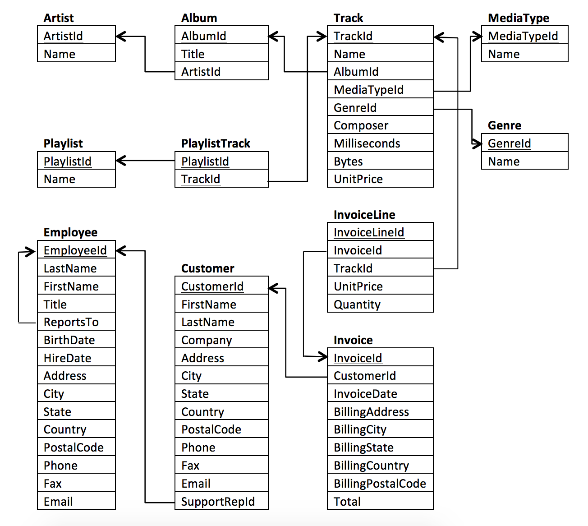
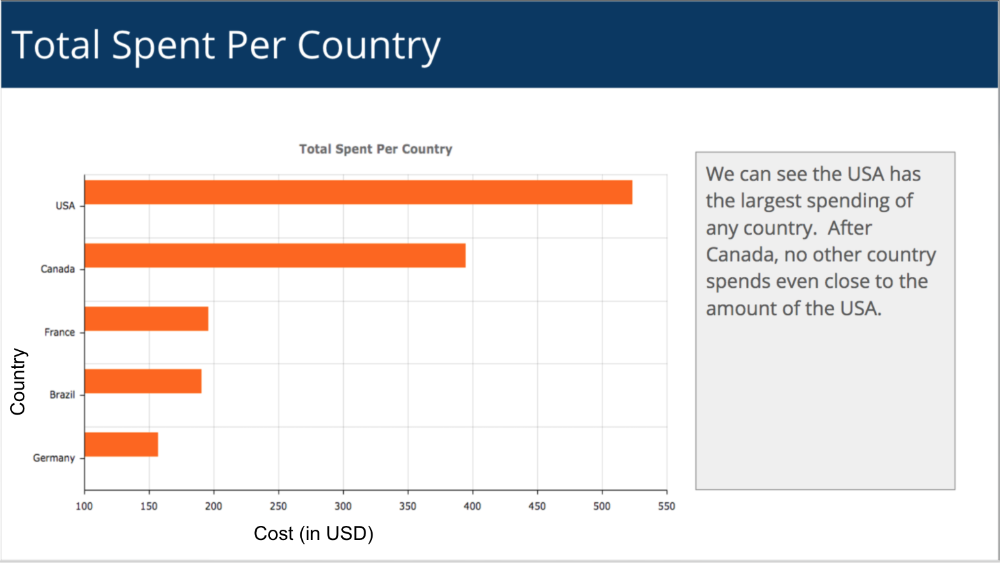

## Chinook Database

## Introduction

In this project, you will query the Chinook Database. The Chinook Database holds information about a music store. For this project, you will be assisting the Chinook team with understanding the media in their store, their customers and employees, and their invoice information. To assist you in the queries ahead, the schema for the Chinook Database is provided below. You can see the columns that link tables together via the arrows.



All of the below instructions are discussed in detail as we work through this lesson on your way to completing this project. The below serves as a quick reference of what you will be doing as you progress through the completion of this project.

## Instructions

You will need to follow the instructions on the next three concepts to get the Chinook database up and running on your own machine, and check that it is set up correctly. There will be two parts to this project.

1. The first part is a series of questions that will assure you have mastered the main concepts taught throughout the SQL lessons. Though these questions will not be "graded" by a reviewer, they will help you self assess.

2. The second part is a presentation. Similar to the first project, there isn't a 'right answer' for the second portion of the project. You have the ability to be creative in the questions you ask. You will then write a SQL query to pull the data needed to successfully answer your question. Use the pulled data to build a visual (bar chart, histogram, or another plot) that answers your question. The essentials of your project submission are discussed in the next sections. In order to review your presentation, you will need to save your slides as a PDF.

## Set Up the Database

Here are the steps:

1. Open up DB Browser to SQLite
2. Click on Open Database
3. Navigate to the Chinook.db file (probably in your downloads)
4. Click on the Execute SQL
5. Start querying your data

**Start Querying Your Data**

The database Entity Relationship Diagram was provided in the previous concept, but you can also find it on the [Chinook database homepage](https://chinookdatabase.codeplex.com/).

Once it looks like you have it all set up, you can start querying your database! First, we could have a look at all the data from the Invoice table:

`SELECT * FROM Invoice;`

Your first query, AWESOME!

Now check out what's in the Employee table.

`SELECT * FROM Employee;`

Looks like you are ready to take on this PROJECT and the WORLD! Everything you have been studying is going to come in handy now!


#### Quiz

1. Which countries have the most Invoices?
Use the Invoice table to determine the countries that have the most invoices. Provide a table of BillingCountry and Invoices ordered by the number of invoices for each country. The country with the most invoices should appear first.

My solution

```
  SELECT BILLINGCOUNTRY,
  	COUNT(INVOICEID)
  FROM INVOICE
  GROUP BY 1
  ORDER BY 2 DESC
```

2. Which city has the best customers?
We would like to throw a promotional Music Festival in the city we made the most money. Write a query that returns the 1 city that has the highest sum of invoice totals. Return both the city name and the sum of all invoice totals.

My solution

```
  SELECT BILLINGCITY,
  	SUM(TOTAL)
  FROM INVOICE
  GROUP BY 1
  ORDER BY 2 DESC
```

3. Who is the best customer?
The customer who has spent the most money will be declared the best customer. Build a query that returns the person who has spent the most money. I found the solution by linking the following three: Invoice, InvoiceLine, and Customer tables to retrieve this information, but you can probably do it with fewer!

My solution

```
  SELECT C.CUSTOMERID,
  	SUM(I.TOTAL)
  FROM CUSTOMER C
  JOIN INVOICE I ON C.CUSTOMERID = I.CUSTOMERID
  GROUP BY 1
  ORDER BY 2 DESC
```

4. Use your query to return the email, first name, last name, and Genre of all Rock Music listeners. Return your list ordered alphabetically by email address starting with A.

I chose to link information from the Customer, Invoice, InvoiceLine, Track, and Genre tables, but you may be able to find another way to get at the information.

My solution


```
  SELECT DISTINCT C.EMAIL,
  	C.FIRSTNAME,
  	C.LASTNAME,
  	G.NAME
  FROM CUSTOMER C
  JOIN INVOICE I ON C.CUSTOMERID = I.CUSTOMERID
  JOIN INVOICELINE IL ON IL.INVOICELINEID = I.INVOICEID
  JOIN TRACK T ON IL.TRACKID = T.TRACKID
  JOIN GENRE G ON T.GENREID = G.GENREID
  WHERE G.NAME = 'Rock'
  ORDER BY 1;
```

5. Who is writing the rock music?
Now that we know that our customers love rock music, we can decide which musicians to invite to play at the concert.

Let's invite the artists who have written the most rock music in our dataset. Write a query that returns the Artist name and total track count of the top 10 rock bands.

You will need to use the Genre, Track , Album, and Artist tables.

My solution

```
  SELECT AR.NAME,
  	COUNT(T.NAME)
  FROM TRACK T
  JOIN GENRE G ON T.GENREID = G.GENREID
  JOIN ALBUM AL ON AL.ALBUMID = T.ALBUMID
  JOIN ARTIST AR ON AR.ARTISTID = AL.ARTISTID
  WHERE G.NAME = 'Rock'
  GROUP BY 1
  ORDER BY 2 DESC
```

6. First, find which artist has earned the most according to the InvoiceLines?

Now use this artist to find which customer spent the most on this artist.

For this query, you will need to use the Invoice, InvoiceLine, Track, Customer, Album, and Artist tables.

Notice, this one is tricky because the Total spent in the Invoice table might not be on a single product, so you need to use the InvoiceLine table to find out how many of each product was purchased, and then multiply this by the price for each artist.

My solution

```
  SELECT 	Y.NAME AS ARTIST_NAME,
          SUM(TOTAL) AS GRAND_TOTAL
  FROM
          (SELECT		X.NAME,
                    X.UNITPRICE * X.QUANTITY AS TOTAL
           FROM
                   (SELECT   AR.NAME,
                             IL.UNITPRICE,
                             IL.QUANTITY
                    FROM ARTIST AR
                    JOIN ALBUM AL ON AR.ARTISTID = AL.ARTISTID
                    JOIN TRACK T ON AL.ALBUMID = T.ALBUMID
                    JOIN INVOICELINE IL ON T.TRACKID = IL.TRACKID
                    ORDER BY 1 DESC) AS X) AS Y
  GROUP BY 1
  ORDER BY 2 DESC
  LIMIT 1
```

**Solution Continued with top Purchaser**

Then, the top purchasers are shown in the table below. The customer with the highest total invoice amount is customer 55, Mark Taylor.

My solution

```
  SELECT   C.CUSTOMERID,
  	       C.FIRSTNAME || ' ' || C.LASTNAME AS CUSTOMER,
  	       AR.NAME AS ARTIST,
  	       SUM(IL.UNITPRICE) AS PRICE
  FROM CUSTOMER C
  JOIN INVOICE I ON C.CUSTOMERID = I.CUSTOMERID
  JOIN INVOICELINE IL ON I.INVOICEID = IL.INVOICEID
  JOIN TRACK T ON IL.TRACKID = T.TRACKID
  JOIN ALBUM AL ON T.ALBUMID = AL.ALBUMID
  JOIN ARTIST AR ON AL.ARTISTID = AR.ARTISTID
  WHERE AR.NAME = 'Iron Maiden'
  GROUP BY 1,2,3
  ORDER BY 4 DESC
  LIMIT 5

```

### Dates in SQLite (the project) Differ From Postgres (the classroom)

In the project you are working with a little different SQL syntax than in the classroom. Though most of the commands and logic will carry over directly, there are some differences between SQLite (used for this project), and PostgreSQL (used in the classroom). Specifically, the way those differences are likely to impact you is related to date functionality.

Postgres `SQL DATE_TRUNC`

```
  SELECT DATE_TRUNC('month', o.occurred_at) ord_date
  FROM orders o
```
This would only return the year and month of the date field in the query results

SQLite version of `DATE_TRUNC` is `STRFTIME`

```
  SELECT STRFTIME('%Y-%m', o.occurred_at) ord_date
  FROM orders o
```
This would only return the year and month of the date field in the query results. In SQLite we have to describe the date format more precisely since this is all that it will return are the pieces specified. We specify this by putting within single quotes the parts of the date we want in our final table.

For this query we wanted only the year and month `%Y` stands for year and `%m` stands for month. The full list of what is below.

```
  %d - day of month: 00

  %f - fractional seconds: SS.SSS

  %H - hour: 00-24

  %j - day of year: 001-366

  %J - Julian day number

  %m - month: 01-12

  %M - minute: 00-59

  %s - seconds since 1970-01-01

  %S - seconds: 00-59

  %w - day of week 0-6 with Sunday==0

  %W - week of year: 00-53

  %Y - year: 0000-9999
```

Postgres SQL `DATE_PART`

```
  SELECT DATE_PART('month', occurred_at) ord_year
  FROM orders
```
This would only return the month of the date field in the query results

SQLite version of `DATE_PART` is `STRFTIME`

```
  SELECT STRFTIME('%m', o.occurred_at) ord_date
  FROM orders o
```
Since we only want to pull the month out we can specify that using the same `STRFTIME` function in SQLite we just have to use the %letter notation to specify which part we want. So here we have to use '%m' instead of 'month'.

Here are some helpful links to assist with working with dates in SQLite.

https://www.techonthenet.com/sqlite/functions/strftime.php
https://sqlite.org/lang_datefunc.html

Should you have to work another SQL environment in the future, like Microsoft SQL Server, Oracle, MySQL, or any other SQL environment; there are likely to again be subtle differences. With your current skills, a quick Google search will likely help you be able your transfer what you know to work with any of these environments very quickly.


### Practice:

1. Count how many songs base on genre does customer 12 bought
```
  SELECT DISTINCT G.NAME GENRE,
  	COUNT(T.NAME)
  FROM CUSTOMER C
  JOIN INVOICE I ON I.CUSTOMERID = C.CUSTOMERID
  JOIN INVOICELINE IL ON IL.INVOICEID = I.INVOICEID
  JOIN TRACK T ON T.TRACKID = IL.TRACKID
  JOIN GENRE G ON G.GENREID = T.GENREID
  WHERE C.CUSTOMERID = 12
  GROUP BY 1
  ORDER BY 1
```

2. How much did customer 13 spent across genres?

```
  SELECT C.LASTNAME,
  C.FIRSTNAME,
  G.NAME GENRE,
  SUM(IL.UNITPRICE)
  FROM CUSTOMER C
  JOIN INVOICE I ON I.CUSTOMERID = C.CUSTOMERID
  JOIN INVOICELINE IL ON IL.INVOICEID = I.INVOICEID
  JOIN TRACK T ON T.TRACKID = IL.TRACKID
  JOIN GENRE G ON G.GENREID = T.GENREID
  WHERE C.CUSTOMERID = 13
  GROUP BY 1,2,3
  ORDER BY 1
```

3. How much did each customers spent per genre

```
  SELECT C.CUSTOMERID,
  C.LASTNAME,
  C.FIRSTNAME,
  G.NAME GENRE,
  SUM(IL.UNITPRICE)
  FROM CUSTOMER C
  JOIN INVOICE I ON I.CUSTOMERID = C.CUSTOMERID
  JOIN INVOICELINE IL ON IL.INVOICEID = I.INVOICEID
  JOIN TRACK T ON T.TRACKID = IL.TRACKID
  JOIN GENRE G ON G.GENREID = T.GENREID
  GROUP BY 1,2,3,4
  ORDER BY 1
```

4. How much was spent over all on each genre?

```
  SELECT G.NAME GENRE,
  	SUM(IL.UNITPRICE)
  FROM CUSTOMER C
  JOIN INVOICE I ON I.CUSTOMERID = C.CUSTOMERID
  JOIN INVOICELINE IL ON IL.INVOICEID = I.INVOICEID
  JOIN TRACK T ON T.TRACKID = IL.TRACKID
  JOIN GENRE G ON G.GENREID = T.GENREID
  GROUP BY 1
  ORDER BY 2 DESC
```

5. How much did Americans spent total?

```
  SELECT *
  FROM
  				(SELECT C.CUSTOMERID,
  						C.FIRSTNAME || ' ' || C.LASTNAME AS CUSTOMER,
  						SUM(IL.UNITPRICE) AS TOTAL
  					FROM CUSTOMER C
  					JOIN INVOICE I ON I.CUSTOMERID = C.CUSTOMERID
  					JOIN INVOICELINE IL ON IL.INVOICEID = I.INVOICEID
  					JOIN TRACK T ON T.TRACKID = IL.TRACKID
  					WHERE COUNTRY = 'USA'
  					GROUP BY 1,2
  					ORDER BY 3 DESC) AS X
```

6. How many users per country?
```
  SELECT C.COUNTRY,
  	COUNT(C.CUSTOMERID)
  FROM CUSTOMER C
  GROUP BY 1
  ORDER BY 1
```

7. How much did users spent total per country?
```
  SELECT C.COUNTRY,
  	C.FIRSTNAME || ' ' || C.LASTNAME AS CUSTOMER,
  	SUM(I.TOTAL)
  FROM INVOICE I
  JOIN CUSTOMER C ON C.CUSTOMERID = I.CUSTOMERID
  GROUP BY 1,2
  ORDER BY 3 DESC
```
8. how many songs per genre the music store has?

```
  SELECT G.NAME,
  	COUNT(T.TRACKID)
  FROM TRACK T
  JOIN GENRE G ON T.GENREID = G.GENREID
  GROUP BY 1
  ORDER BY 2 DESC
```

#### Tips from reviewer

* Difference between explicit and implicit JOINs. Here's a good [refresher](https://www.w3computing.com/sqlserver2012/join-operator-explicit-implicit-syntax/) for future reference.

* [Presentations for color blind](https://www.tableau.com/about/blog/2016/4/examining-data-viz-rules-dont-use-red-green-together-53463)

* [Data visualization catalog](https://datavizcatalogue.com/index.html)

### [Project Rubric](https://review.udacity.com/#!/rubrics/1061/view)

### Project submission - Important

**Presentations**

You are now on the portion of the project you will need to submit to a reviewer. To pass this project follow the below instructions to create a presentation.

**Your presentation should include:**

1. Four slides
2. One visualization per slide
3. A 1-2 sentence explanation of each slide
4. The SQL query used to create the data used in the visualization.

> Note: you may choose to use queries that were motivated by the questions on the previous concepts, or you may choose four entirely new questions. However, if you use any of the previous queries, they must be those that had a JOIN as stated in the Rubric.

The submission template is a Google Slides file. Make a copy of the submission template to complete your project. We suggest you use the layout provided, though it is not a requirement.

**Queries**
Please include a text file that includes each of the queries used to create the visualizations. You should **format** your queries for readability, use this tool to help http://www.sql-format.com/. In a plain text file (use notepad, notepad++, or atom).

**Visualizations**
We suggest you use a spreadsheet application, such as Excel or Google Sheets to create your visualizations. However, you’re welcome to use whatever tool you’d like. Your visualizations could be any that you learned about in the previous lesson. Below is one example, and a link has been provided to an example slide.



You should have four slides that are similar to the below submission, but the questions you ask are up to you, and all four of your final submitted queries should contain a JOIN and AGGREGATION. Look at the [Rubric](https://review.udacity.com/#!/rubrics/1061/view) to verify you have met all of necessities for this submission.


**Additional Guidelines**

* There shouldn’t be any additional data prep (sorting, filtering, renaming, etc.) between the query output and the visualization.
* All your four queries must include at least one join and an aggregation.
* Review your project against the project Rubric. Reviewers will use this to evaluate your work.
* The first part of this project is aimed at helping you understand the database, so you can ask interesting questions in the second part. Feel free to use and expand upon the queries you wrote in the first part.
* Once you've finished your project, submit the presentation as a PDF and the queries as a .txt file.
* Don't be afraid to challenge yourself! Try to combine the SQL concepts you know!


# My Project


## Queries I used for my Project:

Query 1 - Used to get the sale per unit per genre and percentage of sale. Limited to top 10.
```
  SELECT
    *,
    (SELECT
      ROUND(ROUND((units_sold * 100), 2) / SUM(quantity), 2)
    FROM invoiceline)
    percentage
  FROM (SELECT
    g.name AS genre,
    COUNT(*) AS units_sold
  FROM track t
  JOIN genre g
    ON t.genreid = g.genreid
  JOIN invoiceline il
    ON il.trackid = t.trackid
  GROUP BY 1
  ORDER BY 2 DESC) sub
  LIMIT 10;
```

Query 2 - Used to get the aggregated table of countries with one customers grouped under 'Other' as country name, total number of customers, total number of orders, total value of orders, average value of orders. Countries grouped in others are excluded in the analysis because of its limited data.

```
  WITH all_country_stats
  AS (SELECT
    c.country country_name,
    SUM(i.total) total_order,
    ROUND(AVG(i.total), 2) avg_order,
    COUNT(invoiceid) no_of_orders,
    COUNT(DISTINCT c.customerid) no_of_customers
  FROM invoice i
  JOIN customer c
    ON c.customerid = i.customerid
  GROUP BY 1),

  grouped_country
  AS (SELECT
    CASE
      WHEN no_of_customers = 1 THEN 'Other'
      ELSE country_name
    END AS grouped_country,
    *
  FROM all_country_stats)

  SELECT DISTINCT
    (grouped_country),
    SUM(no_of_customers) no_of_customers,
    SUM(no_of_orders) no_of_orders,
    SUM(total_order) total_value_order,
    ROUND(AVG(avg_order), 2) avg_order
  FROM grouped_country
  WHERE NOT grouped_country = 'Other'
  GROUP BY 1
  ORDER BY 3 DESC;
```


Query 3 - Used to get the percentage of sale per media type
```
  SELECT
    *,
    (SELECT
      ROUND(ROUND((total_qty * 100), 2) / SUM(quantity), 2)
    FROM invoiceline)
    percentage

  FROM (SELECT
    m.name media_type,
    SUM(quantity) AS total_qty
  FROM mediatype m
  JOIN track t
    ON t.mediatypeid = m.mediatypeid
  JOIN invoiceline il
    ON il.trackid = t.trackid
  GROUP BY 1
  ORDER BY 2 DESC) subquery;
```


Query 4 - Used to get all sales made by the sales agent
```
  SELECT
    (CASE
      WHEN e.employeeid = '3' THEN i.total
      ELSE NULL
    END) AS Jane_Peacock,
    (CASE
      WHEN e.employeeid = '4' THEN i.total
      ELSE NULL
    END) AS Margaret_Park,
    (CASE
      WHEN e.employeeid = '5' THEN i.total
      ELSE NULL
    END) AS Steve_Johnson
  FROM employee e
  JOIN customer c
    ON c.supportrepid = e.employeeid
  JOIN invoice i
    ON i.customerid = c.customerid
```


Query 5 - Used to get which agent has the most sales
```
  SELECT
    strftime('%Y-%m',e.hiredate) hire_date,
    e.firstname|| ' ' ||e.lastname rep,
    COUNT(i.invoiceid) number_of_sale,
    ROUND(SUM(i.total), 2) value_of_sale
  FROM employee e
  JOIN customer c
    ON c.supportrepid = e.employeeid
  JOIN invoice i
    ON i.customerid = c.customerid
  WHERE title = 'Sales Support Agent'
  GROUP BY 1,
           2
```

[Click here](https://medium.com/@marksoro/how-did-i-install-postgres-app-pgadmin-and-build-the-chinook-database-b9fefef87230) to find the tutorial I wrote on how to use PgAdmin and Postgress.app instead of SQLite. :pen:

### [Download my code and slides here](https://github.com/m-soro/Business-Analytics/tree/main/SQL-for-Data-Analysis/L4-Project-Query-Music-Store/Misc/analyze-chinook) :rocket:

[:top:](#)
