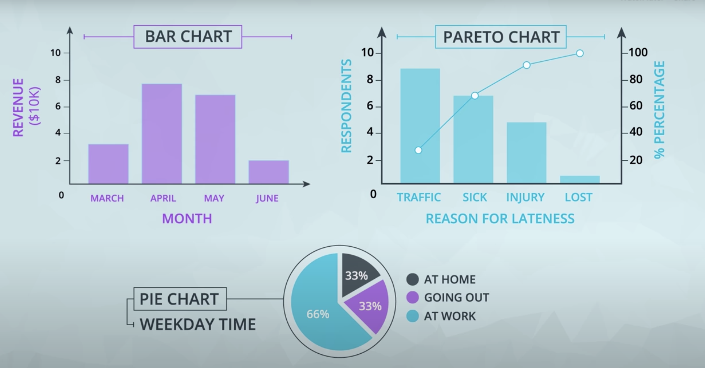
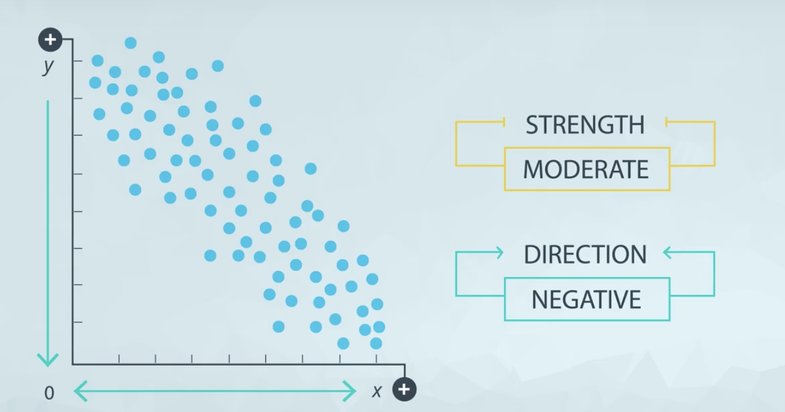
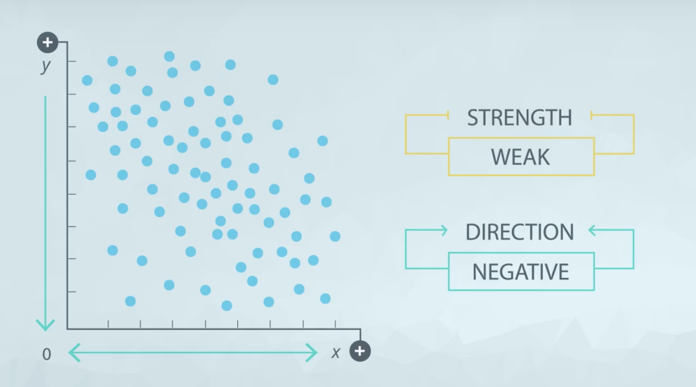
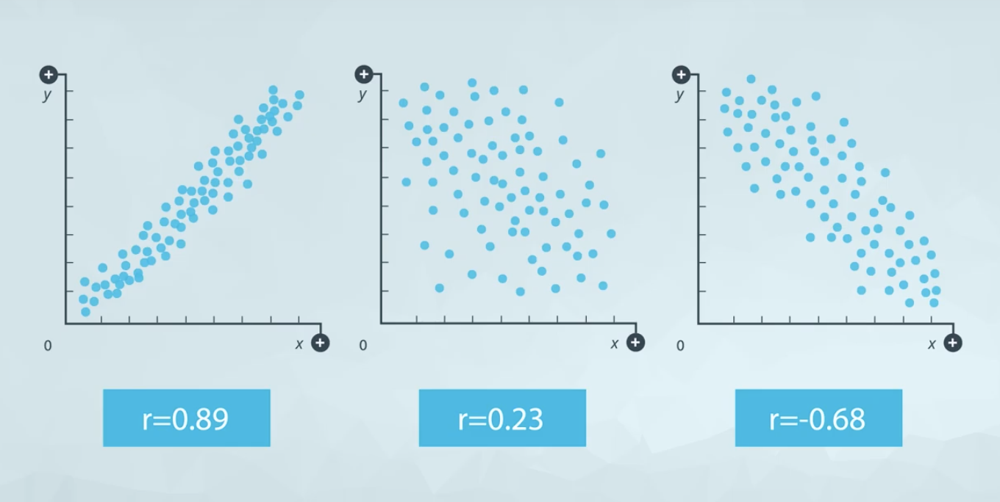
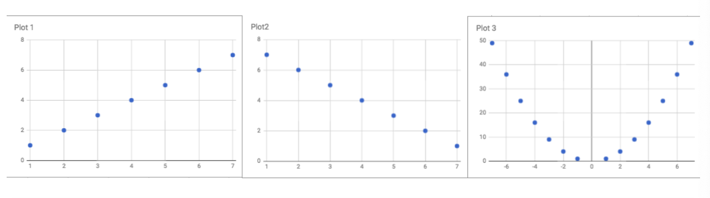
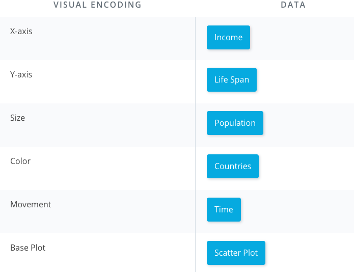

## [Why Do We Use Data Visualizations?](https://www.youtube.com/watch?v=iiOP4PE46f4) :tv:

**Areas of Focus**

There are two major areas of focus in this lesson:

1. Why are data visualizations more useful for delivering insight than just using summary statistics?
2. What plot do you build in a given situation?

**Summary Statistics vs. Visualizations**

Summary statistics like the mean and standard deviation can be great for attempting to quickly understand aspects of a dataset, but they can also be misleading if you make too many assumptions about how the data distribution looks.

[Further Motivation](https://www.youtube.com/watch?v=sjGxUKrbKoI) :tv:

**Beyond Anscombe's Quartet**
More recently **[Alberto Cairo](http://albertocairo.com/)** created the **[Datasaurus](https://www.autodeskresearch.com/publications/samestats)** dataset, which is **amazingly insightful and artistic**, but is built on the same idea that you just discovered. You can find the full dataset, and the visualizations on the **Datasaurus** link.

* [Alberto Cairo](https://video.udacity-data.com/topher/2019/November/5dc49f25_albertocairo.com/albertocairo.com.pdf)
* [Datasaurus dataset](https://video.udacity-data.com/topher/2019/November/5dc49fcf_samestats-differentgraphs/samestats-differentgraphs.pdf)

[Data Types Review](https://github.com/m-soro/Business-Analytics/tree/main/Introduction-to-Data/L1-and-L2-Descriptive-Statistics)

Now take a look at the visualization below, and complete the quiz below by identifying each of the data types.

## [Univariate Plots](https://www.youtube.com/watch?v=kgmYLreYB0A) :tv:

### Recommended charts to use

For **quantitative data**, if we are just looking at **one column** worth of data, we have four common visuals:

1. Histogram
2. Normal Quantile Plot
3. Stem and Leaf Plot
4. Box and Whisker Plot

In **most** cases, you will want to use a **histogram**.

For **categorical data**, if we are looking at just **one variable (column)**, we have three common visuals:

1. Bar Chart
2. Pie Chart
3. Pareto Chart

In **most** cases, you will want to use a **bar chart**.

## [Scatter Plots](https://www.youtube.com/watch?v=DvlxZ37O4i8) :tv:

**Scatter plots**

Scatter plots are a common visual for comparing **two quantitative** variables. A common summary statistic that relates to a scatter plot is the **correlation coefficient** commonly denoted by **r**.

Though there are a [few different](http://www.statisticssolutions.com/correlation-pearson-kendall-spearman/) ways to measure correlation between two variables, the most common way is with [Pearson's correlation coefficient](https://en.wikipedia.org/wiki/Pearson_correlation_coefficient). Pearson's correlation coefficient provides the:

1. Strength
2. Direction

of a **linear relationship**. [Spearman's Correlation Coefficient](https://en.wikipedia.org/wiki/Spearman%27s_rank_correlation_coefficient) does not measure linear relationships specifically, and it might be more appropriate for certain cases of associating two variables.

#### Exercises

A positive, strong relationship. The above data actually has a correlation of almost 0.96.

A moderate, negative relationship. The above data actually has a correlation of almost -0.67

The points don't follow the trend as well as the in the scatterplot above. Therefore, we also see a correlation coefficient that is closer to 0 than the above as well. The negative will occur anytime we have a negative relationship between the variables.

The first two are an example of a **perfect positive** and a **perfect** **negative** relationship. In the final plot, there is clearly a relationship. However, this is a **quadratic relationship**. So Pearson's correlation (which only assesses linear relationships) is a value of **0**.

## [Correlation Coefficients](https://www.youtube.com/watch?v=rL5Bn8Fi-zE) :tv:

**Correlation Coefficients**

Correlation coefficients provide a **measure of the strength** and **direction of a linear relationship**.

We can tell the direction based on whether the correlation is positive or negative.

A rule of thumb for judging the strength:

It can also be calculated in **Excel** and other spreadsheet applications using **CORREL(col1, col2)**, where col1 and col2 are the two columns you are looking to compare to one another.

The closer the correlation coefficient to 1 and -1 the stronger the relationship.

A correlation coefficient of 0 doesn't necessarily mean that there is no relationship between two variables. Rather that there isn't a linear relationship.

## [Line Plots](https://www.youtube.com/watch?v=GsaBT47pjgQ) :tv:

Line plots are a common plot for viewing **data over time**. These plots allow us to quickly identify overall trends, seasonal occurrences, peaks, and valleys in the data. You will commonly see these used in looking at stock prices over time, but really tracking anything over time can be easily viewed using these plots.

## [What is the Question?](https://www.youtube.com/watch?v=xQJyObqxg3E) :tv:

The key to building great data visualizations is in aiming them at answering the questions you want answered. This presentation gave a number of ways to show the exact same data in different ways depending on the question you want to answer.

## [What About with More Than Two Variables?](https://www.youtube.com/watch?v=ufKcdUbLj9c) :tv:

Here you were able to see a number of different visuals for comparing more than two variables - there isn't a right answer in choosing these plots - and this is where the science can become more of an art. In the next quiz, you will see why we might choose one plotting method vs. another using some of the same data from the video.

### Multiple Variables Quiz

**Which Plot Is Best?**

Below the same data are shown in 4 different ways. You can download the data by clicking the button below. You can also access the data in a Google Sheet here. Use the below plots to answer the following quiz questions.

**Notice, that there isn't one plot that is best for all questions.** We really need to show the data in a way that the insight is easy for your audience to see it. Depending on the insight you are trying to highlight, you may choose a different way to display the data.

1. Which product had the fastest growth in sales from January to July?

`Product 3`

2. In which month did Product 1 have more than 50% of the sales?

`February`

3. Did total sales ever exceed 1000 units?

`Yes, in November`

## [Why Data Dashboards](https://www.youtube.com/watch?v=8ni2lCqAVvQ) :tv:

### When We Have Lots of Variables

Hans Rosling shows an [amazing visualization](https://www.youtube.com/watch?v=jbkSRLYSojo) :tv: that incorporates many variables all at once. Take a look for yourself!

**Introduction to Data Dashboards**

 [Hans Rosling's youtube video summary](https://video.udacity-data.com/topher/2019/November/5dcb20b4_hans-roslings-200-countries-200-years-4-minutes/hans-roslings-200-countries-200-years-4-minutes.pdf)

 **Introduction to Visual Encodings**

 Use the video from the previous concept to assist with this quiz. An image is provided below which may also help with answering the questions if you just need a reminder!

 

 

### Recap
In this lesson:

1. You motivated the need for data visualization by showing that **summary statistics don't tell the full story**. You saw datasets where the **summary statistics** were the **same**, but the actual **data** were very **different**!

2. You did a review of **data types**. In general there are **quantitative** and **categorical** variables. Quantitative variables can be either **discrete or continuous**, while categorical variables are either **ordinal or nominal**.

3. You looked at **univariate plots**. In most cases a **histogram** should be used for **quantitative data**, while a **bar chart** should be used for **categorical** data. There are some cases where you might use one of the other plots.

4. You then looked at **bivariate plots**, where you were comparing **two variables to one another**. **Scatter plots** are the most common way to visualize **two quantitative variables**, while a **line chart** is common for data that you are watching over **time**. If you are comparing **two** **categorical variables**, the best choice is probably a **side-by-side bar chart**.

5. You learned about **correlation coefficients**, which provide the **strength** and **direction of linear relationships**. You learned a rule of thumb for determining whether the relationship between two quantitative variables is **strong, moderate**, or **weak**.

6. You then looked at cases where we had **more than two variables**. You learned that using these plots effectively is about building the plot that helps you see the insight that answers the question you have.

7. You gained some insight into visual encodings and data dashboards, which will be a part of the next lessons!

### [What's Next?](https://www.youtube.com/watch?v=AwpX6HkhL0k) :tv:
