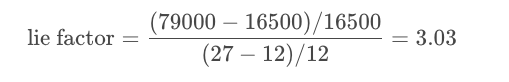

### [Introduction](https://www.youtube.com/watch?v=Q0lZkNF6O0g)

### [Lesson Overview](https://www.youtube.com/watch?v=Gg77PqkQkhs)

You can see one of Cole's seminars [here](https://www.youtube.com/watch?v=8EMW7io4rSI). She stresses that six lessons of communicating with data:

1. **Understand the context** - this means knowing your audience and conveying a clear message about what you want your audience to know or do with the information you are providing.

2. **Choose an appropriate visual display** - this was covered in the last lesson. Check out the lesson titled recap in the previous section if you need a quick refresher.

3. **Eliminate clutter** - you should only provide information to the user that helps convey your message.

4. **Focus attention where you want it** - build visualizations that pull attention to the message you want to highlight.

5. **Think like a designer** - you will learn a number of design principles in this lesson to assist as you start to put together your own data visualizations.

6. **Tell a story** - your visualizations should give the audience a story. The most powerful data visualizations move people to take action.

## [Exploratory vs. Explanatory Analyses](https://www.youtube.com/watch?v=wvgBSMks4p8)

There are two main reasons for creating visuals using data:

**Exploratory analysis** is done when you are searching for insights. These visualizations don't need to be perfect. You are using plots to find insights, but they don't need to be aesthetically appealing. You are the consumer of these plots, and you need to be able to find the answer to your questions from these plots.

**Explanatory analysis** is done when you are providing your results for others. These visualizations need to provide you the emphasis necessary to convey your message. They should be accurate, insightful, and visually appealing.

The five steps of the data analysis process:

1. **Extract** - Obtain the data from a spreadsheet, SQL, the web, etc.

2. **Clean** - Here we could use exploratory visuals.

3. **Explore** - Here we use exploratory visuals.

4. **Analyze** - Here we might use either exploratory or explanatory visuals.

5. **Share** - Here is where explanatory visuals live.

### [What Makes a Bad Visual?](https://www.youtube.com/watch?v=zbvB_9f7bFs)

Visuals can be bad if they:

1. Don't convey the message.
2. Are misleading.

This seems straightforward, but often visuals are created that do one or both of these unintentionally. There is an entire book that was published aimed at misleading visuals: [How to Lie with Statistics](http://faculty.neu.edu.cn/cc/zhangyf/papers/How-to-Lie-with-Statistics.pdf).

### [What Experts Say About Visual Encodings](https://www.youtube.com/watch?v=98aog0eVcC4)

Experts and researchers have determined the types of visual patterns that allow humans to **best** understand certain information. In general, humans are able to best understand data encoded with **positional changes** **(differences in x- and y- position as we see with scatterplots)** and **length changes (differences in box heights as we see with bar charts and histograms)**.

Alternatively, humans **struggle** with understanding data encoded with **color hue changes** (as are unfortunately commonly used as an additional variable encoding in scatter plots - we'll study this in upcoming concepts) and **area changes** (as we see in pie charts, which often makes them not the best plot choice).

### [Chart Junk](https://www.youtube.com/watch?v=3BTBEYOG2o8)

From [Wikipedia](https://en.wikipedia.org/wiki/Chartjunk), Chart junk refers to all visual elements in charts and graphs that are not necessary to comprehend the information represented on the graph or that distract the viewer from this information.

Examples of chart junk you saw in this video include:

1. Heavy grid lines
2. Unnecessary text
3. Pictures surrounding the visual
4. Shading or 3d components
5. Ornamented chart axes

### [Data Ink Ratio](https://www.youtube.com/watch?v=gW2FapuYV4A)

The **data-ink ratio**, credited to Edward Tufte, is directly related to the idea of chart junk. The more of the ink in your visual that is related to conveying the message in the data, the better.

Limiting chart junk increases the data-ink ratio.

### [Design Integrity](https://www.youtube.com/watch?v=y72_fVFtqlY)

**Design Integrity Notes**
It is key that when you build plots you maintain integrity for the underlying data.

One of the main ways discussed here for looking at data integrity was with the lie factor. Lie factor depicts the degree to which a visualization distorts or misrepresents the data values being plotted. It is calculated in the following way:

The delta symbol (\DeltaΔ) stands for difference or change. In words, the lie factor is the relative change shown in the graphic divided by the actual relative change in the data. Ideally, the lie factor should be 1: any other value means that there is some mismatch in the ratio of depicted change to actual change.

**Lie Factor in the Video**
The lie factor shown in the video was in comparing the largest to the smallest doctor in terms of pixels.

The number of pixels related to the largest image is 79,000 and 16,500 for the smallest. The percentage change is 27% to 12%. So, the lie factor is calculated as:

**Further Reading**
* [Flowing Data: How to Spot Visualization Lies](https://flowingdata.com/2017/02/09/how-to-spot-visualization-lies/)
